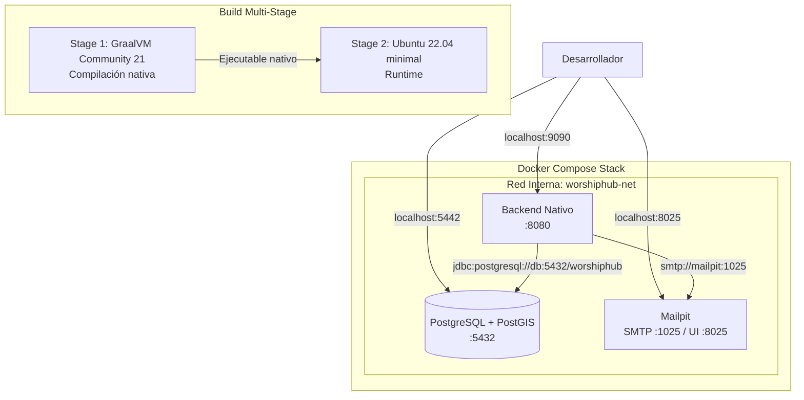
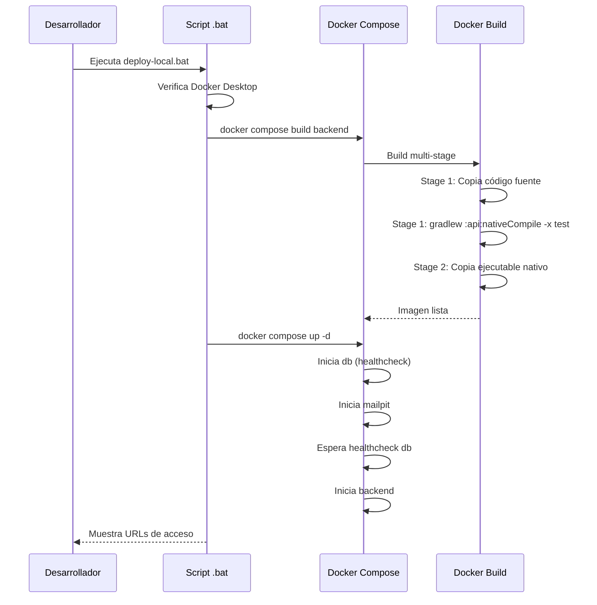

# Documento de Diseño: Docker Local Native Deploy

## Resumen

Este diseño describe la implementación de un flujo de compilación nativa GraalVM multi-stage en Docker y la orquestación completa del stack local (PostgreSQL + Mailpit + Backend nativo) mediante docker-compose. El objetivo es que un desarrollador en Windows pueda levantar todo el entorno con un solo comando, sin necesidad de tener GraalVM instalado localmente.

## Arquitectura

### Diagrama de Arquitectura

### Flujo de Build Multi-Stage

## Componentes e Interfaces

### 1. Dockerfile.native (Multi-Stage)

**Responsabilidad**: Compilar el proyecto completo como imagen nativa de GraalVM y producir una imagen Docker ligera para ejecución.

**Diseño**:
- **Stage 1 (builder)**: Usa `ghcr.io/graalvm/graalvm-community:21` como imagen base. Copia todo el código fuente del proyecto multi-módulo, instala dependencias del sistema necesarias (findutils) y ejecuta `./gradlew :api:nativeCompile -x test --no-daemon`.
- **Stage 2 (runtime)**: Usa `ubuntu:22.04` como imagen base ligera. Copia únicamente el ejecutable nativo generado. Crea un usuario no-root `appuser` para seguridad. Expone puerto 8080.

**Decisión de diseño**: Se usa Ubuntu 22.04 en lugar de distroless porque el ejecutable nativo de Spring Boot puede requerir bibliotecas dinámicas del sistema (libc, libz, etc.) que distroless no incluye. Ubuntu minimal ofrece un buen balance entre tamaño y compatibilidad.

### 2. docker-compose.yml (Actualizado)

**Responsabilidad**: Orquestar los tres servicios del stack local con dependencias, healthchecks y red compartida.

**Servicios**:
| Servicio | Imagen | Puerto Host | Puerto Contenedor |
|----------|--------|-------------|-------------------|
| db | postgis/postgis:16-3.5 | 5442 | 5432 |
| mailpit | axllent/mailpit | 8025, 1025 | 8025, 1025 |
| backend | build local (Dockerfile.native) | 9090 | 8080 |

**Dependencias**:
- `backend` depende de `db` (condition: service_healthy) y `mailpit` (condition: service_started)

**Red**: Se define una red explícita `worshiphub-net` de tipo bridge para comunicación interna entre servicios.

### 3. Script deploy-local.bat

**Responsabilidad**: Automatizar el proceso completo de build y despliegue para desarrolladores en Windows.

**Comandos disponibles**:
| Comando | Acción |
|---------|--------|
| `deploy-local.bat` (sin args) | Build + up completo |
| `deploy-local.bat build` | Solo construir imagen |
| `deploy-local.bat up` | Solo levantar servicios |
| `deploy-local.bat down` | Detener servicios |
| `deploy-local.bat logs` | Ver logs del backend |
| `deploy-local.bat rebuild` | Rebuild backend sin afectar volúmenes |
| `deploy-local.bat clean` | Eliminar volúmenes y recrear todo |

**Validaciones**:
- Verifica que Docker Desktop esté corriendo (`docker info`)
- Muestra mensajes de error claros si Docker no está disponible

### 4. Variables de Entorno del Backend

**Configuración inyectada via docker-compose**:

| Variable | Valor |
|----------|-------|
| SPRING_PROFILES_ACTIVE | local |
| DATABASE_URL | jdbc:postgresql://db:5432/worshiphub |
| DATABASE_USERNAME | postgres |
| DATABASE_PASSWORD | postgres |
| JWT_SECRET | local-dev-secret-key-for-development-only-not-for-production-use-32chars-minimum |
| FLYWAY_ENABLED | true |
| FLYWAY_BASELINE_ON_MIGRATE | true |
| SERVER_PORT | 8080 |
| MAIL_HOST | mailpit |
| MAIL_PORT | 1025 |

## Modelos de Datos

No se introducen nuevos modelos de datos. Esta funcionalidad opera a nivel de infraestructura de desarrollo local y no modifica el esquema de la base de datos ni las entidades del dominio.

Los datos existentes de PostgreSQL se persisten mediante el volumen `./data/db` ya configurado.

## Manejo de Errores

### Errores de Build

| Escenario | Causa | Solución |
|-----------|-------|----------|
| OOM durante compilación nativa | Docker con menos de 8GB RAM | Documentar requisito de 8GB+ en Docker Desktop Settings > Resources |
| Fallo de descarga de dependencias | Sin conexión a internet | Mensaje de error claro, sugerir verificar conectividad |
| Timeout de compilación | Máquina con recursos limitados | La compilación nativa puede tomar 5-15 min la primera vez |

### Errores de Runtime

| Escenario | Causa | Solución |
|-----------|-------|----------|
| Backend no conecta a DB | DB no está healthy aún | `depends_on` con `condition: service_healthy` |
| Puerto 9090 ocupado | Otro proceso usa el puerto | Mensaje en script indicando verificar puertos |
| Migraciones Flyway fallan | Schema inconsistente | Opción `clean` en script para resetear datos |

### Healthchecks

- **PostgreSQL**: `pg_isready -U postgres -d worshiphub` (interval: 10s, retries: 5)
- **Backend**: `curl -f http://localhost:8080/actuator/health || exit 1` (interval: 15s, start_period: 30s, retries: 10)

El `start_period` del backend es generoso (30s) porque la imagen nativa arranca rápido (~1-3s) pero Flyway puede tomar tiempo en la primera ejecución.

## Estrategia de Testing

### Enfoque

Esta funcionalidad es infraestructura de desarrollo local (Docker, scripts, configuración). **No aplica property-based testing** porque:
- Es configuración declarativa (docker-compose.yml, Dockerfile), no funciones con entrada/salida
- Los scripts .bat son procedurales con efectos secundarios (ejecutar Docker)
- La validación se hace mediante pruebas de integración manuales y smoke tests

### Pruebas de Validación

1. **Smoke Test Manual**: Ejecutar `deploy-local.bat` y verificar que:
   - La imagen se construye sin errores
   - Los tres servicios inician correctamente
   - El endpoint `/actuator/health` responde 200
   - Swagger UI es accesible en `http://localhost:9090/swagger-ui.html`
   - Mailpit UI es accesible en `http://localhost:8025`

2. **Validación de Conectividad**:
   - Backend conecta a PostgreSQL (Flyway ejecuta migraciones)
   - Backend puede enviar emails via Mailpit (SMTP en puerto 1025)

3. **Validación de Script**:
   - `deploy-local.bat` sin Docker muestra error apropiado
   - `deploy-local.bat clean` elimina datos y recrea
   - `deploy-local.bat rebuild` reconstruye solo el backend

4. **Validación de Dockerfile**:
   - La imagen final ejecuta con usuario no-root
   - El ejecutable nativo arranca en menos de 5 segundos
   - El tamaño de la imagen final es razonable (< 200MB)
