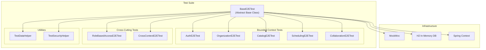
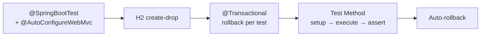

# Documento de Diseño — Tests E2E Automatizados para WorshipHub

## Overview

Este documento describe la arquitectura y diseño de la suite completa de tests E2E automatizados para la API backend de WorshipHub. La suite reemplazará los 2 tests básicos existentes en `EndToEndWorkflowTest.kt` con una cobertura exhaustiva de los 5 bounded contexts: Auth, Organization, Catalog, Scheduling y Collaboration.

### Decisiones de Diseño Clave

1. **Organización por bounded context**: Una clase de test por bounded context (más clases adicionales para cross-context y RBAC), lo que facilita la navegación y el mantenimiento.
2. **Tests independientes con setup propio**: Cada test configura sus datos prerequisito mediante llamadas API internas (helper methods), evitando dependencias de orden de ejecución.
3. **Base class compartida**: `BaseE2ETest` centraliza la configuración de MockMvc, ObjectMapper, y helpers de autenticación/datos.
4. **MockMvc con `@SpringBootTest`**: Tests de integración completos que levantan el contexto de Spring con H2 en memoria, sin mocks de servicios.
5. **`@WithMockUser` + SecurityContext customizado**: Para simular diferentes roles sin necesidad de JWT real.
6. **`@Transactional` con rollback**: Cada test se ejecuta en una transacción que hace rollback automático, garantizando aislamiento.

## Architecture

### Diagrama de Arquitectura de Tests



### Estrategia de Ejecución



## Components and Interfaces

### 1. BaseE2ETest (Clase Base Abstracta)

Clase base que todas las clases de test E2E extienden. Centraliza la configuración compartida.

```kotlin
@SpringBootTest
@AutoConfigureWebMvc
@ActiveProfiles("h2")
@Transactional
abstract class BaseE2ETest {
    @Autowired lateinit var mockMvc: MockMvc
    @Autowired lateinit var objectMapper: ObjectMapper
    
    // Helper para crear datos de test
    lateinit var testData: TestDataHelper
    
    @BeforeEach
    fun baseSetUp() {
        testData = TestDataHelper(mockMvc, objectMapper)
    }
}
```

**Responsabilidades:**
- Configuración de `@SpringBootTest` con perfil H2
- Inyección de `MockMvc` y `ObjectMapper`
- Inicialización de `TestDataHelper`
- Anotación `@Transactional` para rollback automático

### 2. TestDataHelper

Clase utilitaria que encapsula la creación de datos prerequisito mediante llamadas MockMvc internas.

```kotlin
class TestDataHelper(
    private val mockMvc: MockMvc,
    private val objectMapper: ObjectMapper
) {
    // Registra una iglesia y retorna churchId + adminUserId
    fun registerChurch(
        churchName: String = "Test Church",
        adminEmail: String = "admin@test.com"
    ): ChurchRegistrationResult
    
    // Crea un equipo y retorna teamId
    fun createTeam(
        churchId: UUID, 
        name: String = "Worship Team"
    ): UUID
    
    // Crea una canción y retorna songId
    fun createSong(
        title: String = "Amazing Grace",
        artist: String = "John Newton"
    ): UUID
    
    // Crea un setlist y retorna setlistId
    fun createSetlist(
        churchId: UUID,
        name: String = "Sunday Setlist",
        songIds: List<UUID> = emptyList()
    ): UUID
    
    // Crea una categoría y retorna categoryId
    fun createCategory(name: String = "Worship"): UUID
    
    // Crea un tag y retorna tagId
    fun createTag(name: String = "Contemporary"): UUID
}
```

**Decisión de diseño**: Se usa `TestDataHelper` en lugar de inserción directa en BD para que los tests validen el flujo completo a través de la API. Esto asegura que los datos se crean exactamente como lo haría un cliente real.

### 3. TestSecurityHelper

Utilidades para configurar el contexto de seguridad en tests.

```kotlin
object TestSecurityHelper {
    // Crea un SecurityContext con userId, churchId y roles
    fun mockSecurityContext(
        userId: UUID,
        churchId: UUID,
        roles: List<String> = listOf("CHURCH_ADMIN")
    ): SecurityContext
    
    // RequestPostProcessor para MockMvc que inyecta auth context
    fun withAuth(
        userId: UUID,
        churchId: UUID,
        roles: List<String>
    ): RequestPostProcessor
}
```

**Nota**: Dado que `SecurityContext.getCurrentUserId()` lee del `authentication.principal` y `getCurrentChurchId()` lee de `authentication.details`, los helpers deben configurar ambos campos correctamente.

### 4. Clases de Test por Bounded Context

| Clase | Bounded Context | Requirements |
|-------|----------------|-------------|
| `AuthE2ETest` | Auth | Req 1-5 (registro, login, email verification, passwords, invitations) |
| `OrganizationE2ETest` | Organization | Req 6-9 (roles, profile, teams, team members) |
| `CatalogE2ETest` | Catalog | Req 10-13 (songs, categories, tags, attachments, comments, global songs) |
| `SchedulingE2ETest` | Scheduling | Req 14-18 (services, recurring, setlists, advanced setlists, availability) |
| `CollaborationE2ETest` | Collaboration | Req 19-20 (notifications, chat) |
| `RoleBasedAccessE2ETest` | Cross-cutting | Req 21 (RBAC enforcement) |
| `CrossContextE2ETest` | Cross-cutting | Req 22 (flujos multi-context) |

### 5. Interfaz de Assertions Comunes

```kotlin
// Extension functions para assertions frecuentes en la suite
fun ResultActions.expectCreated(): ResultActions = andExpect(status().isCreated)
fun ResultActions.expectOk(): ResultActions = andExpect(status().isOk)
fun ResultActions.expectNoContent(): ResultActions = andExpect(status().isNoContent)
fun ResultActions.expectBadRequest(): ResultActions = andExpect(status().isBadRequest)
fun ResultActions.expectForbidden(): ResultActions = andExpect(status().isForbidden)
fun ResultActions.expectConflict(): ResultActions = andExpect(status().isConflict)
fun ResultActions.expectNotFound(): ResultActions = andExpect(status().isNotFound)

// Helper para extraer valores de respuestas JSON
fun ResultActions.extractUUID(jsonPath: String): UUID
fun ResultActions.extractString(jsonPath: String): String
```

## Data Models

### Modelos de Datos de Test

Los tests no introducen nuevos modelos de dominio. Utilizan los DTOs existentes de la API para construir requests y validar responses. Los modelos auxiliares son:

#### ChurchRegistrationResult
```kotlin
data class ChurchRegistrationResult(
    val churchId: UUID,
    val adminUserId: UUID
)
```

#### TestUser
```kotlin
data class TestUser(
    val userId: UUID,
    val email: String,
    val churchId: UUID,
    val role: String
)
```

#### TestConstants
```kotlin
object TestConstants {
    const val VALID_PASSWORD = "SecurePass123!"
    const val WEAK_PASSWORD = "123"
    const val VALID_EMAIL = "test@worshiphub.com"
    const val CHURCH_NAME = "Iglesia de Prueba"
    const val CHURCH_ADDRESS = "Calle Test 123"
    const val CHURCH_EMAIL = "church@test.com"
}
```

### Estructura de Directorios

```
api/src/test/kotlin/com/worshiphub/api/integration/
├── BaseE2ETest.kt                    # Clase base abstracta
├── TestDataHelper.kt                 # Helper para crear datos prerequisito
├── TestSecurityHelper.kt             # Helper para contexto de seguridad
├── TestConstants.kt                  # Constantes compartidas
├── auth/
│   └── AuthE2ETest.kt               # Tests Req 1-5
├── organization/
│   └── OrganizationE2ETest.kt       # Tests Req 6-9
├── catalog/
│   └── CatalogE2ETest.kt            # Tests Req 10-13
├── scheduling/
│   └── SchedulingE2ETest.kt         # Tests Req 14-18
├── collaboration/
│   └── CollaborationE2ETest.kt      # Tests Req 19-20
├── security/
│   └── RoleBasedAccessE2ETest.kt    # Tests Req 21
└── crosscontext/
    └── CrossContextE2ETest.kt       # Tests Req 22
```

## Error Handling

### Estrategia de Manejo de Errores en Tests

1. **Assertions claras con mensajes descriptivos**: Cada assertion incluye un mensaje que describe qué se esperaba, facilitando el diagnóstico de fallos.

2. **Validación de estructura de error**: Los tests de error no solo verifican el status code, sino también la estructura del body de error (campos `error`, `message`, etc.).

3. **Patrón de test para errores**:
```kotlin
// Patrón estándar para tests de error
@Test
fun `should return 400 when password is too short`() {
    val request = mapOf(
        "churchName" to "Test Church",
        // ... otros campos válidos
        "adminPassword" to "123"  // < 8 caracteres
    )
    
    mockMvc.perform(
        post("/api/v1/auth/church/register")
            .contentType(MediaType.APPLICATION_JSON)
            .content(objectMapper.writeValueAsString(request))
    )
    .andExpect(status().isBadRequest)
    .andExpect(jsonPath("$.message").exists())
}
```

4. **Tests de validación de campos**: Para endpoints con validación Jakarta (`@Valid`), se verifican los mensajes de error específicos por campo.

5. **Tests de autorización**: Verifican que endpoints protegidos retornan 403 para roles insuficientes y 401 para requests no autenticados.

### Categorías de Error Cubiertas

| Categoría | HTTP Status | Ejemplo |
|-----------|-------------|---------|
| Validación de input | 400 | Password corto, campos faltantes |
| No autenticado | 401 | Request sin token |
| Sin permisos | 403 | TEAM_MEMBER intenta crear equipo |
| No encontrado | 404 | GET equipo inexistente |
| Conflicto | 409 | Email duplicado en registro |

## Testing Strategy

### Enfoque General

Esta feature ES la suite de tests, por lo que la estrategia de testing se refiere a cómo validar que los tests mismos son correctos y completos.

### Por qué NO se aplica Property-Based Testing

Property-Based Testing **no es apropiado** para esta feature porque:

1. **Los tests son integration tests**: Cada criterio de aceptación verifica un endpoint específico con inputs específicos y respuestas HTTP esperadas. No hay propiedades universales que se cumplan "para todo input".
2. **Comportamiento determinístico**: Dado un input específico a un endpoint, la respuesta es determinística (status code + body). No hay variación significativa con inputs aleatorios.
3. **Costo de ejecución**: Cada test levanta el contexto de Spring y ejecuta queries contra H2. Ejecutar 100+ iteraciones por propiedad sería prohibitivamente lento.
4. **Naturaleza de los criterios**: Los criterios describen escenarios de test concretos ("WHEN X THEN verify Y"), no propiedades universales.

### Estrategia de Validación de la Suite

1. **Cobertura de requirements**: Cada test method se anota con un comentario que referencia el requirement que valida (e.g., `// Validates: Requirement 1.1`).

2. **Tests example-based**: Cada criterio de aceptación se traduce en 1 test method con datos concretos y assertions específicas.

3. **Aislamiento**: `@Transactional` con rollback automático garantiza que cada test es independiente.

4. **Verificación de compilación**: Los tests deben compilar y ejecutarse exitosamente con `./gradlew :api:test`.

### Patrones de Test

#### Patrón Happy Path
```kotlin
@Test
@WithMockUser(roles = ["CHURCH_ADMIN"])
fun `should create team successfully`() {
    // 1. Setup: crear datos prerequisito
    val churchId = testData.registerChurch().churchId
    
    // 2. Execute: llamar al endpoint bajo test
    val result = mockMvc.perform(
        post("/api/v1/teams")
            .header("Church-Id", churchId)
            .contentType(MediaType.APPLICATION_JSON)
            .content(objectMapper.writeValueAsString(request))
    )
    
    // 3. Assert: verificar respuesta
    result.andExpect(status().isCreated)
          .andExpect(jsonPath("$.teamId").exists())
}
```

#### Patrón Error/Edge Case
```kotlin
@Test
@WithMockUser(roles = ["TEAM_MEMBER"])
fun `should return 403 when team member tries to create team`() {
    mockMvc.perform(
        post("/api/v1/teams")
            .contentType(MediaType.APPLICATION_JSON)
            .content(objectMapper.writeValueAsString(request))
    )
    .andExpect(status().isForbidden)
}
```

#### Patrón Cross-Context Flow
```kotlin
@Test
@WithMockUser(roles = ["CHURCH_ADMIN"])
fun `should complete full worship service preparation flow`() {
    // Step 1: Register church
    val church = testData.registerChurch()
    
    // Step 2: Create team
    val teamId = testData.createTeam(church.churchId)
    
    // Step 3: Create songs
    val songId = testData.createSong()
    
    // Step 4: Create setlist
    val setlistId = testData.createSetlist(church.churchId, songIds = listOf(songId))
    
    // Step 5: Schedule service
    // Step 6: Members respond
    // Step 7: Verify confirmation status
}
```

### Configuración de Test

- **Profile**: `@ActiveProfiles("h2")` — usa H2 in-memory con `ddl-auto: create-drop`
- **Flyway**: Deshabilitado en perfil H2 (JPA auto-genera schema)
- **Transacciones**: `@Transactional` en `BaseE2ETest` para rollback automático
- **Security**: `@WithMockUser` para roles simples; `TestSecurityHelper` para contextos con userId/churchId

### Cobertura Esperada

| Bounded Context | # Tests | Requirements |
|----------------|---------|-------------|
| Auth | ~25 | Req 1-5 |
| Organization | ~20 | Req 6-9 |
| Catalog | ~24 | Req 10-13 |
| Scheduling | ~22 | Req 14-18 |
| Collaboration | ~4 | Req 19-20 |
| RBAC | ~7 | Req 21 |
| Cross-Context | ~3 | Req 22 |
| **Total** | **~105** | **Req 1-22** |
