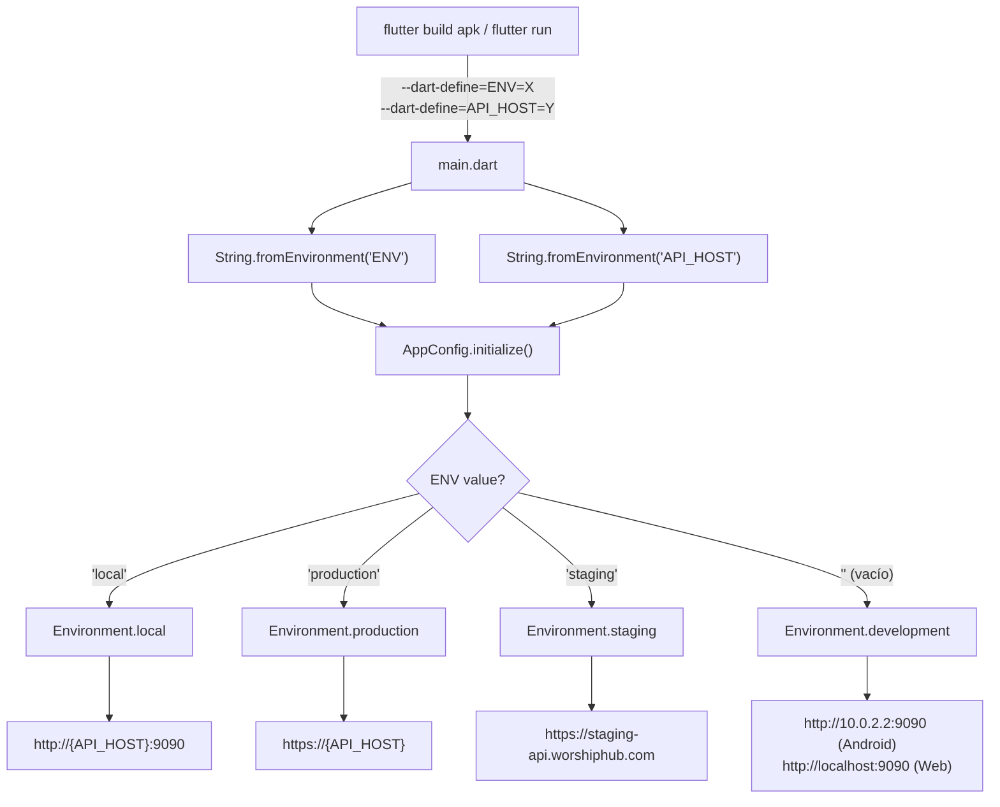
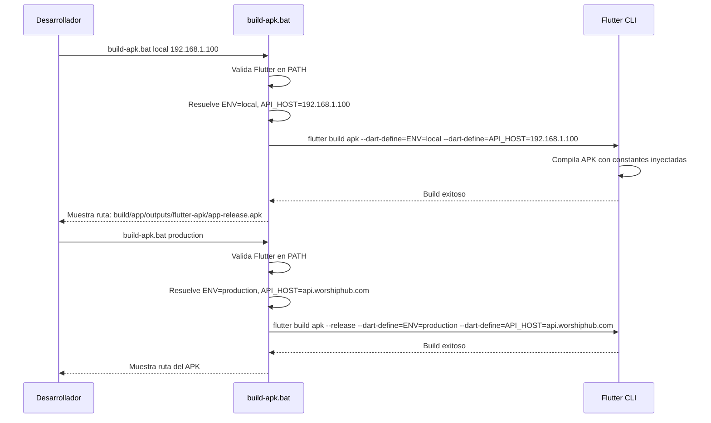
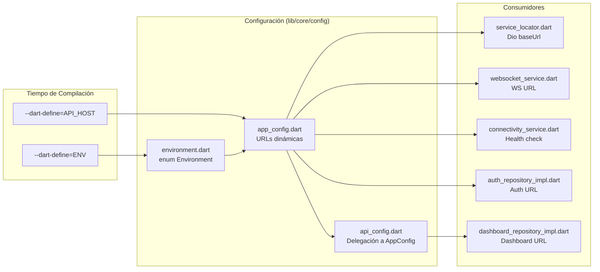

# Documento de Diseño: Compilación de APK por Entorno

## Resumen

Este diseño describe las modificaciones necesarias en el módulo de configuración de la app Flutter WorshipHub para soportar compilación de APKs con configuraciones de entorno diferenciadas. Se introduce un nuevo entorno `local` para conectar dispositivos físicos Android al backend Docker nativo corriendo en la red local, se implementa la lectura dinámica de variables de entorno via `--dart-define`, y se crea un script `.bat` de automatización para Windows.

Los cambios se concentran en tres archivos de configuración existentes (`environment.dart`, `app_config.dart`, `api_config.dart`), el punto de entrada (`main.dart`), y un nuevo script de build. El diseño preserva la compatibilidad total con el flujo de desarrollo actual en emulador/web.

## Arquitectura

### Flujo de Resolución de Entorno



### Flujo de Compilación con Script



### Relación entre Componentes



## Componentes e Interfaces

### 1. `environment.dart` — Enum de Entornos

**Cambio**: Agregar el valor `local` al enum `Environment` y agregar helper `isLocal`.

```dart
enum Environment {
  development,
  local,      // NUEVO: Backend Docker en red local
  staging,
  production,
}

class EnvironmentConfig {
  static Environment _current = Environment.development;

  static Environment get current => _current;
  static void setCurrent(Environment env) => _current = env;

  static bool get isDevelopment => _current == Environment.development;
  static bool get isLocal => _current == Environment.local;       // NUEVO
  static bool get isStaging => _current == Environment.staging;
  static bool get isProduction => _current == Environment.production;
}
```

**Decisión de diseño**: Se agrega `local` entre `development` y `staging` en el enum para reflejar el orden lógico de los entornos (desarrollo local → red local → staging → producción).

### 2. `app_config.dart` — Configuración Dinámica de URLs

**Cambio**: Introducir lectura de `--dart-define` para `ENV` y `API_HOST`, y construir URLs dinámicamente para los entornos `local` y `production`.

**Interfaz pública**:

```dart
class AppConfig {
  /// Resuelve el Environment a partir del string de --dart-define=ENV
  static Environment resolveEnvironment(String envString);

  /// Resuelve el host API a partir del entorno y el --dart-define=API_HOST
  static String resolveApiHost(Environment env, String apiHostOverride);

  /// URL base HTTP del backend
  static String get baseUrl;

  /// URL de WebSocket del backend
  static String get webSocketUrl;

  /// URL completa de la API (baseUrl + /api/v1)
  static String get apiBaseUrl;

  /// Nivel de log según entorno
  static String get logLevel;

  /// Inicializa la configuración leyendo --dart-define
  static void initialize({Environment? environment});
}
```

**Lógica de resolución de URLs**:

| Entorno | Base URL | WebSocket URL |
|---------|----------|---------------|
| `development` (Android) | `http://10.0.2.2:9090` | `ws://10.0.2.2:9090/ws/chat` |
| `development` (Web) | `http://localhost:9090` | `ws://localhost:9090/ws/chat` |
| `local` | `http://{API_HOST}:9090` | `ws://{API_HOST}:9090/ws/chat` |
| `staging` | `https://staging-api.worshiphub.com` | `wss://staging-api.worshiphub.com/ws/chat` |
| `production` | `https://{API_HOST}` | `wss://{API_HOST}/ws/chat` |

**Valores por defecto de `API_HOST`**:

| Entorno | Default API_HOST |
|---------|-----------------|
| `local` | `10.0.2.2` |
| `production` | `api.worshiphub.com` |

**Lógica de `resolveEnvironment`**:

```dart
static Environment resolveEnvironment(String envString) {
  switch (envString.toLowerCase()) {
    case 'local':
      return Environment.local;
    case 'staging':
      return Environment.staging;
    case 'production':
      return Environment.production;
    default:
      return Environment.development;
  }
}
```

**Lógica de `resolveApiHost`**:

```dart
static String resolveApiHost(Environment env, String apiHostOverride) {
  if (apiHostOverride.isNotEmpty) return apiHostOverride;
  switch (env) {
    case Environment.local:
      return '10.0.2.2';
    case Environment.production:
      return 'api.worshiphub.com';
    default:
      return '';  // No aplica para development/staging (URLs fijas)
  }
}
```

**Decisión de diseño**: Se extraen `resolveEnvironment` y `resolveApiHost` como métodos estáticos puros (sin dependencia de estado global) para facilitar el testing unitario y property-based testing. El método `initialize()` los invoca internamente y almacena el resultado en estado estático.

**Nivel de log por entorno**:

| Entorno | Log Level |
|---------|-----------|
| `development` | `debug` |
| `local` | `debug` |
| `staging` | `info` |
| `production` | `warning` |

### 3. `api_config.dart` — Delegación a AppConfig

**Cambio**: Eliminar la URL hardcodeada y delegar a `AppConfig.baseUrl`.

```dart
class ApiConfig {
  static String get baseUrl => AppConfig.baseUrl;
  static const Duration connectTimeout = Duration(seconds: 30);
  static const Duration receiveTimeout = Duration(seconds: 30);
}
```

**Decisión de diseño**: Se mantiene `ApiConfig` como clase separada para no romper los consumidores existentes (`dashboard_repository_impl.dart`), pero se elimina la duplicación de URL delegando a `AppConfig`. Los timeouts permanecen como constantes en `ApiConfig` ya que son independientes del entorno.

### 4. `main.dart` — Lectura de `--dart-define`

**Cambio**: Reemplazar el hardcode de `Environment.development` por lectura dinámica de `String.fromEnvironment`.

```dart
void main() async {
  // ...
  // Leer variables de compilación
  const envString = String.fromEnvironment('ENV');
  
  // Inicializar configuración con entorno resuelto
  AppConfig.initialize(envString: envString);
  // ...
}
```

**Decisión de diseño**: Se usa `const String.fromEnvironment('ENV')` que es evaluado en tiempo de compilación por Dart. Cuando no se proporciona `--dart-define=ENV`, el valor es un string vacío `''`, lo cual `resolveEnvironment` mapea a `Environment.development`, manteniendo el comportamiento actual.

### 5. `build-apk.bat` — Script de Automatización

**Ubicación**: `worship_hub_ui/scripts/build-apk.bat`

**Comandos**:

| Invocación | Acción |
|------------|--------|
| `build-apk.bat` | Muestra ayuda con opciones |
| `build-apk.bat local` | Build APK local con IP default (10.0.2.2) |
| `build-apk.bat local 192.168.1.100` | Build APK local con IP personalizada |
| `build-apk.bat production` | Build APK producción con host default |
| `build-apk.bat production mi-servidor.com` | Build APK producción con host personalizado |

**Validaciones del script**:
1. Verificar que `flutter` esté disponible en PATH
2. Validar que el argumento sea `local` o `production`
3. Mostrar los parámetros de compilación antes de ejecutar
4. Mostrar la ruta del APK generado al finalizar

**Estructura del script**:

```
@echo off
1. Verificar Flutter SDK
2. Parsear argumentos (entorno, host opcional)
3. Construir comando flutter build apk con --dart-define
4. Ejecutar compilación
5. Mostrar resultado y ruta del APK
```

## Modelos de Datos

No se introducen nuevos modelos de datos. Los cambios son exclusivamente en la capa de configuración estática de la aplicación. Las constantes de compilación (`--dart-define`) se resuelven en tiempo de compilación y se almacenan como valores estáticos en `AppConfig`.

**Constantes de compilación utilizadas**:

| Constante | Tipo | Uso |
|-----------|------|-----|
| `ENV` | `String` | Determina el entorno activo (`local`, `production`, `staging`, `development`) |
| `API_HOST` | `String` | Sobrescribe el host del backend para entornos `local` y `production` |

## Propiedades de Correctitud

*Una propiedad es una característica o comportamiento que debe mantenerse verdadero en todas las ejecuciones válidas de un sistema — esencialmente, una declaración formal sobre lo que el sistema debe hacer. Las propiedades sirven como puente entre especificaciones legibles por humanos y garantías de correctitud verificables por máquina.*

### Propiedad 1: Construcción de URLs para entorno local

*Para cualquier* dirección IP válida usada como `API_HOST` en el entorno `local`, la URL base debe ser `http://{ip}:9090` y la URL de WebSocket debe ser `ws://{ip}:9090/ws/chat`.

**Valida: Requisitos 1.1, 1.5, 2.1, 2.3**

### Propiedad 2: Construcción de URLs para entorno de producción con seguridad

*Para cualquier* hostname válido usado como `API_HOST` en el entorno `production`, la URL base debe ser `https://{host}` y la URL de WebSocket debe ser `wss://{host}/ws/chat`. Todas las URLs deben usar exclusivamente protocolos seguros (HTTPS/WSS).

**Valida: Requisitos 1.2, 1.6, 3.1, 3.3, 3.4**

### Propiedad 3: Resolución de entorno desde string

*Para cualquier* string de entorno válido (`local`, `production`, `staging`), la función `resolveEnvironment` debe retornar el valor correspondiente del enum `Environment`. Para cualquier string no reconocido (incluyendo string vacío), debe retornar `Environment.development`.

**Valida: Requisitos 1.3, 1.4, 7.1, 7.2**

## Manejo de Errores

### Errores de Configuración

| Escenario | Comportamiento |
|-----------|---------------|
| `ENV` no proporcionado | Default a `development`, comportamiento actual preservado |
| `ENV` con valor no reconocido (ej: `"test"`) | Default a `development` con log de advertencia |
| `API_HOST` no proporcionado en `local` | Default a `10.0.2.2` (emulador Android) |
| `API_HOST` no proporcionado en `production` | Default a `api.worshiphub.com` |
| `API_HOST` proporcionado en `development` | Ignorado, se usan URLs fijas de desarrollo |

### Errores del Script de Build

| Escenario | Comportamiento |
|-----------|---------------|
| Flutter SDK no en PATH | Mensaje de error: "Flutter SDK no encontrado. Instale Flutter y agréguelo al PATH." |
| Sin argumentos | Muestra ayuda con ejemplos de uso |
| Argumento inválido (ni `local` ni `production`) | Mensaje de error con opciones válidas |
| Fallo de compilación Flutter | Propaga el código de error de Flutter al caller |

### Errores de Conectividad en Runtime

| Escenario | Comportamiento Actual (preservado) |
|-----------|-----------------------------------|
| Backend no accesible | Dio timeout después de 30s, error manejado por repositorios |
| WebSocket no conecta | Reconexión con backoff exponencial (ya implementado) |
| Health check falla | `ConnectivityService` reporta offline |

## Estrategia de Testing

### Enfoque Dual: Tests Unitarios + Property-Based Testing

Esta funcionalidad tiene lógica pura de resolución de configuración que es ideal para property-based testing, combinada con aspectos de integración (scripts, build) que requieren verificación manual.

### Property-Based Testing

**Librería**: `glados` (ya incluida en `pubspec.yaml` como dev_dependency)

**Configuración**: Mínimo 100 iteraciones por propiedad.

**Tag de cada test**: `Feature: flutter-apk-build-environments, Property {N}: {descripción}`

Cada propiedad de correctitud del diseño se implementará como un test property-based individual:

1. **Property 1**: Generar IPs aleatorias válidas → verificar formato de URL base y WS para entorno local
2. **Property 2**: Generar hostnames aleatorios válidos → verificar formato de URL base y WS para producción, verificar protocolos seguros
3. **Property 3**: Generar strings de entorno (válidos e inválidos) → verificar resolución correcta del enum

### Tests Unitarios (Ejemplo-Based)

Tests específicos para valores por defecto y compatibilidad:

1. **Defaults de API_HOST**: Verificar que `local` sin API_HOST usa `10.0.2.2`, `production` sin API_HOST usa `api.worshiphub.com`
2. **Compatibilidad development**: Verificar que sin `--dart-define`, las URLs son las mismas que antes (Android: `10.0.2.2:9090`, Web: `localhost:9090`)
3. **Compatibilidad staging**: Verificar que `ENV=staging` sigue funcionando con URLs fijas
4. **Log levels**: Verificar que cada entorno retorna el nivel de log correcto
5. **ApiConfig delegación**: Verificar que `ApiConfig.baseUrl` retorna el mismo valor que `AppConfig.baseUrl`

### Verificación Manual del Script

1. **Smoke test**: Ejecutar `build-apk.bat` sin argumentos → debe mostrar ayuda
2. **Build local**: Ejecutar `build-apk.bat local 192.168.1.100` → debe generar APK
3. **Build producción**: Ejecutar `build-apk.bat production` → debe generar APK con `--release`
4. **Sin Flutter**: Ejecutar en terminal sin Flutter en PATH → debe mostrar error claro
5. **APK funcional**: Instalar APK generado en dispositivo → debe conectar al backend correcto

### Ubicación de Tests

```
worship_hub_ui/test/core/config/
├── app_config_test.dart          # Tests unitarios de AppConfig
├── app_config_property_test.dart # Property-based tests
├── environment_test.dart         # Tests del enum Environment
└── api_config_test.dart          # Tests de delegación ApiConfig
```
