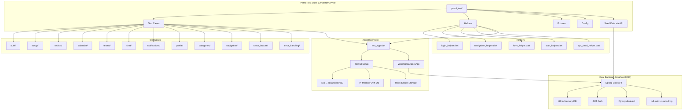
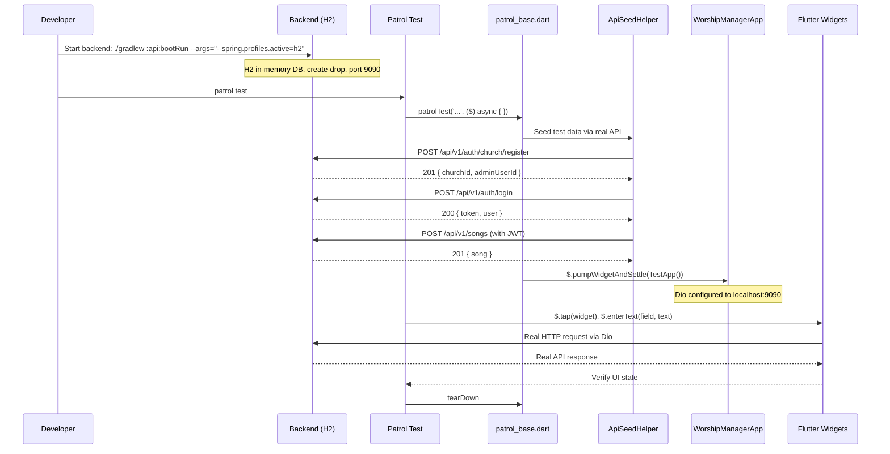
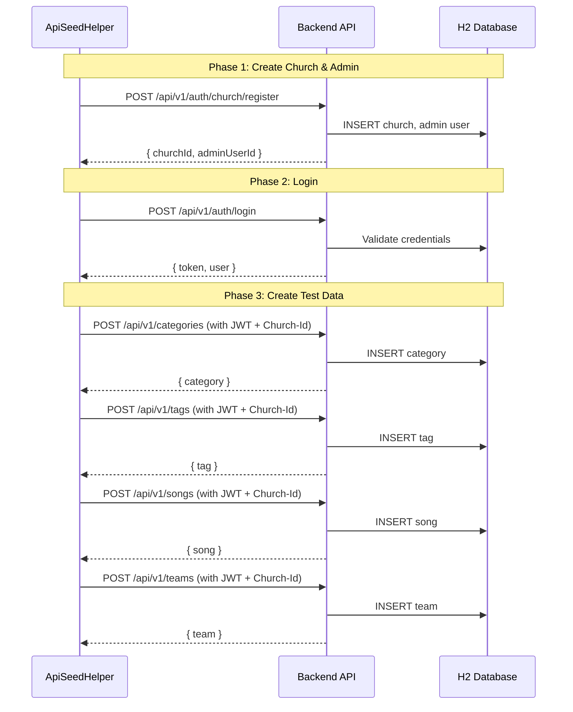

# Documento de Diseño — Tests E2E de UI Flutter para WorshipHub

## Overview

Este diseño define la arquitectura y estrategia de implementación para una suite de tests end-to-end (E2E) de UI Flutter usando **Patrol** como framework de testing. La suite ejecutará la app WorshipHub completa en un emulador/dispositivo, interactuando con widgets reales y comunicándose con el **backend real** (Spring Boot con H2 en memoria) para validar flujos de negocio completos desde la perspectiva del usuario.

### Decisiones de Diseño Clave

1. **Patrol sobre `integration_test` nativo**: Patrol extiende `integration_test` con finders más intuitivos (`$(Text)`, `$(Key)`) y automatización nativa (diálogos de permisos, notificaciones). Esto simplifica la escritura de tests y permite interactuar con elementos nativos del sistema.

2. **Backend real con H2 en memoria (no mocks)**: Los tests E2E se ejecutan contra el backend real de Spring Boot usando el perfil `h2` que configura una base de datos H2 en memoria. Esto permite:
   - **Detectar bugs reales** tanto en frontend como en backend
   - **Validar contratos de API** reales (no asunciones sobre respuestas)
   - **Encontrar problemas de integración** que los mocks no revelarían
   - **Aprovechar la infraestructura existente**: el backend ya tiene el perfil `h2` con `ddl-auto: create-drop` y Flyway deshabilitado

   **Rationale**: El backend aún no es estable y se necesita encontrar fallas para corregirlas. Usar mocks ocultaría estos problemas. El perfil H2 proporciona un backend limpio y rápido sin dependencias externas (PostgreSQL, Docker).

3. **Seed data via API calls (no SQL directo)**: Los datos de prueba se crean a través de llamadas HTTP a la API real (registrar iglesia, login, crear canciones, etc.) en lugar de insertar SQL directamente en H2. Esto valida los endpoints de creación y mantiene la integridad referencial.

4. **Test isolation via backend restart o API cleanup**: Cada grupo de tests comienza con un backend limpio. Se puede reiniciar el backend entre suites o usar endpoints de cleanup si están disponibles.

5. **Reuso del `service_locator.dart` con override mínimo**: Se reutiliza la estructura de `initializeDependencies()` pero apuntando Dio al backend de test (localhost:9090). Se reemplaza `SecureStorage` con una implementación in-memory y se omite Firebase.

## Architecture

### Diagrama de Arquitectura de Tests



### Estructura de Directorios

```
worship_hub_ui/
├── patrol_test/
│   ├── test_app.dart                    # App initialization for E2E tests
│   ├── patrol_base.dart                 # Base class with common setup/teardown
│   │
│   ├── config/
│   │   └── test_config.dart             # Test environment configuration (backend URL, etc.)
│   │
│   ├── seed/
│   │   ├── api_seed_helper.dart         # HTTP client for seeding data via API
│   │   ├── auth_seed.dart               # Register church, create users via API
│   │   ├── song_seed.dart               # Create songs via API
│   │   ├── setlist_seed.dart            # Create setlists via API
│   │   ├── team_seed.dart               # Create teams via API
│   │   └── category_seed.dart           # Create categories/tags via API
│   │
│   ├── fixtures/
│   │   ├── test_data.dart               # Centralized test data constants
│   │   └── api_endpoints.dart           # API endpoint path constants
│   │
│   ├── helpers/
│   │   ├── login_helper.dart            # Automate login flow via UI
│   │   ├── navigation_helper.dart       # Navigate to specific pages
│   │   ├── form_helper.dart             # Fill forms, submit, validate errors
│   │   ├── wait_helper.dart             # Wait for loading states, animations
│   │   └── assertion_helper.dart        # Common assertion patterns
│   │
│   ├── mocks/
│   │   └── mock_secure_storage.dart     # In-memory SecureStorage replacement
│   │
│   ├── tests/
│   │   ├── auth/
│   │   │   ├── login_test.dart                    # Req 3
│   │   │   ├── church_registration_test.dart      # Req 2
│   │   │   └── invitation_acceptance_test.dart    # Req 4
│   │   ├── songs/
│   │   │   ├── song_crud_test.dart                # Req 5
│   │   │   └── song_search_filter_test.dart       # Req 6
│   │   ├── setlists/
│   │   │   └── setlist_crud_test.dart             # Req 7
│   │   ├── calendar/
│   │   │   └── calendar_availability_test.dart    # Req 8
│   │   ├── teams/
│   │   │   └── team_management_test.dart          # Req 9
│   │   ├── chat/
│   │   │   └── team_chat_test.dart                # Req 10
│   │   ├── notifications/
│   │   │   └── notifications_test.dart            # Req 11
│   │   ├── profile/
│   │   │   └── profile_password_test.dart         # Req 12
│   │   ├── categories/
│   │   │   └── category_tag_test.dart             # Req 13
│   │   ├── navigation/
│   │   │   └── app_navigation_test.dart           # Req 14
│   │   ├── cross_feature/
│   │   │   └── cross_feature_flows_test.dart      # Req 15
│   │   └── error_handling/
│   │       └── error_states_test.dart             # Req 16
│   │
│   └── README.md                        # Setup instructions, troubleshooting
│
├── pubspec.yaml                         # + patrol dev_dependency
└── patrol.yaml                          # Patrol CLI configuration
```

### Flujo de Ejecución de un Test



## Components and Interfaces

### 1. TestConfig

Configuración centralizada del entorno de tests.

```dart
/// Test environment configuration.
/// Points the app to the real backend running with H2 profile.
class TestConfig {
  /// Backend URL for E2E tests.
  /// The backend must be running with: ./gradlew :api:bootRun --args="--spring.profiles.active=h2"
  ///
  /// For Android emulator, use 10.0.2.2 (maps to host localhost).
  /// For web or desktop tests, use localhost directly.
  static const String backendBaseUrl = 'http://10.0.2.2:9090';
  static const String backendWebUrl = 'http://localhost:9090';

  /// WebSocket URL for chat tests
  static const String wsUrl = 'ws://10.0.2.2:9090/ws/chat';

  /// Timeouts
  static const Duration apiTimeout = Duration(seconds: 15);
  static const Duration widgetSettleTimeout = Duration(seconds: 10);
  static const Duration navigationSettleTimeout = Duration(seconds: 3);

  /// Get the appropriate base URL based on platform
  static String get baseUrl {
    // In integration tests on Android emulator, use 10.0.2.2
    // For other platforms, use localhost
    return backendBaseUrl; // Default to Android emulator
  }
}
```

### 2. ApiSeedHelper

Cliente HTTP directo (sin pasar por la UI) para crear datos de prueba en el backend real antes de ejecutar los tests.

```dart
/// HTTP client for seeding test data directly via the real API.
/// Uses Dio independently from the app's Dio instance.
/// This allows creating prerequisite data (churches, users, songs, etc.)
/// before the UI tests interact with the app.
class ApiSeedHelper {
  final Dio _dio;
  String? _authToken;
  String? _churchId;
  String? _userId;

  ApiSeedHelper() : _dio = Dio(BaseOptions(
    baseUrl: TestConfig.baseUrl,
    connectTimeout: TestConfig.apiTimeout,
    receiveTimeout: TestConfig.apiTimeout,
  ));

  /// Register a new church with admin user.
  /// Returns { churchId, adminUserId, message }.
  Future<Map<String, dynamic>> registerChurch({
    String churchName = TestData.churchName,
    String churchAddress = TestData.churchAddress,
    String churchEmail = TestData.churchEmail,
    String adminEmail = TestData.adminEmail,
    String adminPassword = TestData.adminPassword,
    String adminFirstName = TestData.adminFirstName,
    String adminLastName = TestData.adminLastName,
  });

  /// Login and store the JWT token for subsequent API calls.
  Future<Map<String, dynamic>> login({
    String email = TestData.adminEmail,
    String password = TestData.adminPassword,
  });

  /// Create a song via API. Requires prior login.
  Future<Map<String, dynamic>> createSong({
    required String title,
    String? artist,
    String? key,
    double? bpm,
    String? lyrics,
    String? chords,
  });

  /// Create a setlist via API. Requires prior login.
  Future<Map<String, dynamic>> createSetlist({
    required String name,
    List<String>? songIds,
  });

  /// Create a team via API. Requires prior login.
  Future<Map<String, dynamic>> createTeam({
    required String name,
    String? description,
  });

  /// Create a category via API. Requires prior login.
  Future<Map<String, dynamic>> createCategory({
    required String name,
    String? description,
  });

  /// Create a tag via API. Requires prior login.
  Future<Map<String, dynamic>> createTag({
    required String name,
    String? color,
  });

  /// Send an invitation via API. Requires prior login as admin.
  Future<Map<String, dynamic>> sendInvitation({
    required String email,
    required String firstName,
    required String lastName,
    String role = 'TEAM_MEMBER',
  });

  /// Check if the backend is reachable and healthy.
  Future<bool> isBackendHealthy();

  /// Get stored auth token
  String? get authToken => _authToken;
  String? get churchId => _churchId;
  String? get userId => _userId;
}
```

### 3. MockSecureStorage

Reemplazo in-memory de `FlutterSecureStorage` para tests, evitando dependencias de plataforma nativa.

```dart
/// In-memory implementation of secure storage for testing.
/// Replaces FlutterSecureStorage which requires native platform keychain.
/// This is needed because Patrol tests run in a test harness where
/// the native keychain may not be available or may persist between tests.
class MockSecureStorage {
  final Map<String, String> _store = {};

  Future<void> write({required String key, required String value});
  Future<String?> read({required String key});
  Future<void> delete({required String key});
  Future<void> deleteAll();
  Future<Map<String, String>> readAll();
}
```

### 4. TestApp (test_app.dart)

Punto de entrada de la app para tests E2E. Configura el DI container apuntando al backend real.

```dart
/// Initializes the app for E2E testing against the real backend.
/// Key differences from production initialization:
/// - Dio points to TestConfig.baseUrl (localhost:9090 via emulator)
/// - SecureStorage replaced with MockSecureStorage (in-memory)
/// - Drift database uses in-memory SQLite
/// - Firebase initialization is skipped
/// - WebSocket connects to test backend
/// - DatabaseCleaner is skipped (no mock data to clear)
Future<Widget> createTestApp({
  MockSecureStorage? mockStorage,
}) async {
  // Reset get_it to ensure clean state
  await GetIt.instance.reset();

  // Initialize test dependencies pointing to real backend
  await initializeTestDependencies(
    mockStorage: mockStorage,
  );

  return const WorshipManagerApp();
}

/// Registers all dependencies for E2E testing.
/// Mirrors initializeDependencies() from service_locator.dart but with:
/// - Dio baseUrl = TestConfig.baseUrl
/// - No Firebase
/// - In-memory Drift database
/// - MockSecureStorage
Future<void> initializeTestDependencies({
  MockSecureStorage? mockStorage,
}) async {
  final sl = GetIt.instance;

  // Dio pointing to real backend
  sl.registerLazySingleton<Dio>(() {
    final dio = Dio();
    dio.options.baseUrl = TestConfig.baseUrl;
    dio.options.connectTimeout = TestConfig.apiTimeout;
    dio.options.receiveTimeout = TestConfig.apiTimeout;
    // AuthInterceptor still needed for JWT token management
    dio.interceptors.add(AuthInterceptor());
    return dio;
  });

  // ... register all other dependencies same as production
  // (repositories, use cases, BLoCs)
}
```

### 5. TestEnvironment (patrol_base.dart)

Clase que encapsula el setup/teardown completo para cada test.

```dart
/// Encapsulates the complete test environment setup and teardown.
/// Ensures backend is healthy, seeds required data, and provides helpers.
///
/// Usage:
/// ```dart
/// void main() {
///   patrolTest('my test', ($) async {
///     final env = await TestEnvironment.setup($);
///     await env.seedHelper.registerChurch();
///     await env.seedHelper.login();
///     // ... test code
///     await env.tearDown();
///   });
/// }
/// ```
class TestEnvironment {
  final PatrolTester $;
  final ApiSeedHelper seedHelper;
  final MockSecureStorage mockStorage;
  final LoginHelper loginHelper;
  final NavigationHelper navigationHelper;
  final FormHelper formHelper;
  final WaitHelper waitHelper;

  /// Setup the test environment:
  /// 1. Verify backend is healthy
  /// 2. Create MockSecureStorage
  /// 3. Initialize test app with real backend
  /// 4. Create all helpers
  static Future<TestEnvironment> setup(PatrolTester $) async {
    final seedHelper = ApiSeedHelper();

    // Verify backend is running
    final isHealthy = await seedHelper.isBackendHealthy();
    if (!isHealthy) {
      throw StateError(
        'Backend is not running. Start it with:\n'
        'cd worship_hub_api && ./gradlew :api:bootRun --args="--spring.profiles.active=h2"'
      );
    }

    final mockStorage = MockSecureStorage();

    // Pump the test app
    await $.pumpWidgetAndSettle(await createTestApp(mockStorage: mockStorage));

    return TestEnvironment._(
      $: $,
      seedHelper: seedHelper,
      mockStorage: mockStorage,
      // ... initialize helpers
    );
  }

  Future<void> tearDown() async {
    await mockStorage.deleteAll();
    await GetIt.instance.reset();
  }
}
```

### 6. Helpers

#### LoginHelper
```dart
/// Automates the login flow for tests that require authentication.
/// Uses the real backend — credentials must exist (created via ApiSeedHelper).
class LoginHelper {
  final PatrolTester $;
  final ApiSeedHelper seedHelper;

  /// Perform a complete login flow via UI interaction.
  /// Prerequisite: Church and user must be registered via seedHelper.
  Future<void> loginViaUI({
    String email = TestData.adminEmail,
    String password = TestData.adminPassword,
  }) async {
    // Navigate to login page if not already there
    // Enter email
    // Enter password
    // Tap login button
    // Wait for navigation to Home_Page
  }

  /// Seed a church + admin user and login via UI.
  /// Convenience method that combines seeding and UI login.
  Future<void> registerAndLogin() async {
    await seedHelper.registerChurch();
    await loginViaUI();
  }
}
```

#### NavigationHelper
```dart
/// Provides navigation shortcuts for common page transitions.
/// Interacts with the real UI — taps on feature cards, back buttons, etc.
class NavigationHelper {
  final PatrolTester $;

  Future<void> goToSongs();      // Tap "Canciones" card on Home_Page
  Future<void> goToSetlists();   // Tap "Setlists" card on Home_Page
  Future<void> goToCalendar();   // Tap "Calendario" card on Home_Page
  Future<void> goToTeams();      // Tap "Equipos" card on Home_Page
  Future<void> goToCategories(); // Tap "Categorías" card on Home_Page
  Future<void> goToNotifications(); // Tap notification icon on Home_Page
  Future<void> goToProfile();    // Tap profile icon on Home_Page
  Future<void> goBack();         // Tap back button
}
```

#### FormHelper
```dart
/// Provides form interaction utilities for filling and submitting forms.
class FormHelper {
  final PatrolTester $;

  /// Fill a text field identified by key or label text
  Future<void> fillField(String keyOrLabel, String value);

  /// Submit a form by tapping the submit/save button
  Future<void> submitForm({String? buttonText});

  /// Verify that a validation error message is displayed
  Future<void> expectValidationError(String errorText);

  /// Clear a text field
  Future<void> clearField(String keyOrLabel);
}
```

#### WaitHelper
```dart
/// Provides utilities for waiting on async operations and animations.
class WaitHelper {
  final PatrolTester $;

  /// Wait for loading indicators (shimmer, spinner) to disappear
  Future<void> waitForLoadingToComplete();

  /// Wait for a specific widget to appear
  Future<void> waitForWidget(Finder finder, {Duration timeout});

  /// Wait for navigation transitions to complete
  Future<void> waitForNavigation();
}
```

## Data Models

### Seed Data Strategy

En lugar de mock responses, los datos de prueba se crean a través de la API real. Esto valida los endpoints de creación y garantiza integridad referencial.

#### Flujo de Seed Data



### API Endpoint Constants

```dart
/// Centralized API endpoint paths used by seed helpers and for reference.
class ApiEndpoints {
  static const String healthCheck = '/api/v1/health';
  static const String login = '/api/v1/auth/login';
  static const String registerChurch = '/api/v1/auth/church/register';
  static const String googleCallback = '/api/v1/auth/oauth2/google/callback';
  static const String songs = '/api/v1/songs';
  static const String songsSearch = '/api/v1/songs/search';
  static const String songsFilter = '/api/v1/songs/filter';
  static const String setlists = '/api/v1/setlists';
  static const String generateSetlist = '/api/v1/setlists/generate';
  static const String teams = '/api/v1/teams';
  static const String services = '/api/v1/services';
  static const String availability = '/api/v1/availability';
  static const String notifications = '/api/v1/notifications';
  static const String invitations = '/api/v1/invitations';
  static const String profile = '/api/v1/users/profile';
  static const String passwordStatus = '/api/v1/auth/password/status';
  static const String passwordChange = '/api/v1/auth/password/change';
  static const String passwordSet = '/api/v1/auth/password/set';
  static const String passwordForgot = '/api/v1/auth/password/forgot';
  static const String categories = '/api/v1/categories';
  static const String tags = '/api/v1/tags';
  static const String dashboardStats = '/api/v1/dashboard/stats';
  static const String chatMessages = '/api/v1/chat'; // /{teamId}/messages
}
```

### Test Data Constants

```dart
/// Centralized test data used across all E2E tests.
/// These values are used both for seeding via API and for UI assertions.
class TestData {
  // Auth - Church Admin
  static const adminEmail = 'admin@worshiphub-test.com';
  static const adminPassword = 'TestPassword123!';
  static const adminFirstName = 'Test';
  static const adminLastName = 'Admin';
  static const churchName = 'Iglesia E2E Test';
  static const churchAddress = 'Calle Test 123, Ciudad Test';
  static const churchEmail = 'church@worshiphub-test.com';

  // Songs
  static const songTitle = 'Amazing Grace';
  static const songArtist = 'John Newton';
  static const songKey = 'G';
  static const songBpm = 72.0;
  static const songLyrics = 'Amazing grace, how sweet the sound\nThat saved a wretch like me';
  static const songChords = '[G]Amazing [C]grace, how [G]sweet the sound';

  // Updated song data (for edit tests)
  static const updatedSongTitle = 'Amazing Grace (Updated)';
  static const updatedSongArtist = 'John Newton / Chris Tomlin';

  // Setlists
  static const setlistName = 'Domingo de Adoración';

  // Teams
  static const teamName = 'Equipo de Alabanza';
  static const teamDescription = 'Equipo principal de alabanza dominical';

  // Categories
  static const categoryName = 'Adoración';
  static const categoryDescription = 'Canciones de adoración y alabanza';

  // Tags
  static const tagName = 'Clásico';
  static const tagColor = '#FF5733';

  // Invitations
  static const inviteeEmail = 'newmember@worshiphub-test.com';
  static const inviteeFirstName = 'New';
  static const inviteeLastName = 'Member';
  static const inviteePassword = 'MemberPass123!';

  // Chat
  static const chatMessage = 'Hola equipo, ¿listos para el ensayo?';

  // Validation test data
  static const shortPassword = 'short';
  static const invalidEmail = 'not-an-email';
  static const emptyString = '';
}
```


## Error Handling

### Backend Error Scenarios

Dado que los tests usan el backend real, los errores de la API son respuestas reales del servidor. Esto es una ventaja: si el backend no maneja un caso correctamente, el test lo detectará.

#### Errores que el Backend Genera Naturalmente

| Scenario | How to Trigger | Expected Backend Response | Expected App Behavior |
|---|---|---|---|
| Invalid credentials | Login con password incorrecto | 401 `{ error: 'INVALID_CREDENTIALS' }` | Muestra mensaje de error en Login_Page |
| Duplicate email | Registrar iglesia con email existente | 409 `{ error: 'DUPLICATE_EMAIL' }` | Muestra mensaje de email duplicado |
| Validation error | Enviar form con campos vacíos | 400 `{ error: 'VALIDATION_ERROR', validationErrors: [...] }` | Muestra errores de validación |
| Expired token | Usar token expirado (JWT expiration) | 401 | Redirige a Login_Page |
| Not found | Acceder a recurso inexistente | 404 | Muestra mensaje de recurso no encontrado |
| Short password | Registrar con password < 8 chars | 400 `{ error: 'VALIDATION_ERROR' }` | Muestra error de validación de password |
| Expired invitation | Aceptar invitación con token expirado | 400/404 | Muestra error de invitación expirada |

#### Errores que Requieren Simulación Especial

Algunos errores no se pueden generar fácilmente con el backend real:

| Scenario | Strategy | Implementation |
|---|---|---|
| HTTP 500 Server Error | No se puede forzar fácilmente. **Opción**: Crear un endpoint de test en el backend (`/api/v1/test/error-500`) que solo esté activo en perfil H2. **Alternativa**: Aceptar que este caso se valida con unit tests existentes. | Endpoint de test o skip |
| Network Timeout | **Opción 1**: Agregar un `Interceptor` temporal al Dio de la app que simule timeout para un request específico. **Opción 2**: Detener el backend momentáneamente. | Interceptor temporal |
| Connection Error | Detener el backend antes del test y verificar que la app muestra error de conexión. | Backend stop/start |

```dart
/// Temporary interceptor that can be added to Dio for specific error simulation tests.
/// Only used for Req 16 (error handling tests).
class ErrorSimulationInterceptor extends Interceptor {
  bool simulateTimeout = false;
  bool simulateServerError = false;
  String? targetPath; // Only affect requests to this path

  @override
  void onRequest(RequestOptions options, RequestInterceptorHandler handler) {
    if (targetPath != null && !options.path.contains(targetPath!)) {
      handler.next(options);
      return;
    }

    if (simulateTimeout) {
      handler.reject(DioException(
        requestOptions: options,
        type: DioExceptionType.connectionTimeout,
        message: 'Simulated timeout for E2E test',
      ));
      return;
    }

    if (simulateServerError) {
      handler.resolve(Response(
        requestOptions: options,
        statusCode: 500,
        data: {'error': 'INTERNAL_ERROR', 'message': 'Simulated server error'},
      ));
      return;
    }

    handler.next(options);
  }
}
```

### Test Isolation Strategy

Con un backend real, el aislamiento entre tests es más complejo que con mocks. La estrategia es:

1. **H2 `create-drop`**: El backend con perfil H2 usa `ddl-auto: create-drop`, lo que significa que la base de datos se crea al iniciar y se destruye al detener. Cada reinicio del backend da un estado limpio.

2. **Datos únicos por test**: Cada test usa datos con identificadores únicos (timestamps o UUIDs en emails) para evitar colisiones entre tests que corren en la misma instancia del backend.

```dart
/// Generate unique test data to avoid collisions between tests.
class UniqueTestData {
  static String get uniqueEmail => 'test_${DateTime.now().millisecondsSinceEpoch}@test.com';
  static String get uniqueChurchName => 'Church_${DateTime.now().millisecondsSinceEpoch}';
  static String get uniqueSongTitle => 'Song_${DateTime.now().millisecondsSinceEpoch}';
}
```

3. **Test ordering**: Los tests dentro de un archivo se ejecutan secuencialmente. Los tests que crean datos (register, create) se ejecutan antes de los que los consumen (list, detail).

4. **Grupo de tests comparten seed data**: Dentro de un `group()`, se hace seed una vez en `setUp` y todos los tests del grupo usan esos datos. Esto reduce el tiempo de setup.

```dart
group('Song CRUD', () {
  late TestEnvironment env;
  late String songId;

  setUp(() async {
    env = await TestEnvironment.setup($);
    // Seed: register church + login + create initial song
    await env.seedHelper.registerChurch();
    await env.seedHelper.login();
    final song = await env.seedHelper.createSong(title: 'Test Song');
    songId = song['id'];
  });

  patrolTest('can view song list', ($) async { ... });
  patrolTest('can view song detail', ($) async { ... });
  patrolTest('can edit song', ($) async { ... });
  patrolTest('can delete song', ($) async { ... });
});
```

5. **Backend health check**: Antes de cada suite, verificar que el backend está corriendo y saludable.

### Timeout Handling

- **Backend response timeout**: 15 segundos (el backend con H2 es rápido, pero el primer request puede ser lento por JVM warmup)
- **Widget settle timeout**: 10 segundos para `pumpAndSettle`
- **Navigation settle**: 3 segundos después de cada navegación
- **Test timeout**: 120 segundos por test individual
- **Backend health check timeout**: 5 segundos

### Handling Flaky Tests

1. **Backend warmup**: El primer test puede ser más lento por JVM warmup. Agregar un health check con retry al inicio de la suite.
2. **Unique data**: Usar datos únicos por test para evitar colisiones.
3. **Explicit waits**: Usar `$.waitUntilVisible` de Patrol en lugar de `pumpAndSettle` con timeout fijo.
4. **Retry en CI**: Configurar 1 retry para tests flaky en CI.

## Testing Strategy

### Enfoque General

Esta feature es una **suite de tests E2E de UI** que se ejecuta contra el **backend real** con H2 en memoria. El enfoque es:

1. **Tests E2E contra backend real**: Cada test interactúa con la UI real y el backend real, validando el stack completo.
2. **Seed data via API**: Los datos de prueba se crean a través de la API real antes de cada test/grupo.
3. **No se aplica Property-Based Testing (PBT)**: Los tests E2E son inherentemente example-based.

### Por qué PBT NO aplica

- Los tests E2E validan **flujos de UI específicos**, no funciones puras con input/output
- Cada test tiene un escenario concreto (login con credenciales válidas, crear canción con datos específicos)
- No hay propiedades universales del tipo "para todo input X, la propiedad P(X) se cumple"
- El costo de ejecutar 100+ iteraciones de tests E2E sería prohibitivo (cada iteración requiere la app completa + backend)
- Los tests E2E son por naturaleza **integration tests** y **example-based tests**

### Estructura de Tests por Requisito

| Requisito | Archivo de Test | Tipo | # Tests |
|---|---|---|---|
| Req 1: Infraestructura | Verificación manual + smoke tests | SMOKE | 3-5 |
| Req 2: Registro de iglesia | `auth/church_registration_test.dart` | EXAMPLE + EDGE_CASE | 5-6 |
| Req 3: Login | `auth/login_test.dart` | EXAMPLE + EDGE_CASE | 6 |
| Req 4: Invitaciones | `auth/invitation_acceptance_test.dart` | EXAMPLE + EDGE_CASE | 7 |
| Req 5: CRUD canciones | `songs/song_crud_test.dart` | EXAMPLE + EDGE_CASE | 8 |
| Req 6: Búsqueda/filtrado | `songs/song_search_filter_test.dart` | EXAMPLE | 4 |
| Req 7: CRUD setlists | `setlists/setlist_crud_test.dart` | EXAMPLE | 6 |
| Req 8: Calendario | `calendar/calendar_availability_test.dart` | EXAMPLE + INTEGRATION | 7 |
| Req 9: Equipos | `teams/team_management_test.dart` | EXAMPLE | 6 |
| Req 10: Chat | `chat/team_chat_test.dart` | EXAMPLE + EDGE_CASE | 4 |
| Req 11: Notificaciones | `notifications/notifications_test.dart` | EXAMPLE | 5 |
| Req 12: Perfil/contraseña | `profile/profile_password_test.dart` | EXAMPLE | 6 |
| Req 13: Categorías/tags | `categories/category_tag_test.dart` | EXAMPLE | 6 |
| Req 14: Navegación | `navigation/app_navigation_test.dart` | EXAMPLE | 4 |
| Req 15: Flujos cross-feature | `cross_feature/cross_feature_flows_test.dart` | INTEGRATION | 4 |
| Req 16: Errores/carga | `error_handling/error_states_test.dart` | EXAMPLE | 4 |

**Total estimado: ~83-88 tests E2E**

### Patrón de Test Estándar

```dart
void main() {
  patrolTest('user can create a new song', ($) async {
    // 1. SETUP: Create test environment and seed data
    final env = await TestEnvironment.setup($);
    await env.seedHelper.registerChurch();
    await env.seedHelper.login();

    // 2. LOGIN via UI
    await env.loginHelper.loginViaUI();
    await env.waitHelper.waitForNavigation();

    // 3. NAVIGATE to songs
    await env.navigationHelper.goToSongs();
    await env.waitHelper.waitForLoadingToComplete();

    // 4. CREATE song via UI
    await $(FloatingActionButton).tap(); // Tap create button
    await env.waitHelper.waitForNavigation();

    await env.formHelper.fillField('Título', TestData.songTitle);
    await env.formHelper.fillField('Artista', TestData.songArtist);
    await env.formHelper.fillField('Tonalidad', TestData.songKey);
    await env.formHelper.submitForm();

    // 5. VERIFY: Song appears in list
    await env.waitHelper.waitForNavigation();
    await env.waitHelper.waitForLoadingToComplete();
    expect($(TestData.songTitle), findsOneWidget);

    // 6. CLEANUP
    await env.tearDown();
  });
}
```

### Prerequisitos de Ejecución

Antes de ejecutar los tests E2E:

1. **Iniciar el backend con H2**:
   ```bash
   cd worship_hub_api
   ./gradlew :api:bootRun --args="--spring.profiles.active=h2"
   ```
   El backend estará disponible en `http://localhost:9090`.

2. **Iniciar un emulador Android** (o conectar un dispositivo):
   ```bash
   emulator -avd <avd_name>
   ```

3. **Instalar Patrol CLI** (una vez):
   ```bash
   dart pub global activate patrol_cli
   ```

4. **Ejecutar los tests**:
   ```bash
   cd worship_hub_ui
   patrol test
   # O un archivo específico:
   patrol test patrol_test/tests/auth/login_test.dart
   ```

### Ejecución en CI/CD

```yaml
# Ejemplo de GitHub Actions workflow
jobs:
  e2e-tests:
    runs-on: ubuntu-latest
    steps:
      # 1. Setup Java 21 for backend
      - uses: actions/setup-java@v4
        with:
          java-version: '21'
          distribution: 'temurin'

      # 2. Start backend with H2 in background
      - name: Start backend
        run: |
          cd worship_hub_api
          ./gradlew :api:bootRun --args="--spring.profiles.active=h2" &
          # Wait for backend to be ready
          for i in {1..30}; do
            curl -s http://localhost:9090/api/v1/health && break
            sleep 2
          done

      # 3. Setup Flutter
      - uses: subosito/flutter-action@v2
        with:
          flutter-version: '3.6.1'

      # 4. Start Android emulator
      - uses: reactivecircus/android-emulator-runner@v2
        with:
          api-level: 34
          script: |
            cd worship_hub_ui
            flutter pub get
            patrol test --verbose
```

### Dependencias Requeridas

```yaml
# pubspec.yaml - dev_dependencies (agregar patrol)
dev_dependencies:
  patrol: ^3.13.0  # E2E testing framework
  # Existing dependencies remain unchanged:
  flutter_test:
    sdk: flutter
  flutter_lints: ^6.0.0
  bloc_test: ^10.0.0
  mocktail: ^1.0.4
  glados: ^1.1.1
  drift_dev: ^2.29.0
  build_runner: ^2.4.13
```

### Configuración de Patrol

```yaml
# patrol.yaml (en la raíz de worship_hub_ui/)
app_name: WorshipHub
android:
  package_name: com.example.worship_hub
ios:
  bundle_id: com.example.worshipHub
  # Nota: Ajustar package_name y bundle_id según la configuración real del proyecto
```

### Consideraciones de Rendimiento

- **Backend startup**: ~10-15 segundos (JVM + Spring Boot + H2 init)
- **Primer request**: ~1-2 segundos (JVM warmup)
- **Requests subsiguientes**: ~50-200ms (H2 en memoria es rápido)
- **Inicialización de app**: ~2-3 segundos por test (DI setup + widget pump)
- **Navegación**: ~0.5-1 segundo por transición de página
- **Total estimado**: ~20-30 minutos para la suite completa (~85 tests × ~15-20s promedio)
- **Optimización**: Agrupar tests que comparten seed data para reducir setup repetido

### Ventajas del Enfoque con Backend Real

1. **Detecta bugs reales en ambos lados**: Si el backend retorna un formato inesperado, el test falla y se identifica el problema.
2. **Valida contratos de API**: No hay riesgo de que los mocks estén desactualizados respecto al backend real.
3. **Encuentra problemas de integración**: Timeouts, headers faltantes, encoding issues, etc.
4. **H2 es rápido y limpio**: Base de datos en memoria, sin Docker, sin PostgreSQL, sin estado persistente.
5. **Feedback loop rápido**: Cambios en backend o frontend se validan inmediatamente con los mismos tests.

### Limitaciones y Mitigaciones

| Limitación | Mitigación |
|---|---|
| Backend debe estar corriendo | Health check al inicio de cada suite con mensaje claro de error |
| H2 no es 100% compatible con PostgreSQL | Los tests E2E validan flujos de UI, no queries SQL específicas. Diferencias de SQL se cubren con tests de backend |
| No se puede simular fácilmente HTTP 500 | Usar `ErrorSimulationInterceptor` temporal para tests de Req 16 |
| Tests más lentos que con mocks | Aceptable trade-off por la cobertura de integración real. Optimizar con seed data compartido |
| Estado compartido entre tests | Usar datos únicos por test (emails con timestamp) y agrupar tests con seed compartido |
