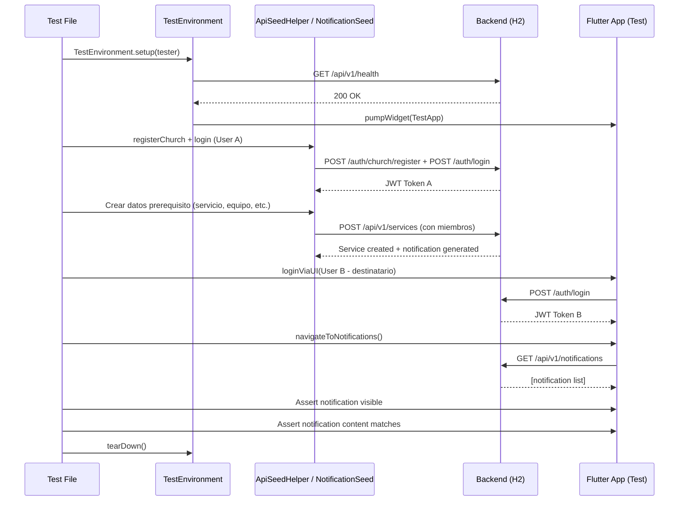

# Documento de Diseño — Tests E2E de Patrol para Sistema de Notificaciones Push

## Visión General

Este diseño describe la implementación de una suite de tests E2E con Patrol que valida el sistema de notificaciones push real de WorshipHub. Los tests reemplazan la suite existente basada en datos mock (`integration_test/tests/notifications/notifications_test.dart`) con tests que ejercitan el backend real (localhost:9090 con H2 in-memory).

La suite cubre: registro/desregistro de token FCM, visualización de notificaciones reales, marcado como leídas, deep linking por tipo, preferencias filtradas por rol, polling de chat, banner in-app, badge de conteo, y flujos de notificación por cada tipo de evento disparador (asignación a servicio, chat, comentarios, cambios de equipo, cancelación, servicios recurrentes, canciones, invitaciones, disponibilidad, setlists, attachments).

### Decisiones de Diseño Clave

1. **Un archivo por flujo de test**: Cada test reside en su propio archivo dentro de `integration_test/tests/push_notifications/` para permitir ejecución individual y aislamiento de fallos.

2. **NotificationSeed como seed helper dedicado**: Se crea un nuevo seed helper (`integration_test/seed/notification_seed.dart`) que encapsula la siembra de notificaciones vía API REST, abstrayendo los endpoints `/api/v1/notifications` y los endpoints de dominio que disparan notificaciones (servicios, chat, canciones, equipos, etc.).

3. **FCM Mock como no-op service**: Los tests reutilizan el patrón existente de `_NoOpWebSocketService` — se registra un `MockPushNotificationService` que provee un token simulado sin conexión real a Firebase. Esto permite validar el flujo de registro/desregistro de token sin dependencia de FCM real.

4. **Siembra de notificaciones vía acciones de dominio**: En lugar de insertar notificaciones directamente en la tabla de BD, los tests disparan las acciones de dominio que generan notificaciones (crear servicio con miembros, enviar mensaje de chat, etc.) para validar el flujo end-to-end completo.

5. **Usuarios múltiples para validar exclusión del remitente**: Los tests que validan "el remitente no recibe su propia notificación" crean dos usuarios (admin + miembro) y verifican que solo el destinatario correcto ve la notificación.

6. **AppLocalizations para aserciones de texto**: Siguiendo la regla del steering e2e-testing, todas las aserciones de texto UI usan el sistema de localización. Los textos dinámicos (nombres de servicio, timestamps) se aseveran directamente ya que provienen de fixtures de test.

7. **Polling con pump incremental**: Para tests que dependen de polling de chat o actualización de badge, se usa el patrón de pump incremental (loop con `pump(Duration(seconds: 1))`) en lugar de `pumpAndSettle`.

## Arquitectura

### Diagrama de Estructura de Tests

```mermaid
graph TB
    subgraph "integration_test/tests/push_notifications/"
        T1[fcm_token_registration_test.dart]
        T2[notifications_screen_test.dart]
        T3[mark_as_read_test.dart]
        T4[deep_linking_test.dart]
        T5[notification_preferences_test.dart]
        T6[chat_polling_test.dart]
        T7[in_app_banner_test.dart]
        T8[badge_count_test.dart]
        T9[service_assignment_notification_test.dart]
        T10[chat_message_notification_test.dart]
        T11[song_comment_notification_test.dart]
        T12[team_change_notification_test.dart]
        T13[service_cancellation_notification_test.dart]
        T14[recurring_service_notification_test.dart]
        T15[song_update_notification_test.dart]
        T16[invitation_accepted_notification_test.dart]
        T17[availability_change_notification_test.dart]
        T18[setlist_modification_notification_test.dart]
        T19[song_attachment_notification_test.dart]
        T20[error_handling_test.dart]
        T21[service_reminder_notification_test.dart]
        T22[new_song_notification_test.dart]
    end

    subgraph "integration_test/seed/"
        NS[notification_seed.dart]
        AS[api_seed_helper.dart]
    end

    subgraph "integration_test/mocks/"
        MPS[mock_push_notification_service.dart]
    end

    subgraph "Infraestructura Existente"
        PB[patrol_base.dart]
        TA[test_app.dart]
        H[helpers/]
    end

    T1 --> PB
    T2 --> PB
    T3 --> PB
    T9 --> NS
    T10 --> NS
    NS --> AS
    MPS --> TA
```



### Diagrama de Flujo de un Test Típico



## Componentes e Interfaces

### 1. NotificationSeed — Seed Helper para Notificaciones

Nuevo seed helper que encapsula la creación de datos que disparan notificaciones en el backend.

```dart
// integration_test/seed/notification_seed.dart
class NotificationSeed {
  final ApiSeedHelper _seedHelper;

  NotificationSeed(this._seedHelper);

  /// Siembra N notificaciones no leídas para el usuario actual
  /// creando acciones de dominio que disparan notificaciones.
  Future<List<Map<String, dynamic>>> seedUnreadNotifications({
    required int count,
    String type = 'SERVICE_INVITATION',
  }) async { ... }

  /// Crea un servicio con miembros asignados, disparando
  /// notificación SERVICE_INVITATION para cada miembro.
  Future<Map<String, dynamic>> seedServiceAssignmentNotification({
    required String serviceName,
    required String scheduledDate,
    required String teamId,
    required List<Map<String, String>> memberAssignments,
  }) async { ... }

  /// Envía un mensaje de chat como otro usuario, disparando
  /// notificación CHAT_MESSAGE para los demás miembros del equipo.
  Future<Map<String, dynamic>> seedChatMessageNotification({
    required String teamId,
    required String message,
    required String senderToken, // JWT del remitente
  }) async { ... }

  /// Obtiene las notificaciones del usuario actual vía API.
  Future<List<Map<String, dynamic>>> getNotifications() async { ... }

  /// Marca una notificación como leída vía API.
  Future<void> markAsRead(String notificationId) async { ... }

  /// Marca todas las notificaciones como leídas vía API.
  Future<void> markAllAsRead() async { ... }
}
```

### 2. MockPushNotificationService — Mock de FCM para Tests

Mock que reemplaza `PushNotificationService` en el contexto de test, proveyendo un token simulado sin conexión real a Firebase.

```dart
// integration_test/mocks/mock_push_notification_service.dart
class MockPushNotificationService implements PushNotificationService {
  static const mockToken = 'test-fcm-token-e2e-12345';
  
  bool tokenRegistered = false;
  bool tokenUnregistered = false;
  final List<RemoteMessage> simulatedMessages = [];

  @override
  String? get currentToken => mockToken;

  @override
  bool get isInitialized => true;

  @override
  Future<void> initialize() async {
    tokenRegistered = true;
  }

  @override
  Future<void> unregisterToken() async {
    tokenUnregistered = true;
  }

  /// Simula la llegada de una notificación en primer plano.
  void simulateForegroundMessage(RemoteMessage message) {
    simulatedMessages.add(message);
    _foregroundController.add(message);
  }

  // ... streams y dispose
}
```

### 3. Extensiones a ApiSeedHelper

El `ApiSeedHelper` existente se extiende con métodos para operaciones de notificación:

```dart
// Métodos adicionales en ApiSeedHelper o NotificationSeed

/// Registra un segundo usuario (miembro) en la misma iglesia.
Future<Map<String, dynamic>> registerSecondUser({
  required String email,
  required String password,
  required String firstName,
  required String lastName,
}) async { ... }

/// Login como un usuario específico (para cambiar contexto de usuario).
Future<Map<String, dynamic>> loginAs({
  required String email,
  required String password,
}) async { ... }

/// Crea un comentario en una canción (dispara NEW_COMMENT).
Future<Map<String, dynamic>> createSongComment({
  required String songId,
  required String content,
}) async { ... }

/// Agrega un miembro a un equipo (dispara TEAM_ASSIGNMENT).
Future<Map<String, dynamic>> addTeamMember({
  required String teamId,
  required String userId,
  String role = 'MEMBER',
}) async { ... }

/// Cancela un servicio (dispara SERVICE_CANCELLED).
Future<Map<String, dynamic>> cancelService({
  required String serviceId,
  String? reason,
}) async { ... }

/// Actualiza preferencias de notificación.
Future<Map<String, dynamic>> updateNotificationPreferences({
  required Map<String, bool> preferences,
}) async { ... }

/// Obtiene preferencias de notificación (incluye tipos aplicables al rol).
Future<Map<String, dynamic>> getNotificationPreferences() async { ... }
```

### 4. Integración con TestEnvironment

El `TestEnvironment` existente se extiende para incluir el `NotificationSeed`:

```dart
// En patrol_base.dart — agregar al TestEnvironment
class TestEnvironment {
  // ... campos existentes ...
  
  /// Notification-specific seeding helper.
  final NotificationSeed notificationSeed;
  
  // En setup():
  final notificationSeed = NotificationSeed(seedHelper);
}
```

### 5. Modificación de test_app.dart para Mock de Push

El `createTestApp` se modifica para registrar un `MockPushNotificationService` en lugar del servicio real:

```dart
// En initializeTestDependencies()
sl.registerSingleton<PushNotificationService>(MockPushNotificationService());
```

## Modelos de Datos

### NotificationItem (Entidad de Dominio Existente)

```dart
class NotificationItem {
  final String id;
  final String title;
  final String body;
  final String type;           // SERVICE_INVITATION, CHAT_MESSAGE, etc.
  final bool isRead;
  final DateTime createdAt;
  final String? relatedEntityId; // UUID de la entidad relacionada (servicio, canción, equipo)
}
```

### Estructura de Respuesta API — GET /api/v1/notifications

```json
[
  {
    "id": "uuid",
    "title": "Nueva convocatoria",
    "body": "Has sido asignado al servicio Domingo de Adoración",
    "type": "SERVICE_INVITATION",
    "isRead": false,
    "createdAt": "2024-01-15T10:30:00Z",
    "relatedEntityId": "service-uuid"
  }
]
```

### Estructura de Respuesta API — GET /api/v1/notifications/preferences

```json
{
  "preferences": {
    "serviceAssignments": true,
    "chatMessages": true,
    "songComments": true,
    "teamChanges": true,
    "newSongs": true,
    "serviceReminders": true,
    "invitationResponses": true,
    "setlistChanges": true,
    "serviceCancellations": true,
    "recurringServices": true,
    "songUpdates": true,
    "songDeletions": true,
    "songAttachments": true,
    "invitationAccepted": true,
    "availabilityChanges": true
  },
  "applicableTypes": ["SERVICE_INVITATION", "CHAT_MESSAGE", ...],
  "userRole": "ADMIN"
}
```

### Mapa de Deep Linking (NotificationRouter)

| Tipo de Notificación    | Ruta go_router                    |
|-------------------------|-----------------------------------|
| SERVICE_INVITATION      | /home/calendar                    |
| CHAT_MESSAGE            | /home/chat/{teamId}               |
| NEW_COMMENT             | /home/songs/detail/{songId}       |
| TEAM_CHANGE             | /home/teams/{teamId}              |
| NEW_SONG                | /home/songs/detail/{songId}       |
| SERVICE_REMINDER        | /home/calendar                    |
| SERVICE_CANCELLED       | /home/calendar                    |
| RECURRING_SERVICE       | /home/calendar                    |
| SONG_UPDATED            | /home/songs/detail/{songId}       |
| SONG_DELETED            | /home/songs                       |
| SONG_ATTACHMENT         | /home/songs/detail/{songId}       |
| INVITATION_ACCEPTED     | /home/teams                       |
| AVAILABILITY_CHANGE     | /home/calendar                    |

## Manejo de Errores

### Estrategia de Manejo de Errores en Tests

1. **Backend no disponible**: `TestEnvironment.setup()` ya verifica la salud del backend antes de ejecutar tests. Si el backend no responde, el test falla con un `StateError` descriptivo.

2. **Timeout en operaciones de siembra**: Los seed helpers usan `TestConfig.apiTimeout` (30s por defecto). Si una operación de siembra falla, el test falla con el error HTTP de Dio que incluye el endpoint y status code.

3. **Notificación no generada a tiempo**: Los tests que dependen de notificaciones generadas por acciones de dominio incluyen un `waitForNotification()` con polling incremental (máximo 10 segundos) antes de navegar a la pantalla de notificaciones.

4. **Cleanup entre tests**: Cada test usa datos únicos (timestamps en emails/nombres) y `TestEnvironment.tearDown()` resetea GetIt. La BD H2 in-memory se recrea por test.

5. **Tests de error handling**: Los tests del Requisito 20 simulan errores de red interceptando Dio con un interceptor temporal que retorna errores 500, verificando que la UI muestra estados de error apropiados.

### Patrones de Espera

```dart
/// Espera a que aparezca al menos una notificación en la pantalla.
Future<void> waitForNotification(TestEnvironment env, {
  Duration timeout = const Duration(seconds: 10),
}) async {
  for (int i = 0; i < timeout.inSeconds; i++) {
    await env.tester.pump(const Duration(seconds: 1));
    // Verificar si hay notificaciones visibles (no empty state)
    final hasNotifications = find.byType(ListTile).evaluate().isNotEmpty;
    if (hasNotifications) return;
  }
  throw TimeoutException('No notifications appeared within $timeout');
}
```

## Estrategia de Testing

### Enfoque General

Esta feature ES una suite de tests E2E — no hay código de producción que testear con property-based testing. Los tests validan flujos de integración completos (UI → Backend → UI) con escenarios específicos.

**Por qué PBT no aplica**: Los tests E2E son inherentemente example-based. Cada test valida un escenario específico (crear servicio → verificar notificación aparece → verificar deep link funciona). No hay funciones puras con input/output variable donde 100 iteraciones con inputs aleatorios encontrarían más bugs que 1-3 ejemplos concretos.

### Estrategia de Tests

| Categoría | Archivos | Enfoque |
|-----------|----------|---------|
| Infraestructura FCM | `fcm_token_registration_test.dart` | Verificar registro/desregistro de token mock |
| Pantalla de notificaciones | `notifications_screen_test.dart` | Datos reales del backend, orden, tipos |
| Interacción usuario | `mark_as_read_test.dart`, `deep_linking_test.dart` | Marcado individual/masivo, navegación |
| Preferencias | `notification_preferences_test.dart` | Filtrado por rol, persistencia |
| Chat polling | `chat_polling_test.dart` | Mensajes vía HTTP polling |
| UI components | `in_app_banner_test.dart`, `badge_count_test.dart` | Banner foreground, badge count |
| Flujos por tipo | `service_assignment_notification_test.dart`, etc. | Un test por tipo de notificación |
| Error handling | `error_handling_test.dart` | Errores de red, reintentos |

### Convenciones de Test

1. **Patrón de cada test**:
   ```dart
   patrolTest('descripción', ($) async {
     final env = await TestEnvironment.setup($.tester);
     try {
       // 1. Seed data via API
       // 2. Login via UI
       // 3. Navigate and interact
       // 4. Assert results
     } finally {
       await env.tearDown();
     }
   });
   ```

2. **Datos únicos**: Cada test genera emails/nombres con timestamp para evitar colisiones.

3. **No pumpAndSettle**: Siempre `pump(Duration(...))` con loops incrementales.

4. **AppLocalizations**: Texto UI se asevera vía l10n, texto dinámico (nombres de test data) se asevera directamente.

5. **Multi-usuario**: Tests que validan "remitente no recibe notificación" crean 2 usuarios, siembran la acción con User A, y verifican la notificación en User B.

### Dependencias de Test

- **Patrol**: Framework de E2E testing (ya configurado)
- **Backend H2**: Servidor local con BD in-memory (ya configurado)
- **TestEnvironment**: Setup/teardown existente (se extiende con NotificationSeed)
- **MockPushNotificationService**: Nuevo mock para FCM (no-op con token simulado)

### Orden de Ejecución Recomendado

Los tests son independientes entre sí, pero para desarrollo iterativo se recomienda:
1. Primero: `fcm_token_registration_test.dart` (valida infraestructura mock)
2. Segundo: `notifications_screen_test.dart` (valida integración con backend)
3. Tercero: `mark_as_read_test.dart` + `badge_count_test.dart` (interacción básica)
4. Cuarto: Tests por tipo de notificación (validan cada flujo de dominio)
5. Último: `error_handling_test.dart` (casos edge)
