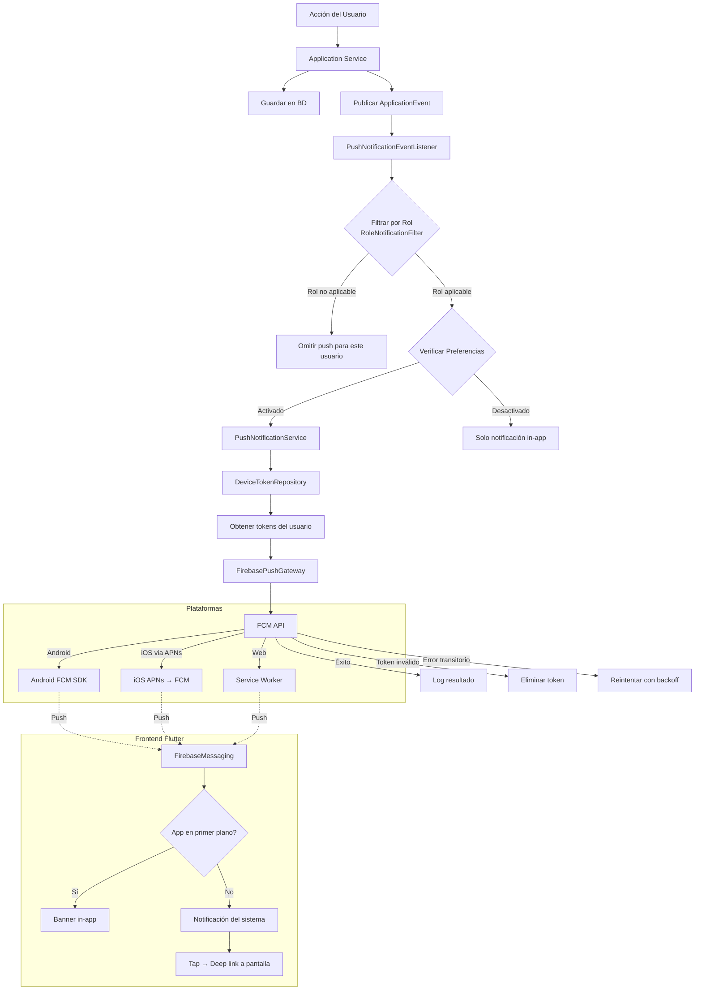
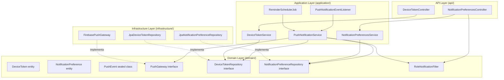
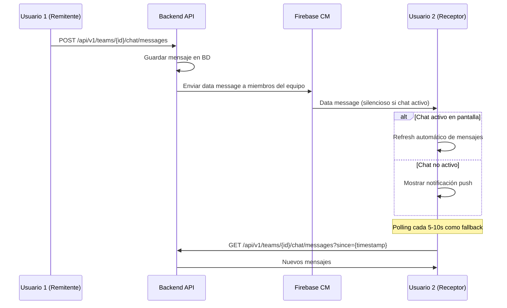

# Documento de Diseño — Sistema de Notificaciones Push

## Visión General

Este diseño describe la integración de Firebase Cloud Messaging (FCM) en WorshipHub para entregar notificaciones push a dispositivos Android, iOS y navegadores web. FCM es el **único mecanismo de entrega push** para todas las plataformas, reemplazando la infraestructura WebSocket/STOMP existente. El sistema conecta los eventos de dominio existentes (asignaciones de servicio, mensajes de chat, comentarios en canciones, cambios de equipo, servicios recurrentes, actualizaciones/eliminaciones de canciones, attachments, aceptación de invitaciones, cambios de disponibilidad, etc.) con FCM a través de un servicio de push asíncrono en el backend, y configura el frontend Flutter para recibir, mostrar y gestionar notificaciones push en las tres plataformas. Adicionalmente, se eliminan las notificaciones mock hardcodeadas del frontend para reemplazarlas con datos reales del backend. El sistema incluye un filtrado por rol de usuario (`Mapa_Notificaciones_Rol`) que garantiza que cada usuario solo reciba notificaciones relevantes a su rol en la iglesia.

### Decisiones de Diseño Clave

1. **FCM como único mecanismo de entrega push**: FCM es el único canal de entrega de notificaciones push para todas las plataformas (Android, iOS y Web). La infraestructura WebSocket/STOMP existente se elimina completamente. El chat en tiempo real se migra a polling con FCM data messages como complemento, eliminando la dependencia de WebSocket.

2. **Spring Application Events como bus de integración**: En lugar de acoplar directamente los servicios de aplicación al servicio de push, se utilizan `ApplicationEventPublisher` de Spring para desacoplar la generación de eventos del envío de notificaciones. Cada servicio de aplicación publica eventos de dominio, y un listener dedicado los traduce a notificaciones push.

3. **Envío asíncrono con `@Async`**: El envío de notificaciones push se ejecuta en un thread pool separado para no bloquear las operaciones principales del usuario. Se usa `@Async` de Spring con un `TaskExecutor` configurado.

4. **Firebase Admin SDK en el módulo `infrastructure`**: Siguiendo Clean Architecture, la integración con Firebase Admin SDK se ubica en el módulo `infrastructure`, exponiendo una interfaz en `domain` que el módulo `application` consume.

5. **Tabla `device_tokens` separada de `notifications`**: Los tokens FCM se almacenan en una tabla dedicada con soporte para múltiples dispositivos por usuario y limpieza automática de tokens inválidos.

6. **Preferencias granulares por tipo de notificación**: Cada usuario puede activar/desactivar tipos específicos de notificación. Las preferencias se verifican antes del envío push, pero la notificación in-app siempre se almacena.

11. **Filtrado por rol de usuario (`RoleNotificationFilter`)**: Se introduce un servicio de dominio `RoleNotificationFilter` que encapsula el `Mapa_Notificaciones_Rol`. Este filtro se aplica como capa adicional DESPUÉS del cálculo de destinatarios y ANTES de la verificación de preferencias. Cada tipo de notificación tiene un conjunto de roles permitidos (Admin recibe todos, Líder_Equipo un subconjunto, Miembro un subconjunto menor). Cuando un usuario tiene múltiples roles, se usa el de mayor jerarquía (Admin > Líder_Equipo > Miembro). La pantalla de preferencias del frontend solo muestra los tipos aplicables al rol actual, y al cambiar de rol, los tipos nuevos se activan por defecto mientras los no aplicables se ocultan (pero se preservan en BD).

7. **Soporte iOS nativo vía APNs a través de FCM**: Los dispositivos iOS reciben notificaciones push a través de Apple Push Notification service (APNs), gestionado automáticamente por FCM. Se configura `ApnsConfig` en cada mensaje FCM destinado a iOS, incluyendo alert, badge y sound. Se implementan categorías de notificación iOS para acciones rápidas (Aceptar/Declinar en asignaciones de servicio).

8. **Eliminación de infraestructura WebSocket/STOMP**: Se eliminan completamente `WebSocketConfig`, `WebSocketAuthInterceptor`, las dependencias `spring-boot-starter-websocket` y `spring-messaging`, y los headers CORS relacionados con WebSocket. El chat en tiempo real se migra a polling periódico con FCM data messages para notificación de nuevos mensajes.

9. **Eliminación de notificaciones mock del frontend**: Se reemplazan todos los datos mock hardcodeados en `NotificationsPage` con llamadas reales al API REST del backend, usando modelos tipados e integración con el BLoC de notificaciones.

10. **Cobertura de tests obligatoria por tipo de notificación**: Cada tipo de notificación debe tener tests unitarios (generación de evento, payload, destinatarios, preferencias) y tests E2E (flujo completo con mock de FCM) antes de considerarse completo.

## Arquitectura

### Diagrama de Flujo General



### Diagrama de Capas



## Componentes e Interfaces

### 1. Domain Layer — Nuevas Entidades e Interfaces

#### PushGateway (Interface)

```kotlin
// domain/collaboration/push/PushGateway.kt
interface PushGateway {
    fun sendToDevice(token: String, notification: PushPayload): PushResult
    fun sendToDevices(tokens: List<String>, notification: PushPayload): List<PushResult>
}

data class PushPayload(
    val title: String,
    val body: String,
    val data: Map<String, String> = emptyMap(),
    val channelId: String? = null,  // Android notification channel
    val badge: Int? = null,         // iOS badge count
    val sound: String? = "default", // iOS/Android sound
    val category: String? = null    // iOS notification category (e.g., "SERVICE_ASSIGNMENT" para acciones rápidas)
)

sealed class PushResult {
    data class Success(val messageId: String) : PushResult()
    data class InvalidToken(val token: String) : PushResult()
    data class TransientError(val token: String, val message: String) : PushResult()
    data class PermanentError(val token: String, val message: String) : PushResult()
}
```

#### PushEvent (Sealed Class para eventos de dominio)

```kotlin
// domain/collaboration/push/PushEvent.kt
sealed class PushEvent {
    abstract val recipientUserIds: List<UUID>
    abstract val notificationType: NotificationType

    data class ServiceAssignment(
        override val recipientUserIds: List<UUID>,
        val serviceName: String,
        val scheduledDate: LocalDateTime,
        val roles: Map<UUID, String>  // userId -> role
    ) : PushEvent() {
        override val notificationType = NotificationType.SERVICE_INVITATION
    }

    data class ChatMessage(
        override val recipientUserIds: List<UUID>,
        val senderName: String,
        val teamName: String,
        val messageExcerpt: String,
        val teamId: UUID
    ) : PushEvent() {
        override val notificationType = NotificationType.TEAM_ASSIGNMENT
    }

    data class SongComment(
        override val recipientUserIds: List<UUID>,
        val commenterName: String,
        val songTitle: String,
        val commentExcerpt: String,
        val songId: UUID
    ) : PushEvent() {
        override val notificationType = NotificationType.NEW_COMMENT
    }

    data class TeamMemberChange(
        override val recipientUserIds: List<UUID>,
        val teamName: String,
        val changeDescription: String,
        val teamId: UUID,
        override val notificationType: NotificationType
    ) : PushEvent()

    data class InvitationResponse(
        override val recipientUserIds: List<UUID>,
        val memberName: String,
        val serviceName: String,
        val scheduledDate: LocalDateTime,
        val accepted: Boolean
    ) : PushEvent() {
        override val notificationType = NotificationType.SERVICE_INVITATION
    }

    data class NewSong(
        override val recipientUserIds: List<UUID>,
        val songTitle: String,
        val artist: String?,
        val addedByName: String,
        val songId: UUID
    ) : PushEvent() {
        override val notificationType = NotificationType.NEW_SONG
    }

    data class ChurchInvitation(
        override val recipientUserIds: List<UUID>,
        val churchName: String,
        val offeredRole: String
    ) : PushEvent() {
        override val notificationType = NotificationType.TEAM_ASSIGNMENT
    }

    data class ServiceReminder(
        override val recipientUserIds: List<UUID>,
        val serviceName: String,
        val scheduledDate: LocalDateTime,
        val setlistName: String?,
        val hoursUntil: Int
    ) : PushEvent() {
        override val notificationType = NotificationType.SERVICE_SCHEDULED
    }

    data class SetlistModified(
        override val recipientUserIds: List<UUID>,
        val serviceName: String,
        val scheduledDate: LocalDateTime,
        val changeSummary: String,
        val serviceId: UUID
    ) : PushEvent() {
        override val notificationType = NotificationType.SERVICE_SCHEDULED
    }

    data class ServiceCancelled(
        override val recipientUserIds: List<UUID>,
        val serviceName: String,
        val originalDate: LocalDateTime,
        val reason: String?
    ) : PushEvent() {
        override val notificationType = NotificationType.SERVICE_SCHEDULED
    }

    data class RecurringServiceCreated(
        override val recipientUserIds: List<UUID>,
        val serviceName: String,
        val scheduledDates: List<LocalDateTime>,
        val recurrencePattern: String,  // "WEEKLY", "BIWEEKLY", "MONTHLY"
        val roles: Map<UUID, String>  // userId -> role
    ) : PushEvent() {
        override val notificationType = NotificationType.RECURRING_SERVICE
    }

    data class RecurrenceRuleUpdated(
        override val recipientUserIds: List<UUID>,
        val parentServiceName: String,
        val newRecurrencePattern: String,
        val affectedDates: List<LocalDateTime>,
        val removedDates: List<LocalDateTime> = emptyList()
    ) : PushEvent() {
        override val notificationType = NotificationType.RECURRING_SERVICE
    }

    data class RecurringServiceDeleted(
        override val recipientUserIds: List<UUID>,
        val serviceName: String,
        val affectedDates: List<LocalDateTime>,
        val reason: String?
    ) : PushEvent() {
        override val notificationType = NotificationType.RECURRING_SERVICE
    }

    data class SongUpdated(
        override val recipientUserIds: List<UUID>,
        val songTitle: String,
        val changedFields: List<String>,  // ["key", "bpm", "lyrics", "chords"]
        val updatedByName: String,
        val songId: UUID
    ) : PushEvent() {
        override val notificationType = NotificationType.SONG_UPDATED
    }

    data class SongDeleted(
        override val recipientUserIds: List<UUID>,
        val songTitle: String,
        val deletedByName: String,
        val affectedSetlists: List<String>
    ) : PushEvent() {
        override val notificationType = NotificationType.SONG_DELETED
    }

    data class AttachmentAdded(
        override val recipientUserIds: List<UUID>,
        val songTitle: String,
        val attachmentType: String,  // "YOUTUBE_LINK", "PDF_SHEET", etc.
        val addedByName: String,
        val songId: UUID
    ) : PushEvent() {
        override val notificationType = NotificationType.SONG_ATTACHMENT
    }

    data class InvitationAccepted(
        override val recipientUserIds: List<UUID>,
        val newMemberName: String,
        val newMemberEmail: String,
        val acceptedRole: String
    ) : PushEvent() {
        override val notificationType = NotificationType.INVITATION_ACCEPTED
    }

    data class MemberUnavailable(
        override val recipientUserIds: List<UUID>,
        val memberName: String,
        val unavailableDate: LocalDate,
        val reason: String?
    ) : PushEvent() {
        override val notificationType = NotificationType.AVAILABILITY_CHANGE
    }

    data class MemberAvailableAgain(
        override val recipientUserIds: List<UUID>,
        val memberName: String,
        val previouslyUnavailableDate: LocalDate
    ) : PushEvent() {
        override val notificationType = NotificationType.AVAILABILITY_CHANGE
    }
}
```

#### DeviceTokenRepository (Interface)

```kotlin
// domain/collaboration/repository/DeviceTokenRepository.kt
interface DeviceTokenRepository {
    fun save(deviceToken: DeviceToken): DeviceToken
    fun findByUserId(userId: UUID): List<DeviceToken>
    fun findByToken(token: String): DeviceToken?
    fun deleteByToken(token: String)
    fun deleteByUserIdAndToken(userId: UUID, token: String)
    fun deleteAllByUserId(userId: UUID)
}
```

#### NotificationPreferenceRepository (Interface)

```kotlin
// domain/collaboration/repository/NotificationPreferenceRepository.kt
interface NotificationPreferenceRepository {
    fun save(preference: NotificationPreference): NotificationPreference
    fun findByUserId(userId: UUID): NotificationPreference?
    fun findByUserIdOrDefault(userId: UUID): NotificationPreference
}
```

#### RoleNotificationFilter (Servicio de Dominio)

Servicio de dominio que encapsula la lógica del `Mapa_Notificaciones_Rol`. Define qué tipos de notificación son aplicables a cada rol de usuario y proporciona métodos para filtrar destinatarios y determinar tipos visibles en preferencias.

```kotlin
// domain/collaboration/push/RoleNotificationFilter.kt

enum class UserRole {
    ADMIN, TEAM_LEADER, MEMBER;

    companion object {
        /**
         * Resuelve el rol de mayor jerarquía de una lista de roles.
         * Admin > Líder_Equipo > Miembro
         */
        fun resolveHighest(roles: List<UserRole>): UserRole =
            roles.minByOrNull { it.ordinal } ?: MEMBER
    }
}

object RoleNotificationFilter {

    /**
     * Mapa_Notificaciones_Rol: define qué tipos de notificación son aplicables a cada rol.
     * - Admin: Todos los tipos (R2–R10, R16–R25)
     * - Líder_Equipo: R2, R3, R4, R5, R6, R7, R9, R10, R16, R17–R19, R20, R21, R22, R24, R25
     * - Miembro: R2, R3, R4, R7, R9, R10, R16, R17–R19, R20, R21, R22
     */
    private val roleNotificationMap: Map<UserRole, Set<NotificationType>> = mapOf(
        UserRole.ADMIN to NotificationType.entries.toSet(),

        UserRole.TEAM_LEADER to setOf(
            NotificationType.SERVICE_INVITATION,       // R2
            NotificationType.CHAT_MESSAGE,             // R3 (mapped via TEAM_ASSIGNMENT)
            NotificationType.NEW_COMMENT,              // R4
            NotificationType.TEAM_MEMBER_ADDED,        // R5
            NotificationType.TEAM_MEMBER_REMOVED,      // R5
            NotificationType.TEAM_LEADER_CHANGED,      // R5
            NotificationType.TEAM_ROLE_CHANGED,        // R5
            NotificationType.TEAM_ASSIGNMENT,          // R5/R6
            NotificationType.NEW_SONG,                 // R7
            NotificationType.SERVICE_SCHEDULED,        // R9/R10
            NotificationType.SERVICE_CANCELLED,        // R16 (mapped via SERVICE_SCHEDULED)
            NotificationType.RECURRING_SERVICE,        // R17–R19
            NotificationType.SONG_UPDATED,             // R20
            NotificationType.SONG_DELETED,             // R21
            NotificationType.SONG_ATTACHMENT,          // R22
            NotificationType.AVAILABILITY_CHANGE,      // R24, R25
        ),

        UserRole.MEMBER to setOf(
            NotificationType.SERVICE_INVITATION,       // R2
            NotificationType.CHAT_MESSAGE,             // R3 (mapped via TEAM_ASSIGNMENT)
            NotificationType.NEW_COMMENT,              // R4
            NotificationType.NEW_SONG,                 // R7
            NotificationType.SERVICE_SCHEDULED,        // R9/R10
            NotificationType.SERVICE_CANCELLED,        // R16 (mapped via SERVICE_SCHEDULED)
            NotificationType.RECURRING_SERVICE,        // R17–R19
            NotificationType.SONG_UPDATED,             // R20
            NotificationType.SONG_DELETED,             // R21
            NotificationType.SONG_ATTACHMENT,          // R22
        )
    )

    /**
     * Determina si un tipo de notificación es aplicable para un rol dado.
     */
    fun isApplicableForRole(notificationType: NotificationType, role: UserRole): Boolean =
        roleNotificationMap[role]?.contains(notificationType) ?: false

    /**
     * Retorna el conjunto de tipos de notificación aplicables para un rol dado.
     */
    fun getApplicableTypes(role: UserRole): Set<NotificationType> =
        roleNotificationMap[role] ?: emptySet()

    /**
     * Filtra una lista de userIds, eliminando aquellos cuyo rol no permite
     * recibir el tipo de notificación dado.
     * 
     * @param userIds Lista de IDs de usuarios candidatos
     * @param notificationType Tipo de notificación a enviar
     * @param roleResolver Función que resuelve el rol efectivo (mayor jerarquía) de un usuario
     * @return Lista filtrada de userIds cuyos roles permiten el tipo de notificación
     */
    fun filterByRole(
        userIds: List<UUID>,
        notificationType: NotificationType,
        roleResolver: (UUID) -> UserRole
    ): List<UUID> =
        userIds.filter { userId ->
            isApplicableForRole(notificationType, roleResolver(userId))
        }
}
```

### 2. Application Layer — Servicios

#### PushNotificationService

Servicio central que orquesta el envío de notificaciones push. Recibe un `PushEvent`, filtra destinatarios por rol de usuario (`RoleNotificationFilter`), verifica preferencias del usuario, obtiene tokens de dispositivos, y delega el envío al `PushGateway`. El flujo es: recipientUserIds → **filtrar por rol** → guardar notificación in-app → verificar preferencias → obtener tokens → enviar push.

```kotlin
// application/notification/PushNotificationService.kt
@Service
class PushNotificationService(
    private val pushGateway: PushGateway,
    private val deviceTokenRepository: DeviceTokenRepository,
    private val notificationPreferenceRepository: NotificationPreferenceRepository,
    private val notificationApplicationService: NotificationApplicationService,
    private val userRoleResolver: UserRoleResolver  // Resuelve el rol efectivo del usuario
) {
    @Async("pushNotificationExecutor")
    fun processPushEvent(event: PushEvent) {
        // 1. Filtrar destinatarios por rol (Mapa_Notificaciones_Rol)
        val roleFilteredRecipients = RoleNotificationFilter.filterByRole(
            userIds = event.recipientUserIds,
            notificationType = event.notificationType,
            roleResolver = { userId -> userRoleResolver.resolveEffectiveRole(userId) }
        )

        for (userId in roleFilteredRecipients) {
            // 2. Siempre guardar notificación in-app
            val payload = event.toPayload(userId)
            notificationApplicationService.sendNotification(
                userId, payload.title, payload.body, event.notificationType
            )
            
            // 3. Verificar preferencias antes de enviar push
            val prefs = notificationPreferenceRepository.findByUserIdOrDefault(userId)
            if (!prefs.isEnabled(event.notificationType)) continue
            
            // 4. Obtener tokens y enviar
            val tokens = deviceTokenRepository.findByUserId(userId)
            if (tokens.isEmpty()) continue
            
            val results = pushGateway.sendToDevices(
                tokens.map { it.token }, payload
            )
            
            // 5. Limpiar tokens inválidos
            results.filterIsInstance<PushResult.InvalidToken>()
                .forEach { deviceTokenRepository.deleteByToken(it.token) }
        }
    }
}
```

#### UserRoleResolver

Servicio auxiliar que resuelve el rol efectivo de un usuario, aplicando la jerarquía Admin > Líder_Equipo > Miembro cuando el usuario tiene múltiples roles.

```kotlin
// application/notification/UserRoleResolver.kt
@Service
class UserRoleResolver(
    private val churchMemberRepository: ChurchMemberRepository,
    private val teamMemberRepository: TeamMemberRepository
) {
    /**
     * Resuelve el rol efectivo (mayor jerarquía) de un usuario.
     * Si el usuario es Admin en alguna iglesia → ADMIN
     * Si el usuario es líder de algún equipo → TEAM_LEADER
     * En caso contrario → MEMBER
     */
    fun resolveEffectiveRole(userId: UUID): UserRole {
        val churchRoles = churchMemberRepository.findRolesByUserId(userId)
        if (churchRoles.any { it.isAdmin() }) return UserRole.ADMIN
        
        val teamRoles = teamMemberRepository.findRolesByUserId(userId)
        if (teamRoles.any { it.isLeader() }) return UserRole.TEAM_LEADER
        
        return UserRole.MEMBER
    }
}
```

#### PushNotificationEventListener

Listener de Spring Application Events que captura eventos publicados por los servicios de aplicación y los delega al `PushNotificationService`.

```kotlin
// application/notification/PushNotificationEventListener.kt
@Component
class PushNotificationEventListener(
    private val pushNotificationService: PushNotificationService
) {
    @EventListener
    fun handlePushEvent(event: PushEvent) {
        pushNotificationService.processPushEvent(event)
    }
}
```

#### DeviceTokenService

```kotlin
// application/notification/DeviceTokenService.kt
@Service
class DeviceTokenService(
    private val deviceTokenRepository: DeviceTokenRepository
) {
    fun registerToken(userId: UUID, token: String, platform: DevicePlatform): Result<UUID>
    fun unregisterToken(userId: UUID, token: String): Result<Unit>
    fun unregisterAllTokens(userId: UUID): Result<Unit>
}
```

#### NotificationPreferencesService

```kotlin
// application/notification/NotificationPreferencesService.kt
@Service
class NotificationPreferencesService(
    private val notificationPreferenceRepository: NotificationPreferenceRepository,
    private val userRoleResolver: UserRoleResolver
) {
    fun getPreferences(userId: UUID): Result<NotificationPreferenceResponse> {
        val prefs = notificationPreferenceRepository.findByUserIdOrDefault(userId)
        val effectiveRole = userRoleResolver.resolveEffectiveRole(userId)
        val applicableTypes = RoleNotificationFilter.getApplicableTypes(effectiveRole)
        return Result.success(NotificationPreferenceResponse(prefs, applicableTypes))
    }
    fun updatePreferences(userId: UUID, command: UpdatePreferencesCommand): Result<NotificationPreference>

    /**
     * Llamado cuando el rol de un usuario cambia. Activa por defecto los tipos
     * de notificación recién disponibles para el nuevo rol.
     */
    fun onRoleChanged(userId: UUID, newRole: UserRole) {
        val prefs = notificationPreferenceRepository.findByUserIdOrDefault(userId)
        val previousApplicable = RoleNotificationFilter.getApplicableTypes(
            userRoleResolver.resolveEffectiveRole(userId) // rol anterior
        )
        val newApplicable = RoleNotificationFilter.getApplicableTypes(newRole)
        val newlyAvailable = newApplicable - previousApplicable
        
        // Activar por defecto los tipos recién disponibles
        if (newlyAvailable.isNotEmpty()) {
            val updatedPrefs = prefs.enableTypes(newlyAvailable)
            notificationPreferenceRepository.save(updatedPrefs)
        }
        // Las preferencias de tipos no aplicables se conservan en BD pero no se muestran
    }
}

/**
 * DTO de respuesta que incluye las preferencias del usuario y los tipos aplicables a su rol.
 */
data class NotificationPreferenceResponse(
    val preferences: NotificationPreference,
    val applicableTypes: Set<NotificationType>
) {
    /**
     * Retorna solo las preferencias visibles para el rol actual del usuario.
     * Los tipos no aplicables se ocultan en la respuesta pero se preservan en BD.
     */
    fun getVisiblePreferences(): Map<NotificationType, Boolean> =
        applicableTypes.associateWith { type -> preferences.isEnabled(type) }
}
```

#### ReminderSchedulerJob

Job programado con `@Scheduled` que busca servicios próximos y genera eventos de recordatorio.

```kotlin
// application/notification/ReminderSchedulerJob.kt
@Component
class ReminderSchedulerJob(
    private val serviceEventRepository: ServiceEventRepository,
    private val applicationEventPublisher: ApplicationEventPublisher
) {
    @Scheduled(fixedRate = 900_000) // Cada 15 minutos
    fun checkUpcomingServices() {
        // Buscar servicios en las próximas 24h y 2h
        // Publicar PushEvent.ServiceReminder para cada uno
    }
}
```

### 3. API Layer — Controllers

#### DeviceTokenController

```
POST   /api/v1/devices/token          → Registrar token FCM
DELETE /api/v1/devices/token           → Desregistrar token FCM (logout)
```

#### NotificationPreferencesController

```
GET    /api/v1/notifications/preferences     → Obtener preferencias (incluye tipos aplicables al rol)
PUT    /api/v1/notifications/preferences     → Actualizar preferencias
```

La respuesta del endpoint GET incluye un campo `applicableTypes` que indica qué tipos de notificación son visibles para el rol actual del usuario. El frontend usa este campo para filtrar los toggles mostrados en la pantalla de preferencias.

**Ejemplo de respuesta GET:**
```json
{
  "preferences": {
    "serviceAssignments": true,
    "chatMessages": true,
    "songComments": true,
    "teamChanges": true,
    "newSongs": true,
    "serviceReminders": true,
    "invitationResponses": true,
    "setlistChanges": true,
    "serviceCancellations": true,
    "recurringServices": true,
    "songUpdates": true,
    "songDeletions": true,
    "songAttachments": true,
    "invitationAccepted": true,
    "availabilityChanges": true
  },
  "applicableTypes": [
    "SERVICE_INVITATION", "CHAT_MESSAGE", "NEW_COMMENT",
    "NEW_SONG", "SERVICE_SCHEDULED", "RECURRING_SERVICE",
    "SONG_UPDATED", "SONG_DELETED", "SONG_ATTACHMENT"
  ],
  "userRole": "MEMBER"
}
```

### 4. Infrastructure Layer — Implementaciones

#### FirebasePushGateway

Implementación de `PushGateway` usando Firebase Admin SDK. Maneja reintentos con backoff exponencial para errores transitorios.

```kotlin
// infrastructure/push/FirebasePushGateway.kt
@Component
class FirebasePushGateway(
    private val firebaseMessaging: FirebaseMessaging
) : PushGateway {
    
    override fun sendToDevice(token: String, notification: PushPayload): PushResult {
        val message = Message.builder()
            .setToken(token)
            .setNotification(Notification.builder()
                .setTitle(notification.title)
                .setBody(notification.body)
                .build())
            .putAllData(notification.data)
            .setAndroidConfig(AndroidConfig.builder()
                .setNotification(AndroidNotification.builder()
                    .setChannelId(notification.channelId ?: "default")
                    .setSound(notification.sound ?: "default")
                    .build())
                .build())
            .setApnsConfig(ApnsConfig.builder()
                .setAps(Aps.builder()
                    .setAlert(ApsAlert.builder()
                        .setTitle(notification.title)
                        .setBody(notification.body)
                        .build())
                    .setBadge(notification.badge ?: 1)
                    .setSound(notification.sound ?: "default")
                    .setCategory(notification.category)
                    .build())
                .build())
            .setWebpushConfig(WebpushConfig.builder()
                .setNotification(WebpushNotification.builder()
                    .setIcon("/icons/icon-192x192.png")
                    .build())
                .build())
            .build()
        
        return try {
            val messageId = firebaseMessaging.send(message)
            PushResult.Success(messageId)
        } catch (e: FirebaseMessagingException) {
            when (e.messagingErrorCode) {
                MessagingErrorCode.UNREGISTERED,
                MessagingErrorCode.INVALID_ARGUMENT -> PushResult.InvalidToken(token)
                MessagingErrorCode.UNAVAILABLE,
                MessagingErrorCode.INTERNAL -> PushResult.TransientError(token, e.message ?: "")
                else -> PushResult.PermanentError(token, e.message ?: "")
            }
        }
    }
    
    override fun sendToDevices(tokens: List<String>, notification: PushPayload): List<PushResult> {
        return tokens.map { sendToDevice(it, notification) }
    }
}
```

**Retry con backoff exponencial**: Para `PushResult.TransientError`, el `PushNotificationService` reintenta hasta 3 veces con delays de 1s, 2s, 4s usando `@Retryable` de Spring Retry o lógica manual con `delay()`.

### 5. Frontend Flutter — Componentes

#### PushNotificationService (Flutter)

Servicio singleton registrado en GetIt que inicializa `FirebaseMessaging`, solicita permisos, gestiona tokens y maneja la recepción de notificaciones.

```dart
// core/services/push_notification_service.dart
class PushNotificationService {
  final FirebaseMessaging _messaging = FirebaseMessaging.instance;
  final DeviceTokenRemoteDataSource _remoteDataSource;
  
  Future<void> initialize() async {
    // 1. Solicitar permisos
    final settings = await _messaging.requestPermission(
      alert: true, badge: true, sound: true,
    );
    
    // 2. Obtener y registrar token
    if (settings.authorizationStatus == AuthorizationStatus.authorized) {
      final token = await _messaging.getToken(
        vapidKey: 'VAPID_KEY_FOR_WEB', // Solo para web
      );
      if (token != null) await _registerToken(token);
    }
    
    // 3. Escuchar refresh de token
    _messaging.onTokenRefresh.listen(_registerToken);
    
    // 4. Configurar handlers
    FirebaseMessaging.onMessage.listen(_handleForegroundMessage);
    FirebaseMessaging.onMessageOpenedApp.listen(_handleNotificationTap);
    FirebaseMessaging.onBackgroundMessage(_backgroundHandler);
  }
}
```

#### Canales de Notificación Android

Se configuran 4 canales en el `AndroidManifest.xml` y programáticamente:

| Canal ID | Nombre | Descripción |
|----------|--------|-------------|
| `services` | Servicios | Asignaciones, recordatorios, cancelaciones, servicios recurrentes |
| `chat` | Chat | Mensajes de equipo |
| `team` | Equipo | Cambios de miembros, roles, invitaciones aceptadas, disponibilidad |
| `songs` | Canciones | Nuevas canciones, comentarios, actualizaciones, eliminaciones, attachments |

#### Service Worker (Web Push)

```javascript
// web/firebase-messaging-sw.js
importScripts('https://www.gstatic.com/firebasejs/10.7.0/firebase-app-compat.js');
importScripts('https://www.gstatic.com/firebasejs/10.7.0/firebase-messaging-compat.js');

firebase.initializeApp({ /* config */ });
const messaging = firebase.messaging();

messaging.onBackgroundMessage((payload) => {
  const { title, body } = payload.notification;
  self.registration.showNotification(title, {
    body, icon: '/icons/icon-192x192.png',
    data: payload.data
  });
});
```

#### Deep Linking desde Notificaciones

El campo `data` del payload FCM incluye `type` y `entityId` que el router de Flutter usa para navegar:

| Tipo | Ruta |
|------|------|
| `SERVICE_INVITATION` | `/calendar/service/{serviceId}` |
| `CHAT_MESSAGE` | `/teams/{teamId}/chat` |
| `NEW_COMMENT` | `/songs/{songId}` |
| `TEAM_CHANGE` | `/teams/{teamId}` |
| `NEW_SONG` | `/songs/{songId}` |
| `SERVICE_REMINDER` | `/calendar/service/{serviceId}` |
| `SERVICE_CANCELLED` | `/calendar` |
| `RECURRING_SERVICE` | `/calendar` |
| `SONG_UPDATED` | `/songs/{songId}` |
| `SONG_DELETED` | `/songs` |
| `SONG_ATTACHMENT` | `/songs/{songId}` |
| `INVITATION_ACCEPTED` | `/teams` |
| `AVAILABILITY_CHANGE` | `/calendar/availability` |

### 6. Soporte iOS — Configuración APNs y Categorías

#### Configuración APNs en el Backend

El `FirebasePushGateway` incluye `ApnsConfig` en cada mensaje FCM, configurando:
- **alert**: Título y cuerpo de la notificación
- **badge**: Contador de notificaciones no leídas
- **sound**: Sonido de notificación (`"default"` por defecto)
- **category**: Categoría de notificación iOS para acciones rápidas

#### Categorías de Notificación iOS

Se registran categorías de notificación en el frontend Flutter para habilitar acciones rápidas:

```dart
// core/services/ios_notification_categories.dart
import 'package:flutter_local_notifications/flutter_local_notifications.dart';

final List<DarwinNotificationCategory> iosNotificationCategories = [
  DarwinNotificationCategory(
    'SERVICE_ASSIGNMENT',
    actions: [
      DarwinNotificationAction.plain('ACCEPT_ACTION', 'Aceptar'),
      DarwinNotificationAction.destructive('DECLINE_ACTION', 'Declinar'),
    ],
  ),
];
```

#### Permisos iOS (UNUserNotificationCenter)

En iOS, el `PushNotificationService` de Flutter solicita permisos mediante el diálogo nativo de iOS al primer inicio de sesión:

```dart
// Dentro de PushNotificationService.initialize()
final settings = await _messaging.requestPermission(
  alert: true,
  badge: true,
  sound: true,
  provisional: false,  // Solicitar permiso explícito en iOS
);
```

#### Interceptación en Primer Plano (iOS)

En iOS, cuando la app está en primer plano, se intercepta la notificación usando `FirebaseMessaging.onMessage` y se muestra un banner in-app personalizado en lugar de la notificación del sistema, igual que en Android.

### 7. Migración de WebSocket/STOMP a FCM

#### Archivos y Clases a Eliminar

La migración requiere eliminar completamente la infraestructura WebSocket/STOMP:

| Archivo/Clase | Ubicación | Razón de Eliminación |
|---------------|-----------|---------------------|
| `WebSocketConfig.kt` | `api/src/main/kotlin/com/worshiphub/config/` | Configuración de WebSocket/STOMP ya no necesaria |
| `WebSocketAuthInterceptor.kt` | `api/src/main/kotlin/com/worshiphub/security/` | Interceptor de autenticación WebSocket ya no necesario |

#### Dependencias a Eliminar de `build.gradle.kts`

```kotlin
// ELIMINAR estas dependencias:
// implementation("org.springframework.boot:spring-boot-starter-websocket")
// implementation("org.springframework:spring-messaging")
```

#### Headers CORS a Eliminar de `CorsConfig`

Eliminar los siguientes headers de la configuración CORS que solo eran necesarios para WebSocket:

```kotlin
// ELIMINAR de CorsConfig.kt:
// "Upgrade"
// "Connection"
// "Sec-WebSocket-Key"
// "Sec-WebSocket-Version"
// "Sec-WebSocket-Extensions"
```

#### Chat en Tiempo Real Post-Migración

Con la eliminación de WebSocket/STOMP, el chat en tiempo real se implementa mediante:

1. **Polling periódico**: El frontend consulta el endpoint REST de mensajes de chat cada N segundos (configurable, recomendado 5-10s) cuando la pantalla de chat está activa.
2. **FCM data messages**: Cuando un nuevo mensaje de chat llega, se envía un FCM data message silencioso que dispara un refresh del chat si la pantalla está activa, o muestra una notificación push si no lo está.



### 8. Eliminación de Notificaciones Mock del Frontend

#### Cambios en `NotificationsPage`

Se eliminan todos los datos mock hardcodeados y se reemplazan con integración real:

**Antes (Mock):**
```dart
// ELIMINAR: datos hardcodeados
final List<Map<String, dynamic>> mockNotifications = [
  {'title': 'Nuevo servicio', 'body': '...', 'date': '...'},
  // ... más datos mock
];
```

**Después (Real):**
```dart
// Integración con BLoC de notificaciones
class NotificationsPage extends StatelessWidget {
  @override
  Widget build(BuildContext context) {
    return BlocBuilder<NotificationsBloc, NotificationsState>(
      builder: (context, state) {
        return switch (state) {
          NotificationsLoading() => const Center(child: CircularProgressIndicator()),
          NotificationsError(:final message) => ErrorWidget(message: message),
          NotificationsEmpty() => const EmptyNotificationsWidget(),
          NotificationsLoaded(:final notifications) => NotificationsList(
            notifications: notifications,
          ),
        };
      },
    );
  }
}
```

#### Modelos Tipados

Se reemplaza `Map<String, dynamic>` con modelos tipados que corresponden a la respuesta del API:

```dart
// domain/entities/notification_item.dart
class NotificationItem {
  final String id;
  final String title;
  final String body;
  final String type;          // NotificationType
  final DateTime createdAt;
  final bool isRead;
  final String? relatedEntityId;
  final String? relatedEntityType;
  
  const NotificationItem({
    required this.id,
    required this.title,
    required this.body,
    required this.type,
    required this.createdAt,
    required this.isRead,
    this.relatedEntityId,
    this.relatedEntityType,
  });
  
  factory NotificationItem.fromJson(Map<String, dynamic> json) => NotificationItem(
    id: json['id'] as String,
    title: json['title'] as String,
    body: json['body'] as String,
    type: json['type'] as String,
    createdAt: DateTime.parse(json['createdAt'] as String),
    isRead: json['isRead'] as bool,
    relatedEntityId: json['relatedEntityId'] as String?,
    relatedEntityType: json['relatedEntityType'] as String?,
  );
}
```

#### Estado Vacío

Cuando no existen notificaciones, se muestra un widget de estado vacío:

```dart
// presentation/features/notifications/widgets/empty_notifications_widget.dart
class EmptyNotificationsWidget extends StatelessWidget {
  @override
  Widget build(BuildContext context) {
    return Center(
      child: Column(
        mainAxisAlignment: MainAxisAlignment.center,
        children: [
          Icon(Icons.notifications_none, size: 64, color: Colors.grey),
          const SizedBox(height: 16),
          Text(
            'No tienes notificaciones',
            style: Theme.of(context).textTheme.titleMedium,
          ),
          const SizedBox(height: 8),
          Text(
            'Las notificaciones de servicios, chat y equipo aparecerán aquí',
            style: Theme.of(context).textTheme.bodyMedium?.copyWith(color: Colors.grey),
            textAlign: TextAlign.center,
          ),
        ],
      ),
    );
  }
}
```

### 9. Arquitectura de Testing Comprehensiva

#### Estructura de Tests Unitarios por Tipo de Notificación

Cada tipo de notificación (Requisitos 2-25) debe tener tests unitarios que cubran:

1. **Generación del evento push**: Verificar que la acción del usuario genera el `PushEvent` correcto
2. **Construcción del payload**: Verificar que `PushPayload` contiene título, cuerpo, data map y campos específicos del tipo
3. **Cálculo de destinatarios**: Verificar que `recipientUserIds` incluye/excluye los usuarios correctos
4. **Filtrado por preferencias**: Verificar que se respetan las preferencias del usuario

```kotlin
// Ejemplo de estructura de test unitario para un tipo de notificación
@Test
fun `ServiceAssignment genera payload con nombre, fecha y rol`() {
    val event = PushEvent.ServiceAssignment(
        recipientUserIds = listOf(userId),
        serviceName = "Servicio Dominical",
        scheduledDate = LocalDateTime.of(2025, 1, 15, 10, 0),
        roles = mapOf(userId to "Guitarrista")
    )
    val payload = event.toPayload(userId)
    
    assertThat(payload.title).contains("Servicio Dominical")
    assertThat(payload.body).contains("Guitarrista")
    assertThat(payload.data["type"]).isEqualTo("SERVICE_INVITATION")
    assertThat(payload.data["entityId"]).isNotNull()
}
```

#### Tabla de Tests Unitarios por Tipo de Notificación

| Tipo (Requisito) | Evento Push | Payload | Destinatarios | Preferencias | Roles Aplicables |
|-------------------|-------------|---------|---------------|--------------|------------------|
| Asignación a servicio (R2) | ✓ | nombre, fecha, rol | miembros asignados | serviceAssignments | Admin, Líder, Miembro |
| Mensaje de chat (R3) | ✓ | remitente, equipo, extracto | equipo \ remitente | chatMessages | Admin, Líder, Miembro |
| Comentario en canción (R4) | ✓ | comentarista, canción, extracto | creador ∪ comentaristas \ actor | songComments | Admin, Líder, Miembro |
| Cambio de equipo (R5) | ✓ | equipo, descripción | todos los miembros | teamChanges | Admin, Líder |
| Respuesta a invitación (R6) | ✓ | miembro, servicio, aceptado | líder del equipo | serviceAssignments | Admin, Líder |
| Nueva canción (R7) | ✓ | título, artista, agregador | iglesia \ creador | newSongs | Admin, Líder, Miembro |
| Invitación a iglesia (R8) | ✓ | iglesia, rol | usuario invitado | teamChanges | Admin |
| Recordatorio de servicio (R9) | ✓ | servicio, hora, setlist | miembros aceptados | serviceReminders | Admin, Líder, Miembro |
| Modificación de setlist (R10) | ✓ | servicio, fecha, cambio | miembros asignados | setlistChanges | Admin, Líder, Miembro |
| Cancelación de servicio (R16) | ✓ | servicio, fecha, motivo | miembros asignados | serviceCancellations | Admin, Líder, Miembro |
| Servicio recurrente creado (R17) | ✓ | servicio, fechas, patrón | miembros \ programador | recurringServices | Admin, Líder, Miembro |
| Regla recurrencia actualizada (R18) | ✓ | servicio, patrón, fechas | miembros afectados \ actor | recurringServices | Admin, Líder, Miembro |
| Servicio recurrente eliminado (R19) | ✓ | servicio, fechas, motivo | miembros \ eliminador | recurringServices | Admin, Líder, Miembro |
| Canción actualizada (R20) | ✓ | canción, campos, actualizador | setlists futuros \ actor | songUpdates | Admin, Líder, Miembro |
| Canción eliminada (R21) | ✓ | canción, eliminador, setlists | setlists afectados \ actor | songDeletions | Admin, Líder, Miembro |
| Attachment agregado (R22) | ✓ | canción, tipo, agregador | creador ∪ comentaristas \ actor | songAttachments | Admin, Líder, Miembro |
| Invitación aceptada (R23) | ✓ | miembro, email, rol | admin invitador | invitationAccepted | Admin |
| Indisponibilidad (R24) | ✓ | miembro, fecha, motivo | líderes del equipo | availabilityChanges | Admin, Líder |
| Disponible de nuevo (R25) | ✓ | miembro, fecha | líderes del equipo | availabilityChanges | Admin, Líder |

#### Infraestructura de Tests E2E

Los tests E2E verifican el flujo completo desde la acción del usuario hasta la entrega push, usando un mock de FCM:

```kotlin
// Configuración del mock de FCM para tests E2E
@TestConfiguration
class TestFcmConfig {
    @Bean
    @Primary
    fun mockPushGateway(): PushGateway = MockPushGateway()
}

class MockPushGateway : PushGateway {
    val sentMessages = mutableListOf<Pair<String, PushPayload>>()
    
    override fun sendToDevice(token: String, notification: PushPayload): PushResult {
        sentMessages.add(token to notification)
        return PushResult.Success("mock-message-id-${sentMessages.size}")
    }
    
    override fun sendToDevices(tokens: List<String>, notification: PushPayload): List<PushResult> {
        return tokens.map { sendToDevice(it, notification) }
    }
    
    fun reset() = sentMessages.clear()
    
    fun findByType(type: String): List<Pair<String, PushPayload>> =
        sentMessages.filter { it.second.data["type"] == type }
}
```

#### Estructura de Tests E2E por Tipo de Notificación

Cada test E2E sigue el patrón:

1. **Setup**: Crear datos de prueba (usuarios, equipos, servicios, tokens de dispositivo)
2. **Action**: Ejecutar la acción disparadora vía API REST
3. **Verify DB**: Verificar que la notificación in-app se creó en la base de datos
4. **Verify FCM**: Verificar que el mock de FCM recibió el mensaje con el payload correcto
5. **Verify Recipients**: Verificar que los destinatarios correctos recibieron la notificación

```kotlin
// Ejemplo de test E2E para asignación a servicio
@SpringBootTest(webEnvironment = SpringBootTest.WebEnvironment.RANDOM_PORT)
@AutoConfigureMockMvc
class ServiceAssignmentNotificationE2ETest {
    
    @Autowired lateinit var mockMvc: MockMvc
    @Autowired lateinit var mockPushGateway: MockPushGateway
    @Autowired lateinit var deviceTokenRepository: DeviceTokenRepository
    @Autowired lateinit var notificationRepository: NotificationRepository
    
    @BeforeEach
    fun setup() {
        mockPushGateway.reset()
        // Crear usuario, equipo, tokens de dispositivo
    }
    
    @Test
    fun `asignar miembro a servicio genera notificación push correcta`() {
        // 1. Setup: registrar token de dispositivo para el miembro
        deviceTokenRepository.save(DeviceToken(
            userId = memberId, token = "fcm-token-123", platform = DevicePlatform.ANDROID
        ))
        
        // 2. Action: crear servicio y asignar miembro vía API
        mockMvc.perform(post("/api/v1/services")
            .contentType(MediaType.APPLICATION_JSON)
            .content("""{"name": "Servicio Dominical", ...}"""))
            .andExpect(status().isCreated)
        
        // 3. Verify: esperar procesamiento asíncrono
        await().atMost(5, TimeUnit.SECONDS).untilAsserted {
            // Verificar notificación in-app en BD
            val notifications = notificationRepository.findByUserId(memberId)
            assertThat(notifications).hasSize(1)
            assertThat(notifications[0].type).isEqualTo(NotificationType.SERVICE_INVITATION)
            
            // Verificar mensaje FCM enviado
            val fcmMessages = mockPushGateway.findByType("SERVICE_INVITATION")
            assertThat(fcmMessages).hasSize(1)
            assertThat(fcmMessages[0].second.title).contains("Servicio Dominical")
        }
    }
}
```

#### Cobertura Requerida

Cada tipo de notificación (Requisitos 2-25) debe tener:
- **Mínimo 1 test unitario** cubriendo el escenario principal
- **Mínimo 1 test E2E** cubriendo el flujo completo
- Tests adicionales para edge cases específicos del tipo

## Modelos de Datos

### Nuevas Tablas (Flyway V14)

#### Tabla `device_tokens`

```sql
CREATE TABLE device_tokens (
    id UUID DEFAULT uuid_generate_v4() PRIMARY KEY,
    user_id UUID NOT NULL REFERENCES users(id) ON DELETE CASCADE,
    token VARCHAR(500) NOT NULL,
    platform VARCHAR(20) NOT NULL,  -- 'ANDROID', 'IOS' o 'WEB'
    created_at TIMESTAMP DEFAULT CURRENT_TIMESTAMP,
    last_used_at TIMESTAMP DEFAULT CURRENT_TIMESTAMP,
    CONSTRAINT uk_device_token UNIQUE (token)
);

CREATE INDEX idx_device_tokens_user_id ON device_tokens(user_id);
```

#### Tabla `notification_preferences`

```sql
CREATE TABLE notification_preferences (
    id UUID DEFAULT uuid_generate_v4() PRIMARY KEY,
    user_id UUID NOT NULL UNIQUE REFERENCES users(id) ON DELETE CASCADE,
    service_assignments BOOLEAN DEFAULT TRUE,
    chat_messages BOOLEAN DEFAULT TRUE,
    song_comments BOOLEAN DEFAULT TRUE,
    team_changes BOOLEAN DEFAULT TRUE,
    new_songs BOOLEAN DEFAULT TRUE,
    service_reminders BOOLEAN DEFAULT TRUE,
    invitation_responses BOOLEAN DEFAULT TRUE,
    setlist_changes BOOLEAN DEFAULT TRUE,
    service_cancellations BOOLEAN DEFAULT TRUE,
    recurring_services BOOLEAN DEFAULT TRUE,
    song_updates BOOLEAN DEFAULT TRUE,
    song_deletions BOOLEAN DEFAULT TRUE,
    song_attachments BOOLEAN DEFAULT TRUE,
    invitation_accepted BOOLEAN DEFAULT TRUE,
    availability_changes BOOLEAN DEFAULT TRUE,
    updated_at TIMESTAMP DEFAULT CURRENT_TIMESTAMP
);
```

### Nuevas Entidades de Dominio

#### DeviceToken

```kotlin
@Entity
@Table(name = "device_tokens")
data class DeviceToken(
    @Id @GeneratedValue(strategy = GenerationType.UUID)
    val id: UUID = UUID.randomUUID(),
    @Column(nullable = false) val userId: UUID,
    @Column(nullable = false, length = 500) val token: String,
    @Enumerated(EnumType.STRING)
    @Column(nullable = false) val platform: DevicePlatform,
    val createdAt: LocalDateTime = LocalDateTime.now(),
    val lastUsedAt: LocalDateTime = LocalDateTime.now()
)

enum class DevicePlatform { ANDROID, IOS, WEB }
```

#### NotificationPreference

```kotlin
@Entity
@Table(name = "notification_preferences")
data class NotificationPreference(
    @Id @GeneratedValue(strategy = GenerationType.UUID)
    val id: UUID = UUID.randomUUID(),
    @Column(nullable = false, unique = true) val userId: UUID,
    val serviceAssignments: Boolean = true,
    val chatMessages: Boolean = true,
    val songComments: Boolean = true,
    val teamChanges: Boolean = true,
    val newSongs: Boolean = true,
    val serviceReminders: Boolean = true,
    val invitationResponses: Boolean = true,
    val setlistChanges: Boolean = true,
    val serviceCancellations: Boolean = true,
    val recurringServices: Boolean = true,
    val songUpdates: Boolean = true,
    val songDeletions: Boolean = true,
    val songAttachments: Boolean = true,
    val invitationAccepted: Boolean = true,
    val availabilityChanges: Boolean = true,
    val updatedAt: LocalDateTime = LocalDateTime.now()
) {
    fun isEnabled(type: NotificationType): Boolean = when (type) {
        NotificationType.SERVICE_INVITATION -> serviceAssignments
        NotificationType.NEW_SONG, NotificationType.SONG_ADDED -> newSongs
        NotificationType.NEW_COMMENT -> songComments
        NotificationType.TEAM_ASSIGNMENT -> teamChanges
        NotificationType.SERVICE_SCHEDULED -> serviceReminders
        NotificationType.TEAM_MEMBER_ADDED, NotificationType.TEAM_MEMBER_REMOVED -> teamChanges
        NotificationType.TEAM_ROLE_CHANGED, NotificationType.TEAM_LEADER_CHANGED -> teamChanges
        NotificationType.RECURRING_SERVICE -> recurringServices
        NotificationType.SONG_UPDATED -> songUpdates
        NotificationType.SONG_DELETED -> songDeletions
        NotificationType.SONG_ATTACHMENT -> songAttachments
        NotificationType.INVITATION_ACCEPTED -> invitationAccepted
        NotificationType.AVAILABILITY_CHANGE -> availabilityChanges
    }

    /**
     * Retorna una copia de las preferencias con los tipos especificados activados.
     * Usado cuando el rol del usuario cambia a uno con más permisos,
     * para activar por defecto los tipos recién disponibles.
     */
    fun enableTypes(types: Set<NotificationType>): NotificationPreference {
        var updated = this
        for (type in types) {
            updated = when (type) {
                NotificationType.SERVICE_INVITATION -> updated.copy(serviceAssignments = true)
                NotificationType.NEW_SONG, NotificationType.SONG_ADDED -> updated.copy(newSongs = true)
                NotificationType.NEW_COMMENT -> updated.copy(songComments = true)
                NotificationType.TEAM_ASSIGNMENT -> updated.copy(teamChanges = true)
                NotificationType.SERVICE_SCHEDULED -> updated.copy(serviceReminders = true)
                NotificationType.TEAM_MEMBER_ADDED, NotificationType.TEAM_MEMBER_REMOVED -> updated.copy(teamChanges = true)
                NotificationType.TEAM_ROLE_CHANGED, NotificationType.TEAM_LEADER_CHANGED -> updated.copy(teamChanges = true)
                NotificationType.RECURRING_SERVICE -> updated.copy(recurringServices = true)
                NotificationType.SONG_UPDATED -> updated.copy(songUpdates = true)
                NotificationType.SONG_DELETED -> updated.copy(songDeletions = true)
                NotificationType.SONG_ATTACHMENT -> updated.copy(songAttachments = true)
                NotificationType.INVITATION_ACCEPTED -> updated.copy(invitationAccepted = true)
                NotificationType.AVAILABILITY_CHANGE -> updated.copy(availabilityChanges = true)
            }
        }
        return updated.copy(updatedAt = LocalDateTime.now())
    }
}
```

### Modificaciones a Entidades Existentes

- **NotificationType**: Se agregan nuevos valores: `CHAT_MESSAGE`, `SETLIST_MODIFIED`, `SERVICE_CANCELLED`, `CHURCH_INVITATION`, `INVITATION_RESPONSE`, `RECURRING_SERVICE`, `SONG_UPDATED`, `SONG_DELETED`, `SONG_ATTACHMENT`, `INVITATION_ACCEPTED`, `AVAILABILITY_CHANGE`.
- **Notification**: Se agrega campo opcional `relatedEntityId: UUID?` y `relatedEntityType: String?` para deep linking.

### Dependencias Nuevas

**Backend (build.gradle.kts del módulo api o infrastructure)**:
```kotlin
implementation("com.google.firebase:firebase-admin:9.3.0")
implementation("org.springframework.retry:spring-retry")
implementation("org.springframework.boot:spring-boot-starter-aop") // Para @Retryable
```

**Dependencias a ELIMINAR del backend (migración WebSocket → FCM)**:
```kotlin
// ELIMINAR:
// implementation("org.springframework.boot:spring-boot-starter-websocket")
// implementation("org.springframework:spring-messaging")
```

**Frontend (pubspec.yaml)** — ya existentes pero sin usar:
```yaml
firebase_messaging: ^16.0.4  # Ya en pubspec.yaml
flutter_local_notifications: ^18.0.0  # Nuevo - para banners in-app, canales Android y categorías iOS
```


## Propiedades de Correctitud

*Una propiedad es una característica o comportamiento que debe mantenerse verdadero en todas las ejecuciones válidas de un sistema — esencialmente, una declaración formal sobre lo que el sistema debe hacer. Las propiedades sirven como puente entre especificaciones legibles por humanos y garantías de correctitud verificables por máquina.*

### Propiedad 1: Round-trip de registro de token

*Para cualquier* combinación válida de (userId, token, plataforma), al registrar el token mediante `DeviceTokenService.registerToken` y luego consultar `DeviceTokenRepository.findByUserId`, el resultado debe contener un `DeviceToken` con el mismo userId, token y plataforma.

**Valida: Requisitos 1.2**

### Propiedad 2: Almacenamiento y entrega multi-dispositivo

*Para cualquier* usuario con N tokens de dispositivo distintos registrados (N ≥ 1), al enviar una notificación push a ese usuario, el sistema debe intentar la entrega a exactamente N tokens, y `DeviceTokenRepository.findByUserId` debe retornar exactamente N registros.

**Valida: Requisitos 1.3, 2.3, 13.6**

### Propiedad 3: Limpieza de tokens inválidos

*Para cualquier* token de dispositivo almacenado, si `PushGateway.sendToDevice` retorna `PushResult.InvalidToken`, entonces después del procesamiento, `DeviceTokenRepository.findByToken` debe retornar null para ese token.

**Valida: Requisitos 1.4, 13.3**

### Propiedad 4: Exclusión del remitente en chat

*Para cualquier* equipo con un conjunto de miembros M y cualquier remitente S ∈ M, al generar un evento `PushEvent.ChatMessage`, el conjunto de `recipientUserIds` debe ser exactamente M \ {S} (todos los miembros excepto el remitente).

**Valida: Requisitos 3.1**

### Propiedad 5: Truncamiento de extractos de texto

*Para cualquier* cadena de texto de longitud arbitraria, la función de generación de extracto debe producir una cadena de máximo 100 caracteres. Si la cadena original tiene ≤ 100 caracteres, el extracto debe ser igual a la original. Si tiene > 100 caracteres, el extracto debe ser un prefijo de la original.

**Valida: Requisitos 3.3, 4.3**

### Propiedad 6: Agregación de destinatarios de comentarios en canciones

*Para cualquier* canción con un creador C, un conjunto de comentaristas previos P, y un nuevo comentarista N, el conjunto de destinatarios de la notificación push debe ser exactamente (P ∪ {C}) \ {N} — es decir, el creador y todos los comentaristas previos, excluyendo al nuevo comentarista.

**Valida: Requisitos 4.1, 4.2**

### Propiedad 7: Broadcast de cambios de equipo

*Para cualquier* equipo con un conjunto de miembros M, al ocurrir un cambio de equipo (miembro agregado, removido, o cambio de líder), todos los miembros de M deben estar incluidos en `recipientUserIds` del evento push generado.

**Valida: Requisitos 5.1, 5.2, 5.3**

### Propiedad 8: Broadcast de nueva canción a la iglesia

*Para cualquier* iglesia con un conjunto de miembros activos A y cualquier creador de canción C ∈ A, al agregar una nueva canción, el conjunto de `recipientUserIds` debe ser exactamente A \ {C}.

**Valida: Requisitos 7.1**

### Propiedad 9: Ventana temporal de recordatorios

*Para cualquier* servicio con estado PUBLISHED o CONFIRMED y una fecha programada D, y cualquier momento actual T: se debe generar un recordatorio de 24h si y solo si 0 < (D - T) ≤ 24 horas, y un recordatorio de 2h si y solo si 0 < (D - T) ≤ 2 horas. Los recordatorios solo se envían a miembros asignados con estado ACCEPTED.

**Valida: Requisitos 9.1, 9.2**

### Propiedad 10: Broadcast de cambios en servicio a miembros asignados

*Para cualquier* servicio con un conjunto de miembros asignados AM, al modificar el setlist o cancelar el servicio, todos los miembros en AM deben estar incluidos en `recipientUserIds` del evento push generado.

**Valida: Requisitos 10.1, 16.1**

### Propiedad 11: Filtrado por preferencias de notificación

*Para cualquier* tipo de notificación T y cualquier configuración de preferencias del usuario, si la preferencia para T está activada, el sistema debe enviar el push Y almacenar la notificación in-app. Si la preferencia para T está desactivada, el sistema debe almacenar la notificación in-app pero NO enviar el push.

**Valida: Requisitos 11.2, 11.3**

### Propiedad 12: Ordenamiento de lista de notificaciones

*Para cualquier* lista de notificaciones con fechas de creación arbitrarias, al consultar las notificaciones de un usuario, el resultado debe estar ordenado por fecha de creación en orden descendente (más reciente primero).

**Valida: Requisitos 12.2**

### Propiedad 13: Reintento con backoff exponencial para errores transitorios

*Para cualquier* error transitorio de FCM (UNAVAILABLE o INTERNAL), el sistema debe reintentar el envío hasta un máximo de 3 veces con delays crecientes (backoff exponencial). Después de 3 reintentos fallidos, el sistema debe registrar el fallo y no reintentar más.

**Valida: Requisitos 13.4**

### Propiedad 14: Consolidación de notificaciones de servicio recurrente

*Para cualquier* servicio recurrente con N instancias generadas y un conjunto de miembros asignados M, al crear el servicio recurrente, cada miembro en M (excepto el programador) debe recibir exactamente una notificación consolidada que contenga todas las N fechas, no N notificaciones individuales.

**Valida: Requisitos 17.1, 17.2**

### Propiedad 15: Exclusión del actor en eventos de servicio recurrente

*Para cualquier* acción sobre un servicio recurrente (creación, actualización de regla, eliminación) realizada por un usuario A, el conjunto de `recipientUserIds` del evento push generado NO debe contener a A.

**Valida: Requisitos 17.1, 18.1, 19.1**

### Propiedad 16: Destinatarios de actualización de canción limitados a setlists futuros

*Para cualquier* canción C presente en un conjunto de setlists S, donde S_futuro ⊆ S son los setlists asociados a servicios con fecha futura, al actualizar C, el conjunto de destinatarios debe ser exactamente los usuarios asignados a servicios con setlists en S_futuro (excepto el actualizador). Usuarios con la canción solo en setlists pasados NO deben recibir notificación.

**Valida: Requisitos 20.1**

### Propiedad 17: Deduplicación de destinatarios por actualización de canción

*Para cualquier* usuario U que tiene una canción C en múltiples setlists futuros, al actualizar C, U debe recibir exactamente una notificación push, no una por cada setlist.

**Valida: Requisitos 20.3**

### Propiedad 18: Destinatarios de eliminación de canción incluyen todos los setlists

*Para cualquier* canción C presente en setlists de un conjunto de usuarios U, al eliminar C, todos los usuarios en U (excepto el eliminador) deben estar en `recipientUserIds`, y la notificación debe incluir los nombres de los setlists afectados para cada usuario.

**Valida: Requisitos 21.1, 21.2**

### Propiedad 19: Destinatarios de attachment = creador + comentaristas previos

*Para cualquier* canción con un creador C y un conjunto de comentaristas previos P, y un usuario A que agrega un attachment, el conjunto de destinatarios debe ser exactamente (P ∪ {C}) \ {A}.

**Valida: Requisitos 22.1**

### Propiedad 20: Notificación de invitación aceptada al invitador correcto

*Para cualquier* invitación enviada por un administrador Admin a un usuario U, cuando U acepta la invitación, el único destinatario de la notificación push debe ser Admin.

**Valida: Requisitos 23.1**

### Propiedad 21: Notificación de disponibilidad al líder de equipo

*Para cualquier* miembro M perteneciente a un equipo con líder(es) L, al marcar indisponibilidad o eliminar indisponibilidad, el conjunto de `recipientUserIds` debe ser exactamente L (los líderes del equipo al que pertenece M).

**Valida: Requisitos 24.1, 25.1**

### Propiedad 22: Filtrado de notificaciones por rol de usuario

*Para cualquier* tipo de notificación T y cualquier usuario con rol efectivo R, si T no está en `Mapa_Notificaciones_Rol[R]`, entonces el usuario NO debe recibir una notificación push de tipo T, incluso si tiene un Token_FCM registrado y sus preferencias de notificación están activadas. Si T está en `Mapa_Notificaciones_Rol[R]`, el filtrado por rol no debe impedir el envío (sujeto a las demás verificaciones de preferencias).

**Valida: Requisitos 30.1, 30.2**

### Propiedad 23: Resolución de jerarquía de roles

*Para cualquier* usuario con múltiples roles asignados (por ejemplo, Líder_Equipo en un equipo y Miembro en otro), el sistema debe resolver el rol efectivo como el de mayor jerarquía (Admin > Líder_Equipo > Miembro) y usar ese rol para determinar los tipos de notificación aplicables.

**Valida: Requisitos 30.5**

### Propiedad 24: Visibilidad de preferencias según rol

*Para cualquier* usuario con rol efectivo R, la respuesta del endpoint GET de preferencias debe marcar como aplicables exactamente los tipos de notificación definidos en `Mapa_Notificaciones_Rol[R]`. Los tipos no aplicables al rol actual deben estar ocultos en la respuesta, independientemente del historial de roles previos del usuario. Las preferencias de tipos no aplicables se conservan en la base de datos.

**Valida: Requisitos 11.5, 11.7**

### Propiedad 25: Activación por defecto al cambio de rol ascendente

*Para cualquier* cambio de rol de un usuario de un rol R_anterior a un rol R_nuevo donde R_nuevo tiene mayor jerarquía, los tipos de notificación recién disponibles (presentes en `Mapa_Notificaciones_Rol[R_nuevo]` pero no en `Mapa_Notificaciones_Rol[R_anterior]`) deben estar activados por defecto en las preferencias del usuario.

**Valida: Requisitos 11.6**

## Manejo de Errores

### Backend

| Escenario | Comportamiento | Código HTTP (si aplica) |
|-----------|---------------|------------------------|
| Token FCM inválido (UNREGISTERED/INVALID_ARGUMENT) | Eliminar token de BD, log warning | N/A (async) |
| Error transitorio FCM (UNAVAILABLE/INTERNAL) | Reintentar con backoff exponencial (1s, 2s, 4s), máx 3 intentos | N/A (async) |
| Error permanente FCM | Log error, no reintentar | N/A (async) |
| Firebase Admin SDK no inicializado | Log error crítico al startup, deshabilitar push (notificaciones in-app siguen funcionando) | N/A |
| Token de registro duplicado | Actualizar `lastUsedAt` del token existente, no crear duplicado | 200 OK |
| Token de registro con formato inválido | Rechazar con validación | 400 Bad Request |
| Usuario no autenticado en registro de token | Rechazar | 401 Unauthorized |
| Preferencias no encontradas para usuario | Retornar preferencias por defecto (todo activado) | 200 OK |
| Rol de usuario no resuelto | Asumir rol MEMBER como fallback, log warning | N/A |
| Tipo de notificación no aplicable al rol del usuario | Omitir envío push silenciosamente (no es un error) | N/A (async) |
| Error al publicar ApplicationEvent | Log error, la operación principal del usuario no se ve afectada | N/A |
| Timeout en envío FCM | Tratar como error transitorio, reintentar | N/A (async) |
| Error APNs (iOS token inválido) | FCM traduce a UNREGISTERED, eliminar token de BD | N/A (async) |

### Frontend

| Escenario | Comportamiento |
|-----------|---------------|
| Permisos de notificación denegados (Android/Web) | Mostrar mensaje informativo, permitir activar desde configuración |
| Permisos de notificación denegados (iOS) | Mostrar mensaje informativo explicando beneficios, guiar a Configuración de iOS |
| Error al obtener token FCM | Log warning, reintentar en próximo inicio de sesión |
| Error al obtener token APNs (iOS) | Log warning, reintentar en próximo inicio de sesión |
| Token FCM cambia (refresh) | Registrar nuevo token automáticamente via `onTokenRefresh` |
| Notificación recibida con app en primer plano (Android/iOS) | Mostrar banner in-app (no notificación del sistema) |
| Deep link a entidad inexistente | Navegar a pantalla principal con mensaje de error |
| Service Worker no soportado (navegador antiguo) | Degradar gracefully, solo notificaciones in-app |
| Error de red al registrar token | Almacenar token localmente, reintentar cuando haya conexión |
| Pantalla de notificaciones sin datos (mock eliminado) | Mostrar estado vacío con mensaje informativo |
| Error al cargar notificaciones del API | Mostrar estado de error con opción de reintentar |

## Estrategia de Testing

### Enfoque Dual: Tests Unitarios + Tests de Propiedades + Tests E2E

Este feature se beneficia de property-based testing (PBT) porque contiene lógica pura significativa: determinación de destinatarios, truncamiento de texto, verificación de preferencias, y lógica temporal de recordatorios. Estas son funciones con comportamiento que varía significativamente con la entrada.

Adicionalmente, se requiere cobertura completa de tests unitarios y E2E para **cada tipo de notificación** (Requisitos 2-25), garantizando que la generación de eventos, construcción de payloads, cálculo de destinatarios y filtrado por preferencias funcionen correctamente para todos los tipos.

### Librería de PBT

- **Backend (Kotlin)**: Kotest 5.8.0 (ya en el proyecto) con su módulo `kotest-property` para property-based testing
- **Frontend (Dart)**: glados 1.1.1 (ya en el proyecto) para property-based testing

### Configuración de Tests de Propiedades

- Mínimo **100 iteraciones** por test de propiedad
- Cada test debe referenciar la propiedad del documento de diseño
- Formato de tag: **Feature: push-notifications, Property {número}: {texto de la propiedad}**

### Tests de Propiedades (Backend — Kotest Property)

| Propiedad | Descripción | Generadores |
|-----------|-------------|-------------|
| P1 | Round-trip de registro de token | Arb.uuid(), Arb.string(50..300), Arb.enum\<DevicePlatform\>() |
| P2 | Multi-dispositivo almacena y entrega a N tokens | Arb.uuid(), Arb.list(Arb.string(), 1..10) |
| P3 | Limpieza de tokens inválidos | Arb.string(50..300) tokens aleatorios |
| P4 | Exclusión del remitente en chat | Arb.set(Arb.uuid(), 2..20), selección aleatoria de remitente |
| P5 | Truncamiento de extractos | Arb.string(0..500) |
| P6 | Agregación de destinatarios de comentarios | Arb.uuid() creador, Arb.set(Arb.uuid()) comentaristas, Arb.uuid() nuevo comentarista |
| P7 | Broadcast de cambios de equipo | Arb.set(Arb.uuid(), 1..30) miembros |
| P8 | Broadcast de nueva canción | Arb.set(Arb.uuid(), 2..50) miembros activos, selección aleatoria de creador |
| P9 | Ventana temporal de recordatorios | Arb.localDateTime() para fecha de servicio y momento actual |
| P10 | Broadcast de cambios en servicio | Arb.set(Arb.uuid(), 1..20) miembros asignados |
| P11 | Filtrado por preferencias | Arb.enum\<NotificationType\>(), Arb.boolean() para cada preferencia |
| P12 | Ordenamiento de notificaciones | Arb.list(Arb.localDateTime(), 1..50) |
| P13 | Reintento con backoff | Simulación de errores transitorios con mock de PushGateway |
| P14 | Consolidación de servicio recurrente | Arb.set(Arb.uuid(), 2..15) miembros, Arb.list(Arb.localDateTime(), 1..12) instancias |
| P15 | Exclusión del actor en recurrentes | Arb.uuid() actor, Arb.set(Arb.uuid(), 2..20) miembros asignados |
| P16 | Destinatarios limitados a setlists futuros | Arb.set(Arb.uuid()) usuarios con setlists futuros vs pasados |
| P17 | Deduplicación por canción en múltiples setlists | Arb.uuid() usuario, Arb.list(Arb.uuid(), 2..5) setlists futuros |
| P18 | Destinatarios de eliminación de canción | Arb.set(Arb.uuid(), 1..20) usuarios con la canción en setlists |
| P19 | Destinatarios de attachment (creador + comentaristas) | Arb.uuid() creador, Arb.set(Arb.uuid()) comentaristas, Arb.uuid() actor |
| P20 | Invitación aceptada al invitador | Arb.uuid() admin, Arb.uuid() nuevo miembro |
| P21 | Disponibilidad notifica al líder | Arb.uuid() miembro, Arb.set(Arb.uuid(), 1..3) líderes |
| P22 | Filtrado de notificaciones por rol | Arb.enum\<NotificationType\>(), Arb.enum\<UserRole\>(), verificar contra Mapa_Notificaciones_Rol |
| P23 | Resolución de jerarquía de roles | Arb.list(Arb.enum\<UserRole\>(), 1..3) roles asignados, verificar que se resuelve el mayor |
| P24 | Visibilidad de preferencias según rol | Arb.enum\<UserRole\>(), verificar que applicableTypes = Mapa_Notificaciones_Rol[role] |
| P25 | Activación por defecto al cambio de rol ascendente | Arb.enum\<UserRole\>() rol anterior, Arb.enum\<UserRole\>() rol nuevo (mayor jerarquía), verificar tipos nuevos activados |

### Tests Unitarios (Ejemplos y Edge Cases)

| Componente | Tests | Tipo |
|------------|-------|------|
| DeviceTokenService | Registro exitoso crea token en BD | Ejemplo |
| DeviceTokenService | Registro duplicado actualiza lastUsedAt | Ejemplo |
| DeviceTokenService | Desregistro elimina token del usuario | Ejemplo |
| DeviceTokenService | Registro de token iOS con plataforma IOS | Ejemplo |
| NotificationPreferencesService | Preferencias por defecto para nuevo usuario (todo activado) | Ejemplo |
| NotificationPreferencesService | Actualización parcial de preferencias | Ejemplo |
| PushNotificationEventListener | Cada tipo de PushEvent genera la llamada correcta | Ejemplo |
| FirebasePushGateway | Mapeo correcto de errores FCM a PushResult | Ejemplo |
| FirebasePushGateway | Construcción de mensaje incluye ApnsConfig con alert, badge, sound | Ejemplo |
| FirebasePushGateway | Construcción de mensaje incluye categoría iOS para SERVICE_ASSIGNMENT | Ejemplo |
| ReminderSchedulerJob | No genera recordatorio para servicios DRAFT o CANCELLED | Edge case |
| ReminderSchedulerJob | No genera recordatorio para miembros con estado DECLINED | Edge case |
| PushPayload builder | Payload de asignación contiene nombre, fecha, rol | Ejemplo |
| PushPayload builder | Payload de cancelación contiene nombre, fecha, motivo | Ejemplo |
| RecurringServiceCreated | Genera una sola notificación consolidada con todas las fechas | Ejemplo |
| RecurringServiceCreated | Excluye al programador de los destinatarios | Edge case |
| RecurrenceRuleUpdated | Incluye fechas eliminadas cuando la regla reduce instancias | Edge case |
| RecurringServiceDeleted | Incluye motivo de eliminación cuando se proporciona | Ejemplo |
| SongUpdated | Solo notifica a usuarios con la canción en setlists futuros, no pasados | Edge case |
| SongUpdated | Deduplica cuando un usuario tiene la canción en múltiples setlists | Edge case |
| SongDeleted | Incluye nombres de setlists afectados en la notificación | Ejemplo |
| AttachmentAdded | Destinatarios = creador + comentaristas previos - actor | Ejemplo |
| InvitationAccepted | Notifica solo al admin que envió la invitación | Ejemplo |
| MemberUnavailable | Notifica a todos los líderes del equipo del miembro | Ejemplo |
| MemberAvailableAgain | Notifica a todos los líderes del equipo del miembro | Ejemplo |
| MemberUnavailable | No notifica si el miembro no pertenece a ningún equipo | Edge case |
| RoleNotificationFilter | isApplicableForRole retorna true para Admin con cualquier tipo | Ejemplo |
| RoleNotificationFilter | isApplicableForRole retorna false para Miembro con INVITATION_ACCEPTED | Ejemplo |
| RoleNotificationFilter | isApplicableForRole retorna false para Miembro con AVAILABILITY_CHANGE | Ejemplo |
| RoleNotificationFilter | Mapa_Notificaciones_Rol de Admin contiene todos los tipos | Ejemplo |
| RoleNotificationFilter | Mapa_Notificaciones_Rol de Líder_Equipo contiene subconjunto correcto | Ejemplo |
| RoleNotificationFilter | Mapa_Notificaciones_Rol de Miembro contiene subconjunto correcto | Ejemplo |
| RoleNotificationFilter | filterByRole elimina usuarios con rol no aplicable | Ejemplo |
| UserRoleResolver | Resuelve ADMIN si usuario es admin en alguna iglesia | Ejemplo |
| UserRoleResolver | Resuelve TEAM_LEADER si usuario es líder de algún equipo | Ejemplo |
| UserRoleResolver | Resuelve MEMBER como fallback | Ejemplo |
| UserRoleResolver | Resuelve ADMIN cuando usuario es admin Y líder (mayor jerarquía) | Edge case |
| PushNotificationService | Omite push para usuario con rol no aplicable al tipo de notificación | Ejemplo |
| PushNotificationService | Envía push a usuario con rol aplicable al tipo de notificación | Ejemplo |
| NotificationPreferencesService | GET retorna applicableTypes según rol del usuario | Ejemplo |
| NotificationPreferencesService | onRoleChanged activa por defecto tipos recién disponibles | Ejemplo |
| NotificationPreferencesService | onRoleChanged conserva preferencias de tipos no aplicables en BD | Edge case |

### Tests Unitarios por Tipo de Notificación (Requisito 29)

Cada uno de los tipos de notificación definidos en Requisitos 2-25 debe tener tests unitarios que cubran:
- **Generación del evento**: Verificar que la acción del usuario genera el `PushEvent` correcto con el `notificationType` adecuado
- **Payload**: Verificar que el payload contiene título, cuerpo, data map y campos específicos del tipo
- **Destinatarios**: Verificar que `recipientUserIds` incluye/excluye los usuarios correctos
- **Preferencias**: Verificar que se respetan las preferencias del usuario (push se omite si desactivado, notificación in-app siempre se almacena)

### Tests de Integración / E2E

Cada test E2E utiliza un **mock de FCM** (`MockPushGateway`) para interceptar y verificar los mensajes push sin realizar envíos reales a dispositivos (ver sección 9 de Componentes para la implementación del mock).

| Escenario | Descripción |
|-----------|-------------|
| Flujo completo de registro de token | Login → solicitar permisos → registrar token → verificar en BD |
| Flujo de registro de token iOS | Login en iOS → solicitar permisos UNUserNotificationCenter → registrar token APNs vía FCM → verificar plataforma IOS en BD |
| Flujo de envío push E2E | Crear servicio → asignar miembros → verificar que mock FCM recibe los mensajes con ApnsConfig para tokens iOS |
| Flujo de preferencias | Desactivar tipo → generar evento → verificar que push NO se envía pero notificación in-app SÍ se crea |
| Flujo de logout | Logout → verificar que token se elimina de BD |
| Flujo de deep linking | Recibir notificación → tap → verificar navegación correcta |
| Flujo de servicio recurrente | Crear servicio recurrente → verificar notificación consolidada a miembros asignados |
| Flujo de actualización de regla | Actualizar regla de recurrencia → verificar notificación con fechas afectadas |
| Flujo de eliminación recurrente | Eliminar servicio recurrente → verificar notificación a todos los miembros de instancias eliminadas |
| Flujo de actualización de canción | Actualizar canción → verificar notificación solo a usuarios con setlists futuros |
| Flujo de eliminación de canción | Eliminar canción → verificar notificación con setlists afectados |
| Flujo de attachment | Agregar attachment → verificar notificación a creador y comentaristas |
| Flujo de invitación aceptada | Aceptar invitación → verificar notificación al admin invitador |
| Flujo de disponibilidad | Marcar indisponibilidad → verificar notificación al líder de equipo |
| Flujo de chat sin WebSocket | Enviar mensaje de chat → verificar entrega vía FCM (no WebSocket) |
| Flujo de filtrado por rol (Admin) | Generar notificación de cualquier tipo → verificar que Admin la recibe |
| Flujo de filtrado por rol (Miembro excluido) | Generar notificación de tipo INVITATION_ACCEPTED → verificar que Miembro NO la recibe |
| Flujo de filtrado por rol (Líder excluido) | Generar notificación de tipo INVITATION_ACCEPTED → verificar que Líder_Equipo NO la recibe (solo Admin) |
| Flujo de cambio de rol ascendente | Cambiar rol de Miembro a Líder_Equipo → verificar que tipos nuevos se activan por defecto en preferencias |
| Flujo de cambio de rol descendente | Cambiar rol de Líder_Equipo a Miembro → verificar que preferencias se conservan en BD pero GET oculta tipos no aplicables |
| Flujo de preferencias con rol | GET preferencias → verificar que applicableTypes corresponde al rol del usuario |

### Tests E2E por Tipo de Notificación (Requisito 29)

Cada uno de los tipos de notificación definidos en Requisitos 2-25 debe tener al menos un test E2E que verifique:
1. **Acción disparadora**: Ejecutar la acción vía API REST
2. **Notificación in-app**: Verificar creación en base de datos
3. **Mensaje FCM**: Verificar que el mock de FCM recibió el mensaje con payload correcto
4. **Destinatarios**: Verificar que los tokens correctos recibieron el mensaje

Los tests E2E usan `@SpringBootTest` con `MockPushGateway` inyectado como `@Primary` bean, y `Awaitility` para esperar el procesamiento asíncrono.

### Tests Frontend (Flutter)

| Componente | Tests | Tipo |
|------------|-------|------|
| PushNotificationService | Inicialización, manejo de permisos, registro de token | Ejemplo |
| PushNotificationService | Solicitud de permisos iOS (UNUserNotificationCenter) | Ejemplo |
| PushNotificationService | Registro de categorías de notificación iOS | Ejemplo |
| NotificationPreferencesBloc | Estados: loading, loaded, error, toggle de preferencias (incluye nuevos tipos) | BLoC test |
| NotificationsBloc | Estados: loading, loaded, empty, error con datos reales del API | BLoC test |
| NotificationsPage | Muestra estado vacío cuando no hay notificaciones | Widget test |
| NotificationsPage | Muestra lista de notificaciones reales (no mock) | Widget test |
| NotificationItem model | Deserialización correcta desde JSON del API | Ejemplo |
| Notification list sorting | Ordenamiento descendente por fecha | Propiedad (glados) |
| Excerpt truncation (si se implementa en frontend) | Truncamiento a 100 caracteres | Propiedad (glados) |
| Deep link router | Mapeo de tipo de notificación a ruta correcta (incluye nuevos tipos) | Ejemplo |
| Banner in-app | Se muestra cuando app está en primer plano (Android e iOS) | Widget test |
| Badge de notificaciones | Conteo correcto de no leídas | Ejemplo |
| Recurring service notification | Muestra fechas consolidadas correctamente | Widget test |
| Song update notification | Muestra campos modificados correctamente | Widget test |
| Availability notification | Muestra nombre del miembro y fecha | Widget test |
| NotificationPreferencesPage | Solo muestra toggles de tipos aplicables al rol del usuario | Widget test |
| NotificationPreferencesPage | Oculta toggles de tipos no aplicables al rol actual | Widget test |
| NotificationPreferencesBloc | Filtra tipos visibles según applicableTypes de la respuesta API | BLoC test |
