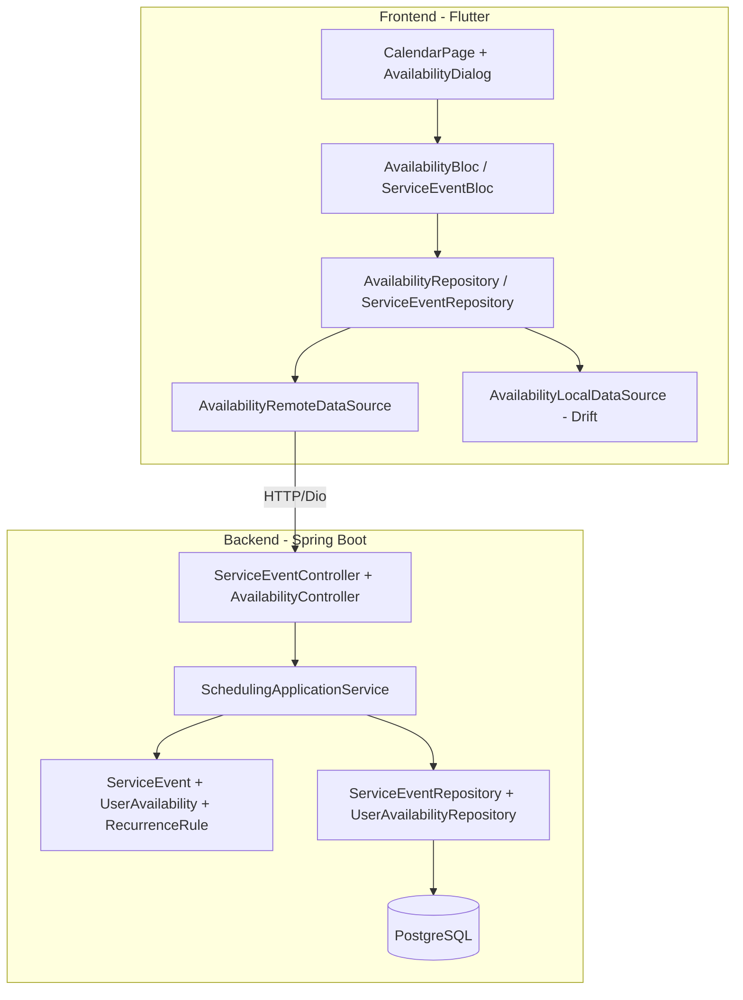

# Documento de Diseño — Disponibilidad de Servicios

## Resumen

Este diseño extiende el contexto de Scheduling de WorshipHub para soportar: (1) recurrencia de cultos (ServiceEvent), (2) endpoint DELETE para eliminar indisponibilidad, (3) endpoint GET `/me` para consultar la disponibilidad propia, y (4) una UI de calendario de disponibilidad vinculada a cultos reales. Se mantiene la arquitectura existente (Clean Architecture + DDD en backend, BLoC + Drift en frontend) y se extienden las entidades, repositorios, servicios y controladores actuales.

## Arquitectura

### Visión General



### Flujo de Datos

1. El usuario interactúa con el `CalendarPage` (selecciona un culto, marca disponibilidad).
2. El `AvailabilityBloc` procesa el evento y llama al repositorio frontend.
3. El repositorio frontend delega al `AvailabilityRemoteDataSource` (Dio) y persiste localmente en Drift.
4. El backend recibe la solicitud en el controlador, delega al `SchedulingApplicationService`, que orquesta las entidades de dominio y persiste vía repositorios JPA.

### Decisiones de Diseño

- **Separar AvailabilityController del ServiceEventController**: El controlador actual (`ServiceEventController`) ya tiene demasiadas responsabilidades. Se crea un `AvailabilityController` dedicado para los endpoints de disponibilidad (POST, GET /me, DELETE).
- **RecurrenceRule como Value Object embebido**: En lugar de crear una tabla separada, se embeben los campos de recurrencia directamente en `service_events` usando `@Embedded` de JPA. Esto simplifica las consultas y evita joins innecesarios.
- **Generación de instancias en el Application Service**: La lógica de generar instancias de cultos recurrentes vive en `SchedulingApplicationService`, no en la entidad de dominio, porque requiere acceso al repositorio para persistir cada instancia.
- **AvailabilityBloc separado del ServiceEventBloc**: Cada BLoC maneja un flujo de estado independiente, siguiendo el principio de responsabilidad única.

## Componentes e Interfaces

### Backend

#### 1. Dominio — Entidades y Value Objects

**RecurrenceFrequency** (enum nuevo):
```kotlin
enum class RecurrenceFrequency { WEEKLY, MONTHLY, YEARLY }
```

**RecurrenceRule** (value object embebido en ServiceEvent):
```kotlin
@Embeddable
data class RecurrenceRule(
    @Enumerated(EnumType.STRING)
    val frequency: RecurrenceFrequency,
    val recurrenceEndDate: LocalDate?,
)
```

**ServiceEvent** (campos nuevos):
```kotlin
// Campos adicionales en ServiceEvent
@Embedded
val recurrenceRule: RecurrenceRule? = null,

@Column
val parentServiceId: UUID? = null,
```

#### 2. Dominio — Repositorios (métodos nuevos)

**ServiceEventRepository**:
```kotlin
fun findByParentServiceId(parentServiceId: UUID): List<ServiceEvent>
fun findByTeamIdAndDateRange(teamId: UUID, startDate: LocalDateTime, endDate: LocalDateTime): List<ServiceEvent>
fun deleteAll(serviceEvents: List<ServiceEvent>)
```

**UserAvailabilityRepository**:
```kotlin
fun findByUserIdAndDateRange(userId: UUID, startDate: LocalDate, endDate: LocalDate): List<UserAvailability>
fun deleteByDateAndTeamMembers(date: LocalDate, teamId: UUID)
```

#### 3. Application — Comandos nuevos

```kotlin
data class CreateRecurringServiceCommand(
    val serviceName: String,
    val scheduledDate: LocalDateTime,
    val teamId: UUID,
    val churchId: UUID,
    val recurrenceRule: RecurrenceRule,
    val memberAssignments: List<MemberAssignment> = emptyList()
)

data class DeleteAvailabilityCommand(
    val availabilityId: UUID,
    val userId: UUID
)

data class GetMyAvailabilityCommand(
    val userId: UUID,
    val startDate: LocalDate?,
    val endDate: LocalDate?
)
```

#### 4. Application — Métodos nuevos en SchedulingApplicationService

```kotlin
fun createRecurringService(command: CreateRecurringServiceCommand): Result<UUID>
fun updateRecurrenceRule(serviceId: UUID, newRule: RecurrenceRule): Result<Unit>
fun deleteRecurringService(serviceId: UUID): Result<Unit>
fun deleteAvailability(command: DeleteAvailabilityCommand): Result<Unit>
fun getMyAvailability(command: GetMyAvailabilityCommand): List<UserAvailability>
```

#### 5. API — AvailabilityController (nuevo)

| Método | Ruta | Descripción |
|--------|------|-------------|
| POST | `/api/v1/services/availability/unavailable` | Marcar indisponibilidad (existente, se mueve aquí) |
| GET | `/api/v1/services/availability/me` | Obtener mis registros de indisponibilidad |
| DELETE | `/api/v1/services/availability/{availabilityId}` | Eliminar registro de indisponibilidad |

#### 6. API — ServiceEventController (endpoints nuevos)

| Método | Ruta | Descripción |
|--------|------|-------------|
| POST | `/api/v1/services` | Crear culto (extendido con recurrencia) |
| PUT | `/api/v1/services/{serviceId}/recurrence` | Modificar regla de recurrencia |
| DELETE | `/api/v1/services/{serviceId}/recurring` | Eliminar culto recurrente y sus instancias |

### Frontend

#### 1. Data Layer

**AvailabilityRemoteDataSource**:
```dart
Future<List<AvailabilityDto>> getMyAvailability({DateTime? startDate, DateTime? endDate});
Future<AvailabilityDto> markUnavailable(DateTime date, String? reason);
Future<void> deleteAvailability(String availabilityId);
```

**ServiceEventRemoteDataSource** (métodos nuevos):
```dart
Future<ServiceEventDto> createRecurringService(CreateRecurringServiceRequest request);
Future<List<DateTime>> previewRecurringDates(RecurrenceRuleDto rule, DateTime startDate);
```

#### 2. BLoC — AvailabilityBloc

**Eventos**:
- `LoadMyAvailability(startDate, endDate)`
- `MarkUnavailable(date, reason)`
- `DeleteAvailability(availabilityId)`
- `LoadServiceEventsForMonth(month, year)`

**Estados**:
- `AvailabilityInitial`
- `AvailabilityLoading`
- `AvailabilityLoaded(availabilities, serviceEvents)`
- `AvailabilityOperationSuccess(message)`
- `AvailabilityError(message)`

#### 3. UI — Widgets

- **AvailabilityCalendarPage**: Reemplaza el `CalendarPage` actual con datos reales del BLoC.
- **AvailabilityDialog**: Diálogo para marcar disponible/no disponible con campo de razón opcional.
- **RecurrenceFormSection**: Sección del formulario de creación de culto con selector de frecuencia y fecha de fin.
- **RecurrenceDatePreview**: Widget que muestra las fechas generadas antes de confirmar.

## Modelos de Datos

### Migración Flyway V12

```sql
-- Agregar campos de recurrencia a service_events
ALTER TABLE service_events
    ADD COLUMN recurrence_frequency VARCHAR(10),
    ADD COLUMN recurrence_end_date DATE,
    ADD COLUMN parent_service_id UUID REFERENCES service_events(id) ON DELETE SET NULL;

-- Índice para consultar instancias hijas
CREATE INDEX idx_service_events_parent_id ON service_events(parent_service_id);

-- Índice para consultar disponibilidad por usuario y rango de fechas
CREATE INDEX idx_user_availability_user_date ON user_availability(user_id, unavailable_date);
```

### Drift (SQLite local — Frontend)

```dart
// Tabla service_events extendida
class ServiceEvents extends Table {
  // ... campos existentes ...
  TextColumn get recurrenceFrequency => text().nullable()();
  DateTimeColumn get recurrenceEndDate => dateTime().nullable()();
  TextColumn get parentServiceId => text().nullable()();
}
```

### DTOs

**AvailabilityResponse** (backend → frontend):
```json
{
  "id": "uuid",
  "unavailableDate": "2025-01-15",
  "reason": "Viaje familiar",
  "createdAt": "2025-01-10T14:30:00"
}
```

**CreateRecurringServiceRequest** (frontend → backend):
```json
{
  "serviceName": "Servicio Dominical",
  "scheduledDate": "2025-01-19T10:00:00",
  "teamId": "uuid",
  "recurrenceRule": {
    "frequency": "WEEKLY",
    "recurrenceEndDate": "2025-06-30"
  },
  "memberAssignments": []
}
```

**ServiceEventResponse** (extendido):
```json
{
  "id": "uuid",
  "serviceName": "Servicio Dominical",
  "scheduledDate": "2025-01-19T10:00:00",
  "teamId": "uuid",
  "status": "PUBLISHED",
  "recurrenceFrequency": "WEEKLY",
  "recurrenceEndDate": "2025-06-30",
  "parentServiceId": null
}
```


## Propiedades de Corrección

*Una propiedad es una característica o comportamiento que debe mantenerse verdadero en todas las ejecuciones válidas de un sistema — esencialmente, una declaración formal sobre lo que el sistema debe hacer. Las propiedades sirven como puente entre especificaciones legibles por humanos y garantías de corrección verificables por máquina.*

### Propiedad 1: Round-trip de creación de culto recurrente

*Para cualquier* ServiceEvent válido con una RecurrenceRule, al crearlo y luego consultar por `parentServiceId`, todos los cultos hijos retornados deben tener el `parentServiceId` igual al ID del culto padre, y el culto padre debe contener la misma `recurrenceRule` con la que fue creado.

**Valida: Requisitos 1.1, 8.1, 8.2, 8.4**

### Propiedad 2: Generación correcta de instancias recurrentes

*Para cualquier* RecurrenceRule (WEEKLY, MONTHLY o YEARLY) con una fecha de inicio y una fecha de fin opcional, el número de instancias generadas debe ser igual al número de ocurrencias de la frecuencia entre la fecha de inicio y la fecha de fin (o 52 semanas si no hay fecha de fin), y cada fecha generada debe corresponder exactamente al intervalo de la frecuencia. Además, la función de vista previa debe producir las mismas fechas que la generación real.

**Valida: Requisitos 1.2, 5.3**

### Propiedad 3: Regeneración preserva instancias con miembros ACCEPTED

*Para cualquier* culto recurrente con instancias futuras, al modificar la regla de recurrencia, las instancias que tengan al menos un miembro con estado ACCEPTED deben permanecer sin cambios, y solo las instancias sin miembros ACCEPTED deben ser regeneradas según la nueva regla.

**Valida: Requisitos 1.4, 1.5**

### Propiedad 4: Eliminación de indisponibilidad (round-trip)

*Para cualquier* registro de UserAvailability creado por un usuario, al enviar DELETE con el mismo userId, el registro debe dejar de existir en el sistema (una consulta posterior por ID debe retornar vacío).

**Valida: Requisitos 2.1**

### Propiedad 5: Autorización de eliminación de indisponibilidad

*Para cualquier* registro de UserAvailability y cualquier userId diferente al propietario del registro, un intento de DELETE debe ser rechazado con error 403, y el registro debe permanecer sin cambios.

**Valida: Requisitos 2.3**

### Propiedad 6: Ordenamiento de disponibilidad por fecha

*Para cualquier* conjunto de registros de UserAvailability de un usuario, el endpoint GET /me debe retornarlos ordenados por `unavailableDate` ascendente, y cuando se proporcionan `startDate` y `endDate`, todos los registros retornados deben tener `unavailableDate` dentro del rango [startDate, endDate], con los campos id, unavailableDate, reason y createdAt presentes.

**Valida: Requisitos 3.1, 3.2, 3.3**

### Propiedad 7: Disponibilidad solo en fechas con cultos

*Para cualquier* fecha y equipo, marcar indisponibilidad solo debe ser posible si existe al menos un ServiceEvent programado para ese equipo en esa fecha. Si no hay cultos, la operación debe ser rechazada.

**Valida: Requisitos 6.1**

### Propiedad 8: Eliminación en cascada de indisponibilidad al eliminar cultos

*Para cualquier* fecha con cultos programados y registros de indisponibilidad asociados, al eliminar todos los cultos de esa fecha, los registros de indisponibilidad de los miembros del equipo correspondiente para esa fecha deben ser eliminados automáticamente.

**Valida: Requisitos 6.3**

### Propiedad 9: Razón opcional en indisponibilidad

*Para cualquier* solicitud POST de indisponibilidad con el campo `reason` como null, cadena vacía, o cadena con contenido, el sistema debe aceptar la solicitud y persistir el registro correctamente, retornando el mismo valor de `reason` al consultarlo.

**Valida: Requisitos 7.2**

## Manejo de Errores

### Backend

| Escenario | Código HTTP | Mensaje |
|-----------|-------------|---------|
| Fecha de fin anterior a fecha de inicio | 400 | "La fecha de fin de recurrencia debe ser posterior a la fecha del culto" |
| Frecuencia inválida | 400 | "Frecuencia no soportada. Use WEEKLY, MONTHLY o YEARLY" |
| Availability no encontrada (DELETE) | 404 | "Registro de indisponibilidad no encontrado" |
| Usuario no autorizado (DELETE) | 403 | "No tiene permiso para eliminar este registro" |
| Rol insuficiente | 403 | "Permisos insuficientes para esta operación" |
| Equipo no encontrado | 404 | "Equipo no encontrado" |
| Fecha sin cultos (marcar disponibilidad) | 400 | "No hay cultos programados en esta fecha para su equipo" |
| Conflicto de horario (< 2h) | 409 | "Ya existe un culto programado dentro de las 2 horas" |

### Frontend

- **Errores de red**: Mostrar SnackBar con mensaje y opción de reintentar. Usar datos locales de Drift como fallback.
- **Errores de validación**: Mostrar mensajes inline en el formulario (campo de razón > 200 caracteres, fecha de fin inválida).
- **Errores de autorización (403)**: Redirigir al login si el token expiró; mostrar mensaje si es falta de permisos.
- **Optimistic UI**: Al marcar disponibilidad, actualizar el estado local inmediatamente y revertir si el backend falla.

## Estrategia de Testing

### Testing Dual: Unit Tests + Property-Based Tests

Se utilizan ambos enfoques de forma complementaria:

- **Unit tests**: Casos específicos, edge cases, integración entre componentes.
- **Property-based tests**: Propiedades universales que deben cumplirse para todas las entradas válidas.

### Backend (Kotlin — JUnit 5 + Kotest)

**Librería de property-based testing**: Kotest (ya incluida en el proyecto, versión 5.8.0).

**Configuración**: Mínimo 100 iteraciones por propiedad.

**Unit Tests**:
- `RecurrenceRule`: Validación de frecuencias, cálculo de fechas para meses cortos (día 31 en febrero → 28/29).
- `SchedulingApplicationService`: Creación de culto recurrente, modificación de regla, eliminación con cascada.
- `AvailabilityController`: Integración con MockMvc para DELETE 204, 404, 403; GET /me con filtros.
- Migración Flyway V12: Verificar que las columnas existen tras la migración.

**Property Tests** (cada test referencia su propiedad del diseño):
- `// Feature: service-availability, Property 1: Round-trip de creación de culto recurrente`
- `// Feature: service-availability, Property 2: Generación correcta de instancias recurrentes`
- `// Feature: service-availability, Property 3: Regeneración preserva instancias con miembros ACCEPTED`
- `// Feature: service-availability, Property 4: Eliminación de indisponibilidad (round-trip)`
- `// Feature: service-availability, Property 5: Autorización de eliminación de indisponibilidad`
- `// Feature: service-availability, Property 6: Ordenamiento de disponibilidad por fecha`
- `// Feature: service-availability, Property 7: Disponibilidad solo en fechas con cultos`
- `// Feature: service-availability, Property 8: Eliminación en cascada de indisponibilidad al eliminar cultos`
- `// Feature: service-availability, Property 9: Razón opcional en indisponibilidad`

### Frontend (Dart — flutter_test + glados)

**Librería de property-based testing**: glados (ya incluida en el proyecto, versión 1.1.1).

**Configuración**: Mínimo 100 iteraciones por propiedad con `Glados.test`.

**Unit Tests**:
- `AvailabilityBloc`: Tests con `bloc_test` para cada evento/estado.
- `AvailabilityRepository`: Tests con mocktail para llamadas a remote/local data sources.
- Widget tests: `AvailabilityDialog` muestra campo de razón opcional, `RecurrenceFormSection` valida campos.

**Property Tests**:
- `// Feature: service-availability, Property 2: Generación correcta de instancias recurrentes` (lógica de preview en frontend)
- `// Feature: service-availability, Property 6: Ordenamiento de disponibilidad por fecha` (ordenamiento local)
- `// Feature: service-availability, Property 9: Razón opcional en indisponibilidad` (serialización/deserialización de DTOs)
