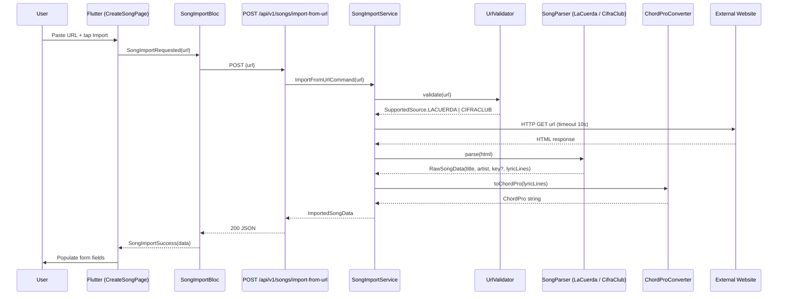

# Design Document: Song Import from URL

## Overview

This feature adds the ability to import song data (title, artist, lyrics, chords) from external websites (lacuerda.net and cifraclub.com) into the church's song catalog. The backend receives a URL, validates the source, scrapes HTML, extracts structured song data, converts chord/lyric alignment into ChordPro format, and returns it to the frontend. The frontend provides a URL input within the song creation flow, calls the import endpoint, and populates the form with extracted data for user review before saving.

The feature integrates into the existing **catalog** bounded context and reuses the existing `Song` entity, `CreateSongCommand`, `SongBloc`, and `CreateSongPage` patterns.

## Architecture

### High-Level Design



### Layer Placement (Clean Architecture)

| Layer | New Components |
|-------|---------------|
| **domain/catalog** | `UrlValidator`, `ChordProConverter`, `SongParser` (interface), `SupportedSource` enum, `RawSongData`, `ImportedSongData` |
| **application/catalog** | `ImportFromUrlCommand`, `SongImportApplicationService` |
| **infrastructure/catalog** | `LaCuerdaSongParser`, `CifraClubSongParser`, `HttpPageFetcher` |
| **api/catalog** | `SongImportController`, `ImportFromUrlRequest`, `ImportedSongResponse` |
| **frontend** | `SongImportBloc`, `SongImportRemoteDataSource`, `ImportFromUrlButton` widget |

### Low-Level Design

#### Backend Module Dependency

```
api → application → domain ← infrastructure
         ↓                        ↓
  SongImportAppService      LaCuerdaSongParser
                            CifraClubSongParser
                            HttpPageFetcher (RestClient)
```

Domain defines interfaces; infrastructure implements HTTP fetching and HTML parsing with Jsoup.

## Components and Interfaces

### Domain Layer

#### `SupportedSource` (enum)

```kotlin
enum class SupportedSource(val domains: List<String>) {
    LACUERDA(listOf("lacuerda.net", "www.lacuerda.net", "acordes.lacuerda.net", "chords.lacuerda.net", "cifras.lacuerda.net")),
    CIFRACLUB(listOf("cifraclub.com", "www.cifraclub.com", "cifraclub.com.br", "www.cifraclub.com.br"));

    companion object {
        fun fromDomain(domain: String): SupportedSource? {
            val lower = domain.lowercase()
            return entries.find { source ->
                source.domains.any { d -> lower == d || lower.endsWith(".$d") }
            }
        }
    }
}
```

> **Implementation note:** `fromDomain()` uses subdomain matching (`endsWith`) to handle regional subdomains (acordes, chords, cifras) without listing every variant explicitly.

#### `UrlValidator`

```kotlin
object UrlValidator {
    private const val MAX_LENGTH = 2048
    private val ALLOWED_SCHEMES = setOf("http", "https")

    fun validate(rawUrl: String): Result<Pair<URI, SupportedSource>>
}
```

Returns `Result.failure` with either `InvalidUrlFormat` or `UnsupportedSource` sealed error.

#### `RawSongData` (value object)

```kotlin
data class RawSongData(
    val title: String,
    val artist: String?,
    val key: String?,
    val lyricLines: List<LyricLine>
)

data class LyricLine(
    val text: String,
    val chords: List<ChordPosition>
)

data class ChordPosition(
    val chord: String,
    val column: Int
)
```

#### `SongParser` (interface)

```kotlin
interface SongParser {
    fun parse(html: String, url: URI): RawSongData
}
```

Throws `SongExtractionException` on failure (missing title or lyrics).

#### `ChordProConverter`

```kotlin
object ChordProConverter {
    fun convert(lines: List<LyricLine>): String
    fun containsChords(text: String): Boolean
}
```

Conversion rules:
1. Insert `[Chord]` at `column` offset in lyric text
2. If `column > lyricLine.text.length`, append chord at end (uses `coerceAtMost(line.text.length)`)
3. Section markers become `{comment: SectionName}`
4. Chord-only lines become `[Am] [G] [C]`
5. If no chord tokens detected, return lyrics plain

> **Bug fix applied:** Original implementation used `coerceAtMost(result.length)` which caused bracket nesting when multiple chords had columns beyond text length. Fixed to `coerceAtMost(line.text.length)` — insertion index is bounded by original text length, not the growing result string.

#### `ImportedSongData` (value object)

```kotlin
data class ImportedSongData(
    val title: String,
    val artist: String?,
    val key: String?,
    val lyrics: String,
    val chords: String  // ChordPro format
)
```

### Application Layer

#### `ImportFromUrlCommand`

```kotlin
data class ImportFromUrlCommand(
    val url: String,
    val userId: UUID,
    val churchId: UUID
)
```

#### `SongImportApplicationService`

```kotlin
@Service
class SongImportApplicationService(
    private val httpPageFetcher: HttpPageFetcher,
    private val parsers: Map<SupportedSource, SongParser>
) {
    fun importFromUrl(command: ImportFromUrlCommand): Result<ImportedSongData>
}
```

Orchestration:
1. `UrlValidator.validate(command.url)` → get URI + source
2. `httpPageFetcher.fetch(uri)` → HTML string (timeout 10s, max 5MB)
3. `parsers[source]!!.parse(html, uri)` → RawSongData
4. Sanitize text (strip HTML tags, script/style elements)
5. `ChordProConverter.convert(rawData.lyricLines)` → chords string
6. Build `ImportedSongData` and return

### Infrastructure Layer

#### `SongImportConfig` (Spring configuration)

```kotlin
@Configuration
class SongImportConfig {
    @Bean
    fun songParserMap(
        laCuerdaParser: LaCuerdaSongParser,
        cifraClubParser: CifraClubSongParser
    ): Map<SupportedSource, SongParser> = mapOf(
        SupportedSource.LACUERDA to laCuerdaParser,
        SupportedSource.CIFRACLUB to cifraClubParser
    )
}
```

> **Implementation note:** Spring cannot auto-wire a `Map<SupportedSource, SongParser>` by convention. This explicit bean definition was added to resolve the injection dependency in `SongImportApplicationService`.

#### `HttpPageFetcher`

```kotlin
@Component
class HttpPageFetcher(private val restClient: RestClient) {
    fun fetch(uri: URI, timeoutSeconds: Long = 10): String
}
```

- Uses Spring's `RestClient` with configurable connect/read timeouts
- Throws `PageUnavailableException` on 4xx/5xx
- Throws `ConnectionFailedException` on network errors
- Throws `PayloadTooLargeException` if response > 5MB
- Throws `ImportTimeoutException` on timeout

#### `LaCuerdaSongParser` (implements `SongParser`)

Parses lacuerda.net HTML using **heuristic content-based extraction** (not CSS-selector-dependent):

- **Title extraction** (priority order): `<h1>` element → JS variable `orola` → `<title>` tag pattern (e.g., "Song - Artist - LaCuerda")
- **Artist extraction** (priority order): `<h2>` near `<h1>` → breadcrumb links → JS variable `oband` → `<title>` tag second segment
- **Lyrics+Chords**: Detects chord format by inspecting `<pre>` block content:
  1. `<a>`/`<A>` tags inside `<pre>` → real LaCuerda chord format (chords are hyperlinks)
  2. Fallback: `<b>` tags inside `<pre>` → inline chord markers
  3. Fallback: plain text chords-above-lyrics pattern (chord lines detected by regex)
- **Chord-lyric pairing**: Pairs each chord-only line with the next lyric line, mapping chord character positions to `ChordPosition` entries
- Throws `ExtractionFailed` if title or lyrics missing

> **Architecture note:** The parser was refactored from CSS-selector-based extraction (which broke on site redesigns) to heuristic content-based extraction that is more resilient to HTML structure changes.

#### `CifraClubSongParser` (implements `SongParser`)

Parses cifraclub.com HTML using **heuristic content-based extraction** (not CSS-selector-dependent):

- **Title extraction** (priority order): `<title>` tag pattern "Song - Artist - Cifra Club" (first segment) → first `<h1>` element → `og:title` meta tag
- **Artist extraction** (priority order): `<title>` tag second segment → meta description → URL slug deslug (converts hyphens to spaces, title case)
- **Key extraction**: Text scan for "Tono"/"Tom" pattern anywhere on page + `data-anchor="--chord-tone"` button element
- **Lyrics+Chords**: Finds ALL `<pre>` elements, picks the largest one containing chord content, then detects format:
  1. Legacy format: inline `<b>` chord tags within `<pre>` divs → extracts chord positions from `<b>` tag offsets
  2. Current format: plain text chords-above-lyrics → pairs chord lines with lyric lines
- **Noise filtering**: Removes known noise lines ("Continúa después del anuncio", ad markers, etc.)
- **Line merging**: Merges wrapped continuation lines (long lyric lines that CifraClub wraps with `\n`) back into single logical lines
- Handles both `.com` and `.com.br` domains
- Throws `ExtractionFailed` if title, artist, or lyrics missing after trim

> **Architecture note:** Original design used `.t1`, `.t3`, `.cifra_cnt pre`, `.tone` CSS selectors. These were replaced with heuristic extraction after the selectors proved unreliable across different CifraClub page variants and locales.

### API Layer

#### `SongImportController`

```kotlin
@RestController
@RequestMapping("/api/v1/songs")
class SongImportController(
    private val songImportService: SongImportApplicationService,
    private val securityContext: SecurityContext
) {
    @PostMapping("/import-from-url")
    @PreAuthorize("hasRole('WORSHIP_LEADER') or hasRole('CHURCH_ADMIN')")
    fun importFromUrl(@Valid @RequestBody request: ImportFromUrlRequest): ImportedSongResponse
}
```

#### `ImportFromUrlRequest`

```kotlin
data class ImportFromUrlRequest(
    @field:NotBlank(message = "URL is required")
    @field:Size(max = 2048, message = "URL must not exceed 2048 characters")
    val url: String
)
```

#### `ImportedSongResponse`

```kotlin
data class ImportedSongResponse(
    val title: String,
    val artist: String?,
    val key: String?,
    val lyrics: String,
    val chords: String
)
```

#### Error Responses

| HTTP Code | Condition | Error body `code` |
|-----------|-----------|-------------------|
| 400 | Missing/empty/too-long URL | `INVALID_REQUEST` |
| 422 | Unsupported source domain | `UNSUPPORTED_SOURCE` |
| 502 | External page unavailable (4xx/5xx) | `PAGE_UNAVAILABLE` |
| 502 | Connection failure | `CONNECTION_FAILED` |
| 502 | HTML structure changed / extraction failed | `EXTRACTION_FAILED` |
| 504 | Import timeout (>15s total) | `IMPORT_TIMEOUT` |
| 413 | Response body > 5MB | `PAYLOAD_TOO_LARGE` |

### Frontend Layer

#### `SongImportBloc`

```dart
class SongImportBloc extends Bloc<SongImportEvent, SongImportState> {
  final SongImportRemoteDataSource remoteDataSource;
}

// Events
class SongImportRequested extends SongImportEvent { final String url; }

// States
class SongImportInitial extends SongImportState {}
class SongImportLoading extends SongImportState {}
class SongImportSuccess extends SongImportState { final ImportedSongData data; }
class SongImportFailure extends SongImportState { final String errorType; final String message; }
```

#### `SongImportRemoteDataSource`

```dart
class SongImportRemoteDataSource {
  final Dio dio;

  Future<ImportedSongData> importFromUrl(String url) async {
    final response = await dio.post(
      '/api/v1/songs/import-from-url',
      data: {'url': url},
    );
    return ImportedSongData.fromJson(response.data);
  }
}
```

#### `ImportFromUrlButton` (widget integration in CreateSongPage)

- URL text field + "Importar" button within a collapsible section
- Client-side validation: non-empty, non-whitespace URL before calling BLoC
- On success: populate `_titleController`, `_artistController`, `_keyController`, `_chordProController`
- On error: show localized error SnackBar by `errorType`
- On loading: disable button, show `CircularProgressIndicator`

#### `ChordProEditor` — `didUpdateWidget` fix

The `ChordProEditor` widget required a `didUpdateWidget` override to detect changes to `initialText` (e.g., after URL import populates the chords field). Previously, `initialText` was only read in `initState()`, so importing a song would not update the editor content. The fix compares `oldWidget.initialText` with the new value and updates the internal controller when they differ.

#### Song Delete Button (SongDetailPage)

Added song deletion functionality to `SongDetailPage`:
- Red trash icon in app bar (visible for WORSHIP_LEADER/CHURCH_ADMIN when song has `serverId`)
- Confirmation dialog following app dark-theme pattern (`AlertDialog`, localized text)
- Dispatches `SongBloc.add(SongDeleteRequested)` → auto-reloads song list after deletion
- `BlocListener` handles success (SnackBar + navigate to song list) and error states
- Localization keys: `songDeleteTitle`, `songDeleteConfirm(title)`

#### Setlist Presentation Width Fix

Changed lyrics container from `Align(topLeft)` → `SizedBox(width: double.infinity)` and reduced padding from 20→16px to maximize available width for lyrics rendering in presentation mode.

#### List Spacing Standardization

Fixed setlist list page horizontal padding from 16px to 20px, matching all other list pages. Standard pattern: `EdgeInsets.fromLTRB(20, 12, 20, 96)` with `SizedBox(height: 12)` separator.

## Data Models

### Backend DTOs

```kotlin
// Request
data class ImportFromUrlRequest(
    @field:NotBlank val url: String
)

// Response
data class ImportedSongResponse(
    val title: String,
    val artist: String?,
    val key: String?,
    val lyrics: String,
    val chords: String
)

// Error response (reuses existing pattern)
data class ErrorResponse(
    val code: String,
    val message: String
)
```

### Frontend Models

```dart
class ImportedSongData {
  final String title;
  final String? artist;
  final String? key;
  final String lyrics;
  final String chords; // ChordPro format

  factory ImportedSongData.fromJson(Map<String, dynamic> json) => ImportedSongData(
    title: json['title'],
    artist: json['artist'],
    key: json['key'],
    lyrics: json['lyrics'],
    chords: json['chords'],
  );
}
```

### Domain Value Objects (Backend)

```kotlin
// Internal pipeline objects — not persisted
data class LyricLine(val text: String, val chords: List<ChordPosition>)
data class ChordPosition(val chord: String, val column: Int)
data class RawSongData(val title: String, val artist: String?, val key: String?, val lyricLines: List<LyricLine>)
```

No new database tables needed. The imported data flows into the existing `Song` entity via `CreateSongCommand` when the user saves.


## Correctness Properties

*A property is a characteristic or behavior that should hold true across all valid executions of a system — essentially, a formal statement about what the system should do. Properties serve as the bridge between human-readable specifications and machine-verifiable correctness guarantees.*

### Property 1: URL validation accepts all valid supported URLs

*For any* string that, after trimming whitespace, forms a syntactically valid URL with scheme `http` or `https`, a domain matching a `SupportedSource` (with or without `www.` prefix), and any combination of path segments, query parameters, and fragment identifiers, with total length ≤ 2048 characters, `UrlValidator.validate()` SHALL return success with the correct `SupportedSource`.

**Validates: Requirements 1.1, 1.4, 1.5, 1.6**

### Property 2: URL validation error type discrimination

*For any* string input to `UrlValidator.validate()`, if the URL is empty, exceeds 2048 characters, uses a non-HTTP/HTTPS scheme, or cannot be parsed as a valid URI, the result SHALL be `InvalidUrlFormat`. If the URL is structurally valid but its domain does not match any `SupportedSource`, the result SHALL be `UnsupportedSource`. These two error categories SHALL be mutually exclusive.

**Validates: Requirements 1.2, 1.3**

### Property 3: ChordPro conversion position accuracy

*For any* `LyricLine` with a non-empty text and a list of `ChordPosition` entries, `ChordProConverter.convert()` SHALL insert each chord in square brackets such that, when brackets are stripped from the output, the chord's original column offset is reproduced within ±1 character position. When a chord's column exceeds the lyric text length, the chord SHALL appear at the end of the line.

**Validates: Requirements 4.1, 4.2, 4.6**

### Property 4: Section markers become ChordPro directives

*For any* section marker string (e.g., "Verse", "Chorus", "Bridge", "Intro", "Outro") detected in the extracted data, `ChordProConverter` SHALL output a `{comment: <SectionName>}` directive line in the resulting ChordPro string.

**Validates: Requirements 4.3**

### Property 5: Chord-only lines produce standalone bracketed output

*For any* `LyricLine` with empty text but one or more `ChordPosition` entries, `ChordProConverter.convert()` SHALL output a single line with each chord wrapped in square brackets separated by spaces (e.g., `[Am] [G] [C]`).

**Validates: Requirements 4.4**

### Property 6: No chord tokens yields plain lyrics

*For any* set of `LyricLine` entries where no chord string matches the chord pattern (root note + optional quality), `ChordProConverter.convert()` SHALL return the lyrics text without any square-bracket annotations.

**Validates: Requirements 4.5**

### Property 7: HTML sanitization preserves only plain text and ChordPro

*For any* string containing HTML tags, `<script>` elements, `<style>` elements, event handler attributes, or encoded HTML entities, after sanitization the output SHALL contain no HTML tag patterns (angle-bracket sequences matching tag syntax), no script/style content, and no encoded entities — while preserving all ChordPro bracket annotations `[...]` intact.

**Validates: Requirements 7.5, 7.6**

### Property 8: Partial extraction never returns partial data

*For any* HTML page where the parser can extract a title but cannot extract lyrics (or vice versa), `SongParser.parse()` SHALL throw `SongExtractionException` rather than returning a `RawSongData` with missing required fields.

**Validates: Requirements 7.3, 2.4, 3.6**

### Property 9: Form population maps all imported fields

*For any* `ImportedSongData` object returned from the import endpoint, when the frontend populates the song creation form, every non-null field in the response SHALL overwrite the corresponding form field, and every null field SHALL leave the form field empty.

**Validates: Requirements 6.3**

### Property 10: Whitespace-only URL rejected without backend call

*For any* string composed entirely of whitespace characters (including empty string), the frontend `SongImportBloc` SHALL emit a validation error state without dispatching an HTTP request to the backend.

**Validates: Requirements 6.7**

## Error Handling

### Backend Error Hierarchy

```kotlin
sealed class SongImportException(message: String) : RuntimeException(message) {
    class InvalidUrlFormat(message: String) : SongImportException(message)
    class UnsupportedSource(val domain: String) : SongImportException("Unsupported source: $domain")
    class PageUnavailable(val statusCode: Int) : SongImportException("Page returned HTTP $statusCode")
    class ConnectionFailed(cause: Throwable) : SongImportException("Connection failed: ${cause.message}")
    class ImportTimeout(val seconds: Long) : SongImportException("Import timed out after ${seconds}s")
    class PayloadTooLarge(val sizeBytes: Long) : SongImportException("Response too large: $sizeBytes bytes")
    class ExtractionFailed(val reason: String) : SongImportException("Extraction failed: $reason")
    class FormatChanged(val source: String) : SongImportException("HTML structure changed for $source")
}
```

### Controller Exception Handler

```kotlin
@ExceptionHandler(SongImportException::class)
fun handleImportException(ex: SongImportException): ResponseEntity<ErrorResponse> {
    val (status, code) = when (ex) {
        is SongImportException.InvalidUrlFormat -> 400 to "INVALID_REQUEST"
        is SongImportException.UnsupportedSource -> 422 to "UNSUPPORTED_SOURCE"
        is SongImportException.PageUnavailable -> 502 to "PAGE_UNAVAILABLE"
        is SongImportException.ConnectionFailed -> 502 to "CONNECTION_FAILED"
        is SongImportException.ExtractionFailed -> 502 to "EXTRACTION_FAILED"
        is SongImportException.FormatChanged -> 502 to "EXTRACTION_FAILED"
        is SongImportException.ImportTimeout -> 504 to "IMPORT_TIMEOUT"
        is SongImportException.PayloadTooLarge -> 413 to "PAYLOAD_TOO_LARGE"
    }
    return ResponseEntity.status(status).body(ErrorResponse(code, ex.message ?: "Import failed"))
}
```

### Frontend Error Mapping

```dart
String _mapErrorToUserMessage(String errorCode, AppLocalizations l10n) {
  switch (errorCode) {
    case 'UNSUPPORTED_SOURCE': return l10n.importUnsupportedSource;
    case 'PAGE_UNAVAILABLE': return l10n.importPageUnavailable;
    case 'CONNECTION_FAILED': return l10n.importConnectionFailed;
    case 'EXTRACTION_FAILED': return l10n.importExtractionFailed;
    case 'IMPORT_TIMEOUT': return l10n.importTimeout;
    case 'PAYLOAD_TOO_LARGE': return l10n.importPayloadTooLarge;
    default: return l10n.importGenericError;
  }
}
```

### Logging Strategy

All import attempts logged at INFO with structured fields:
```
{
  "event": "song_import",
  "url": "<redacted-path>",  // domain only for privacy
  "source": "LACUERDA|CIFRACLUB",
  "outcome": "SUCCESS|FAILURE",
  "errorCategory": "TIMEOUT|EXTRACTION|...",
  "durationMs": 1234,
  "userId": "uuid",
  "churchId": "uuid"
}
```

### Resilience

- No retries on failure (per Req 7.1) — external site issues are transient, user can retry manually
- Timeout hierarchy: HTTP connect 5s, HTTP read 10s, total request 15s
- Response body size checked before full read (Content-Length header) and streaming read with byte counter
- No caching of import results (one-shot operation)

## Testing Strategy

### Backend Tests

**Unit Tests (JUnit 5 + MockK):**
- `UrlValidatorTest` — valid/invalid URLs, edge cases (unicode, IDN domains)
- `ChordProConverterTest` — conversion rules, section markers, edge cases
- `LaCuerdaSongParserTest` — fixture HTML files, extraction accuracy
- `CifraClubSongParserTest` — fixture HTML files, key extraction
- `SongImportApplicationServiceTest` — orchestration with mocked dependencies, error propagation
- `HtmlSanitizerTest` — XSS vectors, encoded entities, mixed content

**Property-Based Tests (Kotest 5.8.0 property testing):**
- `UrlValidatorPropertyTest` — Properties 1 & 2 with generated URLs
- `ChordProConverterPropertyTest` — Properties 3, 4, 5, 6 with generated LyricLines
- `HtmlSanitizerPropertyTest` — Property 7 with generated HTML-tainted strings
- `SongParserPropertyTest` — Property 8 with generated partial HTML structures

Configuration: minimum 100 iterations per property. Tag format: `Feature: song-import-from-url, Property {N}: {title}`.

**Integration Tests (MockMvc + SpringMockK):**
- `SongImportControllerIntegrationTest` — full request/response cycle with mocked service
- Auth/role enforcement tests
- Error response status code mapping

### Frontend Tests

**BLoC Tests (bloc_test + mocktail):**
- `SongImportBlocTest` — all state transitions (loading, success, failure)
- Property 9: form population mapping (with glados)
- Property 10: whitespace validation (with glados)

**Widget Tests:**
- Import button visibility and interaction
- Loading state UI (spinner, disabled button)
- Error message display per error type
- Form retention on failure

**Property-Based Tests (glados):**
- URL whitespace rejection
- Form field population completeness

### Test Fixture Strategy

Store sample HTML files from lacuerda.net and cifraclub.com as test resources:
```
src/test/resources/fixtures/
├── lacuerda/
│   ├── valid-song.html
│   ├── song-no-artist.html
│   └── non-song-page.html
└── cifraclub/
    ├── valid-song-with-key.html
    ├── valid-song-no-key.html
    └── artist-page.html
```

These fixtures enable deterministic parser testing without hitting external sites.
