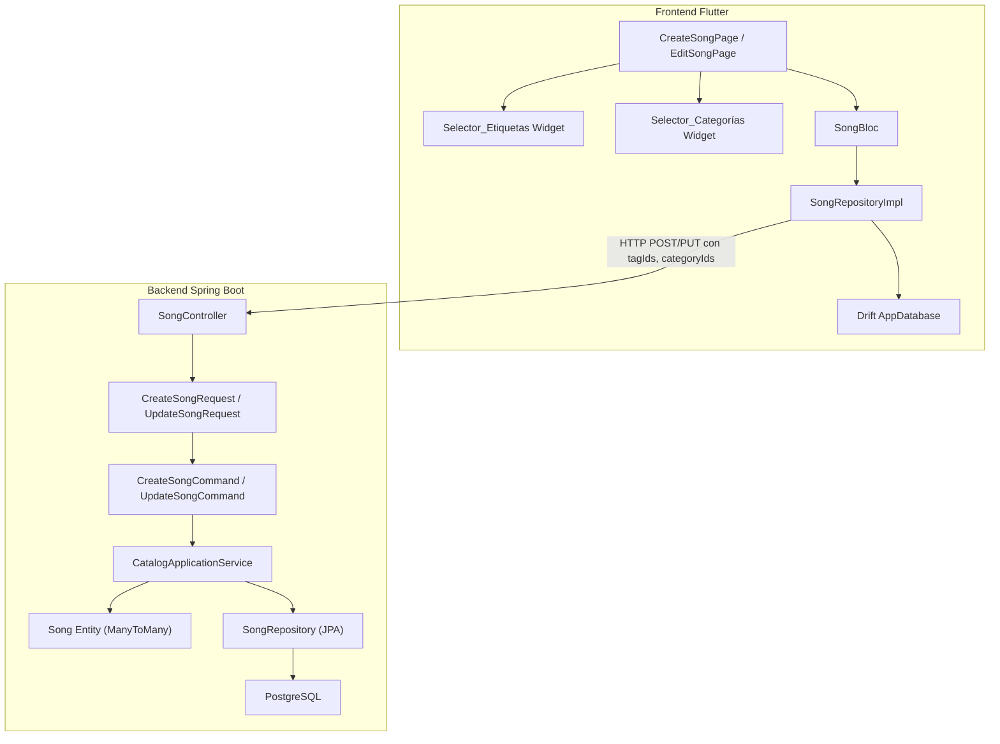
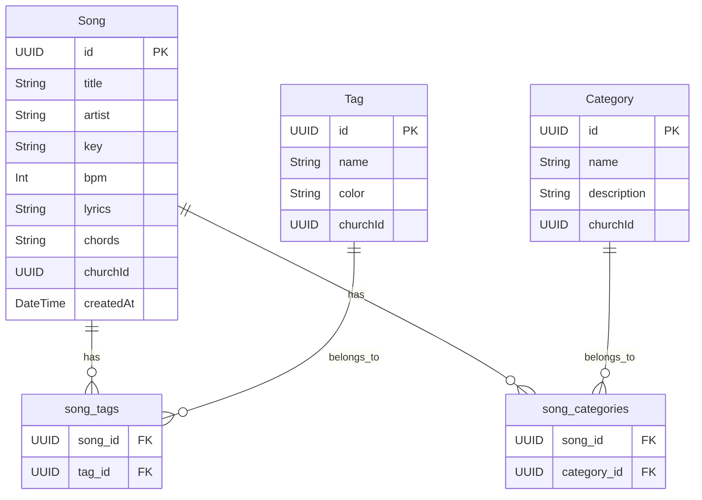

# Documento de Diseño: Asociación de Etiquetas y Categorías en el Módulo de Canciones

## Visión General

Este diseño describe la integración completa de etiquetas (tags) y categorías en el flujo de creación, edición, visualización y filtrado de canciones en WorshipHub. Actualmente, el backend ya posee las relaciones JPA ManyToMany (`song_tags`, `song_categories`), endpoints de asignación separados en `CategoryController`, y entidades de dominio `Tag`/`Category`. Sin embargo, los comandos `CreateSongCommand`/`UpdateSongCommand` no propagan `tagIds`/`categoryIds`, los DTOs de request no los incluyen, y el frontend no ofrece UI para seleccionarlos durante creación/edición.

El objetivo es cerrar esta brecha conectando el flujo de extremo a extremo: desde los selectores de UI en Flutter, pasando por los DTOs y comandos del backend, hasta la persistencia atómica en una sola transacción.

## Arquitectura

La solución se integra en la arquitectura existente de Clean Architecture en ambos lados:



### Decisiones de Diseño

1. **Asociación atómica en creación/actualización**: En lugar de usar los endpoints separados `POST /songs/{id}/tags` y `POST /songs/{id}/categories` (que requieren dos llamadas adicionales), se extienden `CreateSongRequest`/`UpdateSongRequest` para incluir `tagIds`/`categoryIds`. Esto permite persistir todo en una sola transacción, evitando estados inconsistentes.

2. **Reemplazo completo en actualización**: Al actualizar, se envía la lista completa de IDs seleccionados. El backend reemplaza las asociaciones existentes con las nuevas. Esto simplifica la lógica (no se necesita calcular diffs) y es idempotente.

3. **Campos opcionales**: `tagIds` y `categoryIds` son opcionales (`null` por defecto). En creación, `null` significa sin asociaciones. En actualización, `null` significa "no modificar las asociaciones existentes" (diferente de lista vacía que significa "eliminar todas").

4. **Persistencia local con Drift**: Las etiquetas y categorías de cada canción se almacenan como JSON en la columna `tags` existente de la tabla `Songs` de Drift. Para categorías, se añade una columna `categories` similar. Esto mantiene la estrategia offline-first existente.

## Componentes e Interfaces

### Backend (API Layer)

#### CreateSongRequest (modificado)
```kotlin
data class CreateSongRequest(
    val title: String,
    val artist: String? = null,
    val key: String? = null,
    val bpm: Int? = null,
    val lyrics: String? = null,
    val chords: String? = null,
    val tagIds: List<UUID>? = null,
    val categoryIds: List<UUID>? = null
)
```

#### UpdateSongRequest (modificado)
```kotlin
data class UpdateSongRequest(
    val title: String,
    val artist: String? = null,
    val key: String? = null,
    val bpm: Int? = null,
    val lyrics: String? = null,
    val chords: String? = null,
    val tagIds: List<UUID>? = null,
    val categoryIds: List<UUID>? = null
)
```

#### CreateSongCommand (modificado)
```kotlin
data class CreateSongCommand(
    val title: String,
    val artist: String?,
    val key: String?,
    val bpm: Int?,
    val lyrics: String?,
    val chords: String?,
    val churchId: UUID,
    val createdBy: UUID,
    val tagIds: List<UUID>? = null,
    val categoryIds: List<UUID>? = null
)
```

#### UpdateSongCommand (modificado)
```kotlin
data class UpdateSongCommand(
    val title: String,
    val artist: String? = null,
    val key: String? = null,
    val bpm: Int? = null,
    val lyrics: String? = null,
    val chords: String? = null,
    val tagIds: List<UUID>? = null,
    val categoryIds: List<UUID>? = null
)
```

### Backend (Application Layer)

#### CatalogApplicationService.createSong (modificado)
```kotlin
fun createSong(command: CreateSongCommand): Result<Song> {
    // ... validación de duplicados existente ...
    val song = Song(title = command.title, ...)
    
    // Resolver tags y categories si se proporcionan
    val tags = command.tagIds?.let { ids ->
        val found = ids.mapNotNull { tagRepository.findById(it) }.toSet()
        if (found.size != ids.size) {
            return Result.failure(IllegalArgumentException("Invalid tag IDs"))
        }
        found
    } ?: emptySet()
    
    val categories = command.categoryIds?.let { ids ->
        val found = ids.mapNotNull { categoryRepository.findById(it) }.toSet()
        if (found.size != ids.size) {
            return Result.failure(IllegalArgumentException("Invalid category IDs"))
        }
        found
    } ?: emptySet()
    
    val songWithAssociations = song.copy(tags = tags, categories = categories)
    val saved = songRepository.save(songWithAssociations)
    return Result.success(saved)
}
```

#### CatalogApplicationService.updateSong (modificado)
```kotlin
fun updateSong(songId: UUID, command: UpdateSongCommand): Result<Unit> {
    val existing = songRepository.findById(songId) ?: return Result.failure(...)
    
    val tags = command.tagIds?.let { ids ->
        val found = ids.mapNotNull { tagRepository.findById(it) }.toSet()
        if (found.size != ids.size) {
            return Result.failure(IllegalArgumentException("Invalid tag IDs"))
        }
        found
    } ?: existing.tags  // null = mantener existentes
    
    val categories = command.categoryIds?.let { ids ->
        val found = ids.mapNotNull { categoryRepository.findById(it) }.toSet()
        if (found.size != ids.size) {
            return Result.failure(IllegalArgumentException("Invalid category IDs"))
        }
        found
    } ?: existing.categories
    
    val updated = existing.copy(
        title = command.title,
        tags = tags,
        categories = categories,
        // ... otros campos ...
    )
    songRepository.save(updated)
    return Result.success(Unit)
}
```

### Frontend (Presentation Layer)

#### Selector_Etiquetas Widget
Widget reutilizable que muestra las etiquetas disponibles como chips seleccionables con opción de crear nuevas:
- Recibe `List<Tag> availableTags`, `List<Tag> selectedTags`, `Function(List<Tag>) onChanged`
- Incluye botón "+" para crear nueva etiqueta inline (llama a `POST /api/v1/tags`)
- Muestra cada etiqueta con su color como chip

#### Selector_Categorías Widget
Widget similar para categorías:
- Recibe `List<Category> availableCategories`, `List<Category> selectedCategories`, `Function(List<Category>) onChanged`
- Incluye botón "+" para crear nueva categoría inline (llama a `POST /api/v1/categories`)

#### CreateSongPage (modificado)
- Añade `Selector_Etiquetas` y `Selector_Categorías` al formulario
- Al guardar, incluye `tagIds` y `categoryIds` en el request

#### SongRepositoryImpl (modificado)
- `createSong()` y `updateSong()` envían `tagIds` y `categoryIds` en el body HTTP
- `_mapFromApi()` ya parsea `categories` y `tags` de la respuesta (existente)
- `_mapToDb()` almacena categorías como JSON en nueva columna

#### SongCard (modificado)
- Muestra chips de categorías diferenciados visualmente de los tags existentes

### Frontend (Data Layer - Drift)

#### Tabla Songs (modificada)
Se añade columna `categories` para almacenar categorías como JSON:
```dart
class Songs extends Table {
  // ... columnas existentes ...
  TextColumn get categories => text().map(const CategoryListConverter())();
}
```

## Modelos de Datos

### Entidades de Dominio (Backend - sin cambios)

Las entidades `Song`, `Tag` y `Category` ya existen con las relaciones ManyToMany correctas. No requieren modificación.



### DTOs de Request (modificados)

| Campo | Tipo | Requerido | Descripción |
|-------|------|-----------|-------------|
| `tagIds` | `List<UUID>?` | No | IDs de etiquetas a asociar |
| `categoryIds` | `List<UUID>?` | No | IDs de categorías a asociar |

### Modelo Local Drift (modificado)

La tabla `Songs` en Drift se extiende con una columna `categories` que almacena la lista de categorías como JSON, similar a como ya se almacenan los `tags`.

### Entidad Song Flutter (sin cambios)

La entidad `Song` en Flutter ya tiene campos `List<Category> categories` y `List<Tag> tags`. No requiere modificación.


## Propiedades de Correctitud

*Una propiedad es una característica o comportamiento que debe mantenerse verdadero en todas las ejecuciones válidas de un sistema — esencialmente, una declaración formal sobre lo que el sistema debe hacer. Las propiedades sirven como puente entre especificaciones legibles por humanos y garantías de correctitud verificables por máquina.*

### Propiedad 1: Round-trip de creación de canción con asociaciones

*Para cualquier* canción válida y cualquier conjunto de IDs de etiquetas y categorías existentes, al crear la canción con esos IDs y luego obtenerla vía GET, las etiquetas y categorías retornadas deben coincidir exactamente con las proporcionadas en la creación.

**Valida: Requisitos 1.3, 3.3, 8.1, 8.3**

### Propiedad 2: Actualización reemplaza asociaciones completamente

*Para cualquier* canción existente con asociaciones previas de etiquetas y categorías, al actualizar con un nuevo conjunto de IDs de etiquetas y categorías, las asociaciones resultantes deben ser exactamente las del nuevo conjunto, sin retener ninguna asociación previa.

**Valida: Requisitos 2.3, 8.2, 8.4**

### Propiedad 3: IDs inválidos producen error 400

*Para cualquier* solicitud de creación o actualización de canción que contenga al menos un ID de etiqueta o categoría que no existe en la base de datos, la API debe retornar un error 400 (Bad Request).

**Valida: Requisitos 1.5**

### Propiedad 4: IDs nulos preservan asociaciones existentes en actualización

*Para cualquier* canción existente con asociaciones de etiquetas y categorías, al actualizar la canción sin incluir `tagIds` ni `categoryIds` (campos nulos), las asociaciones existentes deben permanecer sin cambios.

**Valida: Requisitos 8.5**

### Propiedad 5: Filtrado por categoría y etiquetas

*Para cualquier* conjunto de canciones con diversas asociaciones de categorías y etiquetas, al filtrar por una categoría y/o un conjunto de etiquetas, cada canción en el resultado debe pertenecer a la categoría seleccionada (si se especificó) Y tener al menos una de las etiquetas seleccionadas (si se especificaron). Además, ninguna canción que cumpla ambos criterios debe ser excluida del resultado.

**Valida: Requisitos 6.1, 6.2, 6.3**

### Propiedad 6: Round-trip de persistencia local de etiquetas y categorías

*Para cualquier* canción con etiquetas y categorías asociadas, al almacenarla en la base de datos local Drift y luego leerla, las etiquetas y categorías recuperadas deben ser equivalentes a las originales (mismo nombre, color/descripción e ID).

**Valida: Requisitos 7.1, 7.2**

## Manejo de Errores

### Backend

| Escenario | Código HTTP | Mensaje |
|-----------|-------------|---------|
| `tagIds` contiene UUID inexistente | 400 | "Invalid tag IDs: [lista de IDs inválidos]" |
| `categoryIds` contiene UUID inexistente | 400 | "Invalid category IDs: [lista de IDs inválidos]" |
| Canción no encontrada en actualización | 404 | "Song not found: {songId}" |
| Canción duplicada (mismo título + artista) | 400 | "Song with same title and artist already exists" |
| Error de transacción en persistencia | 500 | "Failed to create/update song" |

### Frontend

| Escenario | Comportamiento |
|-----------|---------------|
| Error 400 por IDs inválidos | Mostrar SnackBar con mensaje de error, mantener formulario |
| Error de red al crear etiqueta/categoría inline | Mostrar SnackBar de error, mantener selección previa |
| Error de red al guardar canción | Guardar localmente como no sincronizada (offline-first) |
| Error al parsear respuesta de API | Log de error, fallback a datos locales |

## Estrategia de Testing

### Testing Dual

Se utilizan tanto tests unitarios como tests basados en propiedades para cobertura completa:

- **Tests unitarios**: Casos específicos, edge cases, condiciones de error
- **Tests de propiedades**: Propiedades universales verificadas con inputs generados aleatoriamente

### Librería de Property-Based Testing

- **Backend (Kotlin)**: [Kotest](https://kotest.io/) con su módulo de property testing (`kotest-property`)
- **Frontend (Dart)**: [glados](https://pub.dev/packages/glados) para property-based testing en Dart

### Configuración de Tests de Propiedades

- Mínimo **100 iteraciones** por test de propiedad
- Cada test debe referenciar la propiedad del documento de diseño con un comentario:
  - Formato: `Feature: song-tags-categories, Property {número}: {texto de la propiedad}`

### Tests Unitarios (Backend)

- Crear canción con `tagIds` y `categoryIds` válidos → verificar asociaciones
- Crear canción sin `tagIds`/`categoryIds` → verificar sin asociaciones
- Actualizar canción con lista vacía de `tagIds` → verificar eliminación de tags
- Actualizar canción con `tagIds = null` → verificar que tags existentes se mantienen
- Crear canción con UUID de tag inexistente → verificar error 400
- Filtrar por categoría → verificar solo canciones de esa categoría
- Filtrar por tags → verificar canciones con al menos un tag seleccionado
- Filtrar sin filtros → verificar todas las canciones retornadas

### Tests Unitarios (Frontend)

- Serialización de `Song` con tags y categories a JSON para API request
- Deserialización de respuesta API con tags y categories
- Almacenamiento y recuperación de tags/categories en Drift
- Widget test: `Selector_Etiquetas` muestra tags disponibles y permite selección
- Widget test: `Selector_Categorías` muestra categorías y permite selección
- BLoC test: crear canción con tags/categories emite estado correcto

### Tests de Propiedades (Backend)

Cada propiedad de correctitud se implementa como un **único** test de propiedad:

1. **Feature: song-tags-categories, Property 1**: Generar canciones aleatorias con subconjuntos aleatorios de tags/categories existentes, crear vía servicio, obtener y verificar asociaciones.
2. **Feature: song-tags-categories, Property 2**: Generar canción con asociaciones, luego actualizar con nuevo conjunto aleatorio, verificar reemplazo completo.
3. **Feature: song-tags-categories, Property 3**: Generar UUIDs aleatorios no existentes, intentar crear/actualizar, verificar error.
4. **Feature: song-tags-categories, Property 4**: Generar canción con asociaciones, actualizar sin tagIds/categoryIds, verificar que asociaciones se mantienen.
5. **Feature: song-tags-categories, Property 5**: Generar conjunto de canciones con asociaciones variadas, aplicar filtros aleatorios, verificar que resultados cumplen criterios.
6. **Feature: song-tags-categories, Property 6**: Generar canciones con tags/categories aleatorios, guardar en Drift, leer y comparar.
