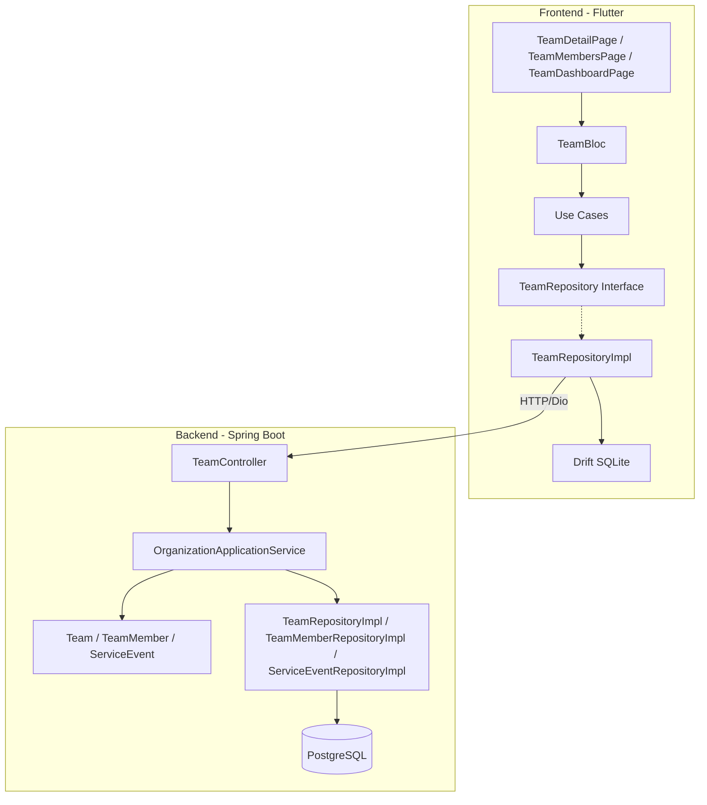
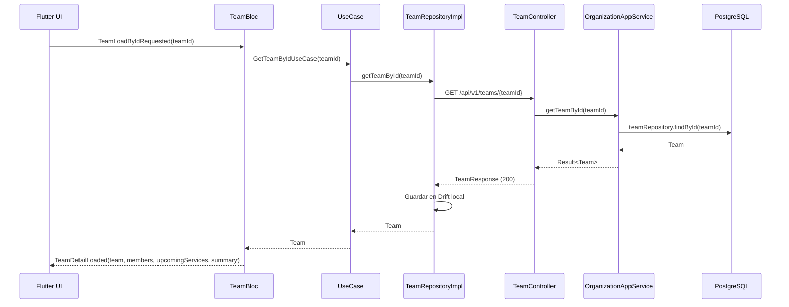
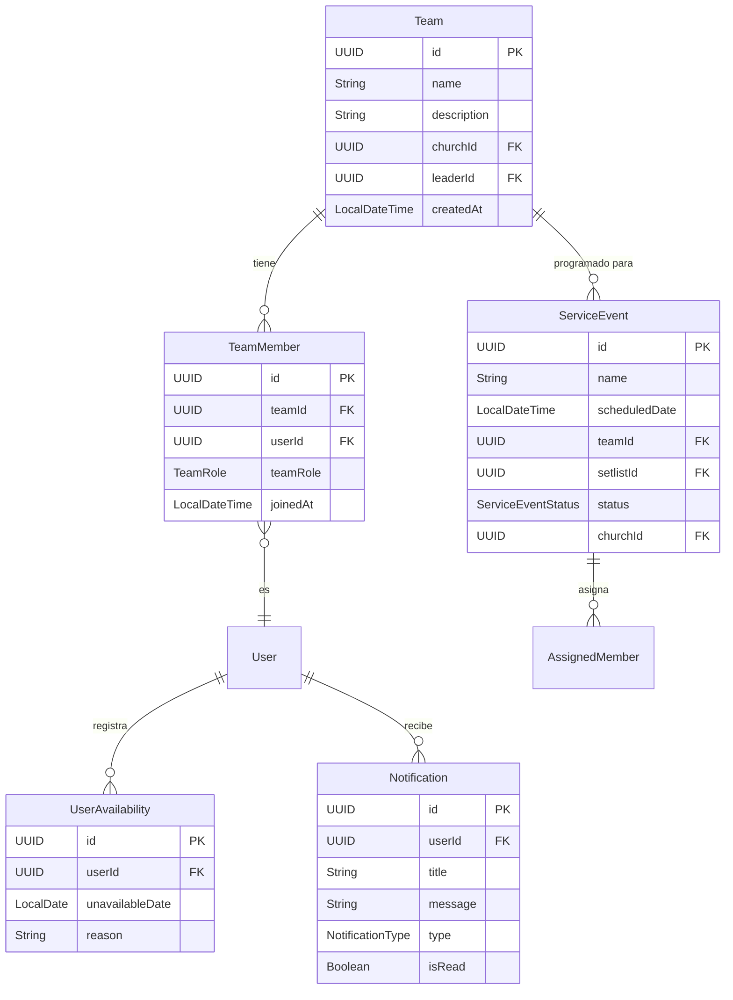

# Documento de Diseño — Módulo de Equipos

## Visión General

Este diseño extiende el módulo de equipos existente en WorshipHub para completar el flujo funcional end-to-end. Actualmente existen las entidades de dominio (`Team`, `TeamMember`, `TeamRole`), repositorios de infraestructura y un único endpoint POST para crear equipos. El diseño cubre:

- **Backend**: Nuevos endpoints REST en `TeamController` (GET lista, GET detalle, PUT actualizar, DELETE eliminar, CRUD de miembros, upcoming-services, availability, summary), nuevos métodos en `OrganizationApplicationService`, nuevos commands, DTOs de request/response, y creación de notificaciones automáticas.
- **Frontend**: Nuevas páginas (`TeamDetailPage`, `TeamMembersPage`, `TeamDashboardPage`), nuevos eventos/estados en `TeamBloc`, nuevos use cases, nuevas entidades de dominio para servicios y disponibilidad, y sincronización con los nuevos endpoints.

La arquitectura sigue los patrones establecidos: Clean Architecture con DDD en backend (4 módulos: api, application, domain, infrastructure) y Clean Architecture con BLoC en frontend (offline-first con Drift).

## Arquitectura

### Diagrama de Componentes



### Flujo de Datos



## Componentes e Interfaces

### Backend — Nuevos Endpoints en TeamController

| Método | Ruta | Descripción | Auth | Código |
|--------|------|-------------|------|--------|
| GET | `/api/v1/teams` | Listar equipos por iglesia | CHURCH_ADMIN, WORSHIP_LEADER, TEAM_MEMBER | 200 |
| GET | `/api/v1/teams/{teamId}` | Detalle de equipo | CHURCH_ADMIN, WORSHIP_LEADER, TEAM_MEMBER | 200/404 |
| PUT | `/api/v1/teams/{teamId}` | Actualizar equipo | CHURCH_ADMIN, WORSHIP_LEADER | 200/404 |
| DELETE | `/api/v1/teams/{teamId}` | Eliminar equipo | CHURCH_ADMIN | 204/404 |
| POST | `/api/v1/teams/{teamId}/members` | Asignar miembro | CHURCH_ADMIN, WORSHIP_LEADER | 201/404/409 |
| GET | `/api/v1/teams/{teamId}/members` | Listar miembros | CHURCH_ADMIN, WORSHIP_LEADER, TEAM_MEMBER | 200 |
| PUT | `/api/v1/teams/{teamId}/members/{userId}/role` | Actualizar rol | CHURCH_ADMIN, WORSHIP_LEADER | 200/404 |
| DELETE | `/api/v1/teams/{teamId}/members/{userId}` | Remover miembro | CHURCH_ADMIN, WORSHIP_LEADER | 204/404 |
| GET | `/api/v1/teams/{teamId}/upcoming-services` | Próximos servicios | CHURCH_ADMIN, WORSHIP_LEADER, TEAM_MEMBER | 200 |
| GET | `/api/v1/teams/{teamId}/availability` | Disponibilidad | CHURCH_ADMIN, WORSHIP_LEADER | 200 |
| GET | `/api/v1/teams/{teamId}/summary` | Resumen del equipo | CHURCH_ADMIN, WORSHIP_LEADER, TEAM_MEMBER | 200 |

### Backend — Nuevos Métodos en OrganizationApplicationService

```kotlin
// Nuevos métodos a agregar
fun getTeamsByChurchId(churchId: UUID): Result<List<Team>>
fun getTeamById(teamId: UUID): Result<Team>
fun updateTeam(command: UpdateTeamCommand): Result<Team>
fun deleteTeam(teamId: UUID): Result<Unit>
fun getUpcomingServices(teamId: UUID): Result<List<UpcomingServiceDTO>>
fun getTeamAvailability(teamId: UUID, startDate: LocalDate, endDate: LocalDate): Result<List<MemberAvailabilityDTO>>
fun getTeamSummary(teamId: UUID): Result<TeamSummaryDTO>
```

### Backend — Nuevos Commands

```kotlin
data class UpdateTeamCommand(
    val teamId: UUID,
    val name: String,
    val description: String?,
    val leaderId: UUID
)
```

### Backend — Nuevos DTOs de Request

```kotlin
// UpdateTeamRequest.kt
data class UpdateTeamRequest(
    @field:NotBlank
    @field:Size(min = 1, max = 100)
    val name: String,
    @field:Size(max = 500)
    val description: String?,
    @field:NotNull
    val leaderId: UUID
)

// UpdateMemberRoleRequest.kt
data class UpdateMemberRoleRequest(
    @field:NotNull
    val teamRole: TeamRole
)
```

### Backend — Nuevos DTOs de Response

```kotlin
// TeamMemberResponse.kt
data class TeamMemberResponse(
    val id: UUID,
    val userId: UUID,
    val teamRole: TeamRole,
    val joinedAt: LocalDateTime
)

// UpcomingServiceResponse.kt
data class UpcomingServiceResponse(
    val id: UUID,
    val name: String,
    val scheduledDate: LocalDateTime,
    val status: ServiceEventStatus,
    val confirmedCount: Int,
    val assignedCount: Int
)

// MemberAvailabilityResponse.kt
data class MemberAvailabilityResponse(
    val userId: UUID,
    val teamRole: TeamRole,
    val unavailableDates: List<UnavailableDateResponse>
)

data class UnavailableDateResponse(
    val date: LocalDate,
    val reason: String?
)

// TeamSummaryResponse.kt
data class TeamSummaryResponse(
    val totalMembers: Int,
    val recentServicesCount: Int,
    val upcomingServicesCount: Int,
    val roleDistribution: Map<TeamRole, Int>
)

// AssignTeamMemberResponse.kt
data class AssignTeamMemberResponse(
    val memberId: UUID,
    val message: String = "Member assigned successfully"
)
```

### Backend — Notificaciones

Se extiende `NotificationType` con nuevos tipos:

```kotlin
enum class NotificationType {
    // Existentes
    SERVICE_INVITATION, NEW_SONG, SONG_ADDED, NEW_COMMENT, TEAM_ASSIGNMENT, SERVICE_SCHEDULED,
    // Nuevos
    TEAM_MEMBER_ADDED,
    TEAM_MEMBER_REMOVED,
    TEAM_ROLE_CHANGED,
    TEAM_LEADER_CHANGED
}
```

La creación de notificaciones se realiza dentro de `OrganizationApplicationService` después de cada operación de mutación de miembros, usando `NotificationRepository.save()`.

### Backend — Nuevos Métodos en Repositorios de Dominio

```kotlin
// UserAvailabilityRepository — agregar
fun findByUserIdAndDateRange(userId: UUID, startDate: LocalDate, endDate: LocalDate): List<UserAvailability>

// TeamMemberRepository — agregar
fun deleteByTeamId(teamId: UUID)
fun countByTeamId(teamId: UUID): Int
```

### Frontend — Nuevas Entidades de Dominio

```dart
// upcoming_service.dart
class UpcomingService {
  final String id;
  final String name;
  final DateTime scheduledDate;
  final String status;
  final int confirmedCount;
  final int assignedCount;
}

// member_availability.dart
class MemberAvailability {
  final String userId;
  final String teamRole;
  final List<UnavailableDate> unavailableDates;
}

class UnavailableDate {
  final DateTime date;
  final String? reason;
}

// team_summary.dart
class TeamSummary {
  final int totalMembers;
  final int recentServicesCount;
  final int upcomingServicesCount;
  final Map<String, int> roleDistribution;
}
```

### Frontend — Nuevos Use Cases

```dart
class UpdateTeamUseCase { ... }
class DeleteTeamUseCase { ... }
class RemoveMemberFromTeamUseCase { ... }
class UpdateMemberRoleUseCase { ... }
class GetUpcomingServicesUseCase { ... }
class GetTeamAvailabilityUseCase { ... }
class GetTeamSummaryUseCase { ... }
```

### Frontend — Nuevos Eventos y Estados del BLoC

Nuevos eventos:
```dart
class TeamUpdateRequested extends TeamEvent { ... }
class TeamDeleteRequested extends TeamEvent { ... }
class TeamMemberRemoveRequested extends TeamEvent { ... }
class TeamMemberRoleUpdateRequested extends TeamEvent { ... }
class TeamUpcomingServicesRequested extends TeamEvent { ... }
class TeamAvailabilityRequested extends TeamEvent { ... }
class TeamSummaryRequested extends TeamEvent { ... }
class TeamDetailLoadRequested extends TeamEvent { ... }  // Carga combinada
```

Nuevos estados:
```dart
class TeamUpdated extends TeamState { ... }
class TeamDeleted extends TeamState { ... }
class TeamMemberRemoved extends TeamState { ... }
class TeamMemberRoleUpdated extends TeamState { ... }
class TeamUpcomingServicesLoaded extends TeamState { ... }
class TeamAvailabilityLoaded extends TeamState { ... }
class TeamSummaryLoaded extends TeamState { ... }
class TeamDetailLoaded extends TeamState { ... }  // Estado combinado para TeamDetailPage
```

### Frontend — Nuevas Páginas

- **TeamDetailPage**: Muestra nombre, descripción, líder, fecha de creación, panel de resumen, próximos servicios, botones de navegación a miembros y chat. Opciones de editar/eliminar para CHURCH_ADMIN y WORSHIP_LEADER.
- **TeamMembersPage**: Lista de miembros con nombre, rol e ícono. Acciones para agregar, remover y cambiar rol. Vista de disponibilidad con selector de rango de fechas.

### Frontend — Extensión de TeamRepository Interface

```dart
abstract class TeamRepository {
  // Existentes...
  
  // Nuevos
  Future<List<UpcomingService>> getUpcomingServices(String teamId);
  Future<List<MemberAvailability>> getTeamAvailability(String teamId, DateTime startDate, DateTime endDate);
  Future<TeamSummary> getTeamSummary(String teamId);
}
```

### Frontend — Sincronización en TeamRepositoryImpl

Cada nuevo método en `TeamRepositoryImpl` sigue el patrón existente:
1. Llamada HTTP al endpoint correspondiente via `Dio`
2. Almacenamiento en Drift local (cuando aplique)
3. Retorno de entidades de dominio
4. Manejo de errores con `Exception('Failed to ...')`

## Modelos de Datos

### Entidades de Dominio Existentes (sin cambios)

- **Team**: `id`, `name`, `description`, `churchId`, `leaderId`, `createdAt`
- **TeamMember**: `id`, `teamId`, `userId`, `teamRole`, `joinedAt`
- **TeamRole**: LEAD_VOCALIST, BACKING_VOCALIST, ACOUSTIC_GUITAR, ELECTRIC_GUITAR, BASS_GUITAR, DRUMS, KEYBOARD, SOUND_ENGINEER, WORSHIP_LEADER
- **ServiceEvent**: `id`, `name`, `scheduledDate`, `teamId`, `setlistId`, `assignedMembers`, `status`, `churchId`, `createdAt`
- **UserAvailability**: `id`, `userId`, `unavailableDate`, `reason`, `createdAt`
- **Notification**: `id`, `userId`, `title`, `message`, `type`, `isRead`, `createdAt`

### Diagrama ER Relevante



### DTOs de Transferencia (Request → Command → Domain → Response)

El flujo de datos sigue el patrón establecido:
1. **Request DTO** (api layer): Validación con Jakarta Validation
2. **Command** (application layer): Objeto inmutable para el servicio
3. **Domain Entity** (domain layer): Lógica de negocio
4. **Response DTO** (api layer): Serialización con Schema annotations


## Propiedades de Correctitud

*Una propiedad es una característica o comportamiento que debe mantenerse verdadero en todas las ejecuciones válidas de un sistema — esencialmente, una declaración formal sobre lo que el sistema debe hacer. Las propiedades sirven como puente entre especificaciones legibles por humanos y garantías de correctitud verificables por máquina.*

### Propiedad 1: Round-trip de CRUD de equipos

*Para cualquier* datos válidos de equipo (nombre entre 1-100 caracteres, descripción ≤500 caracteres, leaderId y churchId válidos), crear un equipo y luego obtenerlo por ID debe retornar los mismos datos; actualizar el equipo y luego obtenerlo debe reflejar los cambios; eliminar el equipo y luego intentar obtenerlo debe resultar en un error 404.

**Validates: Requirements 2.1, 3.1, 4.1**

### Propiedad 2: Validación de restricciones de entrada

*Para cualquier* nombre de equipo con longitud fuera del rango [1, 100] caracteres, o descripción que exceda 500 caracteres, o teamRole que no sea un valor válido del enum TeamRole, el sistema debe rechazar la operación con un error de validación (400).

**Validates: Requirements 3.3, 5.3, 7.3**

### Propiedad 3: Aplicación de autorización por endpoint

*Para cualquier* usuario sin la autoridad requerida, los endpoints de modificación (PUT, DELETE en teams; POST, PUT, DELETE en members) deben retornar 403 cuando el usuario no tiene CHURCH_ADMIN o WORSHIP_LEADER; los endpoints de solo lectura (GET teams, GET members, GET upcoming-services, GET summary) deben retornar 403 cuando el usuario no tiene CHURCH_ADMIN, WORSHIP_LEADER ni TEAM_MEMBER; el endpoint DELETE de equipos debe retornar 403 cuando el usuario no tiene CHURCH_ADMIN.

**Validates: Requirements 1.3, 3.4, 4.3, 5.4, 6.3, 7.4, 8.3, 9.4, 10.3, 11.3**

### Propiedad 4: Unicidad de membresía en equipo

*Para cualquier* equipo y usuario que ya es miembro de ese equipo, intentar asignar al mismo usuario nuevamente debe resultar en un error 409 (Conflict), y la lista de miembros del equipo no debe cambiar.

**Validates: Requirements 5.5**

### Propiedad 5: Eliminación en cascada de miembros

*Para cualquier* equipo con N miembros asociados, al eliminar el equipo, todos los registros de TeamMember asociados a ese teamId deben ser eliminados. No deben quedar registros huérfanos.

**Validates: Requirements 4.4**

### Propiedad 6: Round-trip de CRUD de miembros

*Para cualquier* equipo existente y usuario válido con un TeamRole válido, asignar el miembro y luego listar los miembros del equipo debe incluir al nuevo miembro con el rol correcto; actualizar el rol del miembro y luego listar debe reflejar el nuevo rol; remover al miembro y luego listar no debe incluirlo.

**Validates: Requirements 5.1, 6.1, 7.1, 8.1**

### Propiedad 7: Ordenamiento de próximos servicios

*Para cualquier* equipo con servicios futuros programados, la lista retornada por el endpoint de upcoming-services debe estar ordenada por `scheduledDate` de forma ascendente, y cada elemento debe incluir nombre, fecha programada, estado, cantidad de confirmados y cantidad de asignados.

**Validates: Requirements 9.1, 9.2**

### Propiedad 8: Filtrado de disponibilidad por rango de fechas

*Para cualquier* equipo y rango de fechas [startDate, endDate], la respuesta de disponibilidad debe incluir a todos los miembros del equipo, y las fechas de indisponibilidad de cada miembro deben estar dentro del rango solicitado (ninguna fecha fuera del rango debe aparecer).

**Validates: Requirements 10.1, 10.2**

### Propiedad 9: Consistencia del resumen del equipo

*Para cualquier* equipo, la cantidad `totalMembers` en el resumen debe ser igual al conteo real de registros TeamMember asociados al equipo; la `roleDistribution` debe reflejar exactamente los roles y cantidades de los miembros actuales; `recentServicesCount` debe coincidir con los ServiceEvent del equipo en los últimos 30 días; `upcomingServicesCount` debe coincidir con los ServiceEvent futuros del equipo.

**Validates: Requirements 11.2**

### Propiedad 10: Creación de notificaciones por mutaciones de miembros

*Para cualquier* equipo con N miembros existentes: al asignar un nuevo miembro, se deben crear N notificaciones (una por cada miembro existente) de tipo TEAM_MEMBER_ADDED; al remover un miembro, se deben crear (N-1) notificaciones de tipo TEAM_MEMBER_REMOVED para los miembros restantes; al actualizar el rol de un miembro, se debe crear exactamente 1 notificación de tipo TEAM_ROLE_CHANGED para el miembro afectado; al cambiar el líder del equipo, se deben crear N notificaciones de tipo TEAM_LEADER_CHANGED.

**Validates: Requirements 12.1, 12.2, 12.3, 12.4**

### Propiedad 11: Filtrado de equipos por iglesia

*Para cualquier* churchId, la lista de equipos retornada por GET /api/v1/teams debe contener únicamente equipos cuyo `churchId` coincida con el header Church-Id proporcionado. Ningún equipo de otra iglesia debe aparecer en los resultados.

**Validates: Requirements 1.1**

### Propiedad 12: Sincronización frontend-backend round-trip

*Para cualquier* operación de equipo ejecutada desde el frontend (crear equipo, listar equipos, agregar miembro, consultar servicios, consultar disponibilidad, consultar resumen), el `TeamRepositoryImpl` de Dart debe enviar la solicitud HTTP al endpoint correspondiente y, tras una respuesta exitosa, los datos en la base de datos local Drift deben reflejar los datos retornados por el API.

**Validates: Requirements 17.1, 17.2, 17.3, 17.4, 17.5, 17.6**

### Propiedad 13: Propagación de errores en frontend

*Para cualquier* fallo en la comunicación con el servidor (timeout, error de red, error HTTP 4xx/5xx), el `TeamRepositoryImpl` de Dart debe propagar una excepción con un mensaje descriptivo que permita al usuario entender el problema.

**Validates: Requirements 17.7**

## Manejo de Errores

### Backend

| Escenario | Excepción | Código HTTP | Mensaje |
|-----------|-----------|-------------|---------|
| Equipo no encontrado | `NotFoundException` | 404 | "Team not found: {teamId}" |
| Miembro no encontrado | `NotFoundException` | 404 | "Team member not found" |
| Miembro duplicado | `ConflictException` | 409 | "User is already a member of this team" |
| Validación de nombre | `BadRequestException` | 400 | "Team name must be between 1 and 100 characters" |
| Validación de descripción | `BadRequestException` | 400 | "Description must not exceed 500 characters" |
| TeamRole inválido | `BadRequestException` | 400 | "Invalid team role: {role}" |
| Sin autorización | Spring Security | 403 | "Access Denied" |
| Error interno | `RuntimeException` | 500 | "Internal server error" |

El manejo de errores sigue el patrón existente con `GlobalExceptionHandler` y las excepciones definidas en `ApiExceptions.kt` (`BadRequestException`, `NotFoundException`, `ConflictException`).

### Frontend

| Escenario | Manejo | UX |
|-----------|--------|-----|
| Error de red | `ApiErrorParser.fromDioException()` → `ApiException` | SnackBar rojo con mensaje descriptivo |
| Equipo no encontrado (404) | `TeamError` state en BLoC | Mensaje "Equipo no encontrado" |
| Sin permisos (403) | `TeamError` state en BLoC | Mensaje "No tienes permisos para esta acción" |
| Conflicto (409) | `TeamError` state en BLoC | Mensaje "El miembro ya existe en el equipo" |
| Timeout | Retry con backoff exponencial | Indicador de reintento |

## Estrategia de Testing

### Enfoque Dual: Tests Unitarios + Tests Basados en Propiedades

Se requieren ambos tipos de tests para cobertura completa:

- **Tests unitarios**: Verifican ejemplos específicos, edge cases y condiciones de error
- **Tests basados en propiedades**: Verifican propiedades universales con inputs generados aleatoriamente

### Backend (Kotlin — Kotest Property Testing)

**Librería de property-based testing**: Kotest 5.8.0 (ya incluida en el proyecto)

**Configuración**: Mínimo 100 iteraciones por test de propiedad.

**Tag format**: `// Feature: teams-module, Property {N}: {título}`

Cada propiedad de correctitud (1-11) se implementa como UN SOLO test basado en propiedades usando Kotest `forAll` / `checkAll`.

**Tests unitarios backend**:
- Controller integration tests con MockMvc + SpringMockK para cada endpoint (edge cases: 404, 409, 400)
- Service unit tests con MockK para `OrganizationApplicationService` (nuevos métodos)
- Verificación de notificaciones creadas por cada operación de mutación

**Tests de propiedades backend**:
- P1: Round-trip CRUD de equipos con generadores de nombres/descripciones aleatorios
- P2: Validación de restricciones con generadores de strings fuera de rango
- P3: Autorización con generadores de roles no autorizados por endpoint
- P4: Unicidad de membresía con generadores de asignaciones duplicadas
- P5: Cascade delete con generadores de equipos con N miembros aleatorios
- P6: Round-trip CRUD de miembros con generadores de TeamRole aleatorios
- P7: Ordenamiento de servicios con generadores de fechas aleatorias
- P8: Filtrado de disponibilidad con generadores de rangos de fechas
- P9: Consistencia de resumen con generadores de equipos con miembros y servicios aleatorios
- P10: Notificaciones con generadores de equipos con N miembros
- P11: Filtrado por iglesia con generadores de múltiples churchIds

### Frontend (Dart — Glados Property Testing)

**Librería de property-based testing**: Glados 1.1.1 (ya incluida en el proyecto)

**Configuración**: Mínimo 100 iteraciones por test de propiedad.

**Tag format**: `// Feature: teams-module, Property {N}: {título}`

**Tests unitarios frontend**:
- BLoC tests con `bloc_test` + `mocktail` para cada nuevo evento/estado
- Repository tests con Dio mockeado para cada nuevo método
- Widget tests para TeamDetailPage, TeamMembersPage (estados: loading, loaded, empty, error)

**Tests de propiedades frontend**:
- P12: Sincronización round-trip con generadores de datos de equipo aleatorios
- P13: Propagación de errores con generadores de tipos de fallo aleatorios
